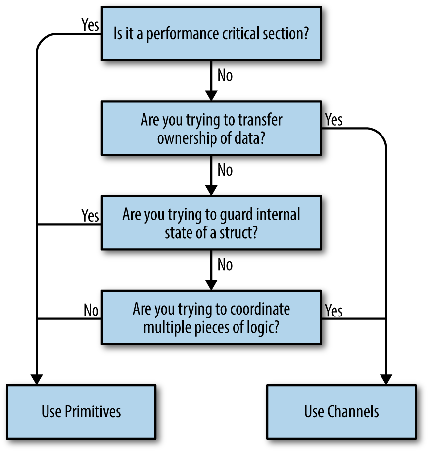

## Table of Contents
  - [Concurrency Practices and Patterns](#Concurrency-Practices-and-Patterns)
    - [把并发代码隐藏为实现细节](#%E6%8A%8A%E5%B9%B6%E5%8F%91%E4%BB%A3%E7%A0%81%E9%9A%90%E8%97%8F%E4%B8%BA%E5%AE%9E%E7%8E%B0%E7%BB%86%E8%8A%82)
    - [小心在闭包中捕获一个会变的变量](#%E5%B0%8F%E5%BF%83%E5%9C%A8%E9%97%AD%E5%8C%85%E4%B8%AD%E6%8D%95%E8%8E%B7%E4%B8%80%E4%B8%AA%E4%BC%9A%E5%8F%98%E7%9A%84%E5%8F%98%E9%87%8F)
    - [for-select 循环要检测关掉的 channel](#forselect-%E5%BE%AA%E7%8E%AF%E8%A6%81%E6%A3%80%E6%B5%8B%E5%85%B3%E6%8E%89%E7%9A%84-channel)
    - [Always Clean Up Your Goroutines](#Always-Clean-Up-Your-Goroutines)
    - [The Done Channel Pattern](#The-Done-Channel-Pattern)
    - [When to Use Buffered Channel](#When-to-Use-Buffered-Channel)
    - [How to Time Out Code](#How-to-Time-Out-Code)
    - [Running Code Exactly Once](#Running-Code-Exactly-Once)
    - [不推荐用 sync.Map](#%E4%B8%8D%E6%8E%A8%E8%8D%90%E7%94%A8-syncMap)
  - [Channel 和 Mutex 用哪个](#Channel-%E5%92%8C-Mutex-%E7%94%A8%E5%93%AA%E4%B8%AA)
    - [什么时候 Mutex 更好用](#%E4%BB%80%E4%B9%88%E6%97%B6%E5%80%99-Mutex-%E6%9B%B4%E5%A5%BD%E7%94%A8)
    - [channel vs mutex](#channel-vs-mutex)
    - [Channel 和 Mutex 怎么选?](#Channel-%E5%92%8C-Mutex-%E6%80%8E%E4%B9%88%E9%80%89)
  - [不要泄露 Goroutine](#%E4%B8%8D%E8%A6%81%E6%B3%84%E9%9C%B2-Goroutine)
    - [Channel 大小设为 0/1](#Channel-%E5%A4%A7%E5%B0%8F%E8%AE%BE%E4%B8%BA-01)
    - [泄露 goroutine 问题很大](#%E6%B3%84%E9%9C%B2-goroutine-%E9%97%AE%E9%A2%98%E5%BE%88%E5%A4%A7)
    - [注意 goroutine 何时退出](#%E6%B3%A8%E6%84%8F-goroutine-%E4%BD%95%E6%97%B6%E9%80%80%E5%87%BA)
    - [等待 goroutine 结束](#%E7%AD%89%E5%BE%85-goroutine-%E7%BB%93%E6%9D%9F)


## Concurrency Practices and Patterns

### 把并发代码隐藏为实现细节

#### ➤ Keep Your APIs Concurrency-Free

Concurrency is an implementation detail, and good API design should hide implementation details as much as possible. This allows you to change how your code works without changing how your code is invoked. Practically, this means that *you should never expose channels or mutexes* in your API’s types, functions, and methods. 

If you expose a channel, you put the responsibility of channel management on the users of your API. This means that the users now have to worry about concerns like whether or not a channel is buffered or closed or `nil`. They can also trigger deadlocks by accessing channels or mutexes in an unexpected order.  

This doesn’t meant that you shouldn’t ever have channels as function parameters or struct fields. It means that they shouldn’t be exported. There are some exceptions to this rule. If your API is a library with a concurrency helper function (like time.After), channels are going to be part of its API.

### 小心在闭包中捕获一个会变的变量

Most of the time, the closure that you use to launch a goroutine has no parameters. Instead, it captures values from the environment where it was declared. There is one common situation where this doesn’t work: when trying to capture the index or value of a for loop. This code contains a subtle bug. 

Any time your goroutine uses a variable whose value might change,  
pass the current value of the variable into the goroutine.   

```go
func 闭包与可变变量() {
    a := []int{2, 4, 6, 8, 10}
    ch := make(chan int, len(a))
    for _, v := range a {
        go func() {
            ch <- v * 2 // 这里捕获了一个会变的变量 v
        }() // 当 goroutine 真正执行时,  v 已经发生了变化
    }
    for i := 0; i < len(a); i++ {
        fmt.Println(<-ch)
    }

    // 解决办法 (1)
    for _, v := range a {
        var v = v   // shadow the value within the loop
        go func() { // for 循环内的同名变量 v 不会发生变化
            ch <- v * 2
        }()
    }

    // 解决办法 (2)
    for _, v := range a {
        go func(val int) {
            ch <- val * 2
        }(v) // 启动 goroutine 时把函数参数传过去
    }
}
```

### for-select 循环要检测关掉的 channel

#### ➤ (1) 若 for-select 循环中某 channel 被关闭,  会读出一堆垃圾值  

When you need to combine data from multiple concurrent sources, the select keyword is great. However, you need to properly handle closed channels. If one of the cases in a select is reading a closed channel, it will always be successful, returning the zero value. Every time that case is selected, you need to check to make sure that the value is valid and skip the case. If reads are spaced out, your program is going to waste a lot of time reading junk values.  

#### ➤ (2) 检测 channel 是否关闭, 然后把 channel 变量设为 nil

When that happens, we rely on something that looks like an error: reading a `nil` channel. As we saw earlier, reading from or writing to a `nil` channel causes your code to hang forever. While that is bad if it is triggered by a bug, you can use a `nil` channel to disable a case in a select. When you detect that a channel has been closed, set the channel’s variable to `nil`. The associated case will no longer run, because the read from the `nil` channel never returns a value.

```go
func for_select_循环中记得检测已关闭的_channel(done, in, in2 chan int) {
    for {
        select {
        case v, ok := <-in:
            if !ok {
                in = nil // the case will never succeed again!
                continue
            }
            fmt.Println(v) // process the v that was read from in
        case v, ok := <-in2:
            if !ok {
                in2 = nil // the case will never succeed again!
                continue
            }
            fmt.Println(v) // process the v that was read from in2
        case <-done:
            return
        }
    }
}
```

### Always Clean Up Your Goroutines

Whenever you launch a goroutine function, you must make sure that it will eventually exit. Unlike variables, the Go runtime can’t detect that a goroutine will never be used again. If a goroutine doesn’t exit, the scheduler will still periodically give it time to do nothing, which slows down your program. *This is called a goroutine leak*.

#### ➤ 使用 Cancel 函数关闭 Goroutine

The `countTo` function creates two channels, one that returns data and another for signaling done. Rather than return the done channel directly, we create a closure that closes the done channel and return the closure instead. Cancelling with a closure allows us to perform additional clean-up work, if needed.  

```go
func main2() {
    // 返回一个 cancel 函数来做必要的清理
    ch, cancel := countTo(10)
    defer cancel()
    for i := range ch {
        if i > 5 {
            break // 就算数到 5 便中途退出,  也不会 goroutine 泄漏
        }
        fmt.Println(i)
    }
}

func countTo(max int) (<-chan int, func()) {
    ch := make(chan int)
    done := make(chan struct{})
    cancel := func() {
        close(done)
    }
    go func() {
        for i := 0; i < max; i++ {
            select {
            case <-done:
                return
            case ch <- i:
            }
        }
        close(ch)
    }()
    return ch, cancel
}
```

### The Done Channel Pattern

Goroutines do cost resources, so regardless of how small their memory footprint is, we don’t want to leave them lying about our process. *If a goroutine is responsible for creating a goroutine, it is also responsible for ensuring it can stop the goroutine*. 

The done channel pattern provides a way to signal a goroutine that it’s time to stop processing. It uses a channel to signal that it’s time to exit. Let’s look at an example where we pass the same data to multiple functions, but only want the result from the fastest function:  

```go
type stringHandler func(string) []string

func searchData(s string, handlers []stringHandler) []string {
    done := make(chan struct{})
    result := make(chan []string)
    // 开启一堆 goroutine 去处理同一数据,  选择首个返回的结果
    for _, handler := range handlers {
        go func(handler stringHandler) {
            select {
            case result <- handler(s):
            case <-done:
            }
        }(handler)
    }
    // 从 result channel 中读取一个结果,  然后关掉 done channel,  通知其他协程退出
    r := <-result
    close(done)
    return r
}
```

We use an empty struct for the type because the value is unimportant; we never write to this channel, only close it. The select statements in the worker goroutines wait for either a write on the result channel (when the handler function returns) or a read on the done channel. Remember that a read on an open channel pauses until there is data available and that a read on a closed channel always returns the zero value for the channel. Reads from done will stay paused until done is closed. In searchData, we read the first value written to result, and then we close done. This signals to the goroutines that they should exit, preventing them from leaking. 

### When to Use Buffered Channel

If a goroutine making writes to a channel *has knowledge of how many writes it will make*, it can be useful to create a buffered channel whose capacity is the number of writes to be made, *and then make those writes as quickly as possible*. 

Buffered channels work great when you want to either *gather data back from a set of goroutines* that you have launched or when you want to limit concurrent usage. In our first example, we are processing the first 10 results on a channel. To do this, we launch 10 goroutines, each of which writes its results to a buffered channel: 

```go
func handleTenTasks(tasks <-chan int) []int {
    const workerCount = 10
    results := make(chan int, workerCount)
    
    for i := 0; i < workerCount; i++ {
        go func() {
            t := <-tasks
            results <- handle(t) // 一人一个坑位,  所以不会阻塞
        }()
    }
    
    var out []int
    for i := 0; i < workerCount; i++ {
        out = append(out, <-results)
    }
    return out
}
```

#### ➤ 一人一个坑位,  每个 goroutine 出结果后就把结果扔到队列,  不会发生阻塞、能尽快结束 goroutine

We know exactly how many goroutines we have launched, and *we want each goroutine to exit as soon as it finishes its work*. This means we can create a buffered channel with one space for each launched goroutine, and have each goroutine write data to this goroutine without blocking. We can then loop over the buffered channel, reading out the values as they are written. When all of the values have been read, we return the results, *knowing that we aren’t leaking any goroutines*.  

#### ➤ 队列有哪些特性

带 buffer 的 channel 也就成了一个队列,  队列有哪些特性呢?

- 解耦,  生产者和消费者之间没有直接联系,  哪怕把消费者变成两个也不影响生产者
- 异步,  把任务提交到队列里就返回了,  不阻塞调用者、不必等任务完成、因为可能要等很久
- 作为缓冲,  解决速度不匹配
  - 比如写入磁盘文件时的 buffered io,  把数据暂存一下再批量写盘,  能提高写入效率
  - 比如请求速度大于系统处理速度时,  把请求暂存到队列里,  就能避免系统崩溃、请求被拒绝

### How to Time Out Code

Most interactive programs have to return a response within a certain amount of time. Other languages introduce additional features on top of promises or futures to add this functionality, but Go’s timeout idiom shows how you build complicated features from existing parts. Let’s take a look:  

```go
func timeLimit(doSomeWork func() (int, error)) (int, error) {
    var result int
    var err error
    done := make(chan struct{})
    go func() {
        defer close(done)
        result, err = doSomeWork()
    }()
    select {
    case <-done:
        return result, err
    case <-time.After(2 * time.Second):
        return 0, errors.New("timeout")
    }
}
```

Any time you need to limit how long an operation takes in Go, you’ll see a variation on this pattern. We have a select choosing between two cases. The first case takes advantage of the done channel pattern we saw earlier. We use the goroutine closure to assign values to `result` and `err` and to close the `done` channel. If the done channel closes first, the read from done succeeds and the values are returned. The second channel is returned by the `After` function in the time package. It has a value written to it after the specified `time.Duration` has passed. When this value is read before `doSomeWork` finishes, `timeLimit` returns the timeout error.

#### ➤ 若超时后要让 goroutine 停止无用功,  可以用 context 的超时取消

If we exit `timeLimit` before the goroutine finishes processing, the goroutine continues to run. We just won’t do anything with the result that it (eventually) returns. *If you want to stop work in a goroutine when you are no longer waiting for it to complete*, use context cancellation.

```go
func 用_Context_支持取消() {
    startSomeWork := func(ctx context.Context) error {
        done := make(chan struct{})
        go func() {
            defer close(done)
            for i := 1; i <= 5; i++ {
                select {
                // ctx.Done() 返回一个 channel,  当 ctx 被取消时这个 channel 会被关闭
                case <-ctx.Done():
                    fmt.Println("任务被取消了")
                    return
                default:
                    time.Sleep(time.Second) // 总共要 5 秒才能完成任务
                    fmt.Printf("进度: %d\n", i*20)
                }
            }
            fmt.Println("任务完成")
        }()
        <-done
        return ctx.Err()
    }

    // 可以手动 cancel() 提前取消, 注意 defer cancel() 是个好习惯,
    // 既能确保 cancel() 至少被调用一次,  也能确保相关资源被尽早释放 (不必等到 timeout 才释放)
    ctx, cancel := context.WithTimeout(context.Background(), 3*time.Second)
    defer cancel()

    err := startSomeWork(ctx) // 一个函数若想支持取消,  则把 context.Context 作为第一个参数
    fmt.Println("error:", err)
}
```

### Running Code Exactly Once

As we covered in “The init Function: Avoid if Possible” on page 186, `init` should be reserved for initialization of effectively immutable package-level state. However, sometimes you want to lazy load, or call some initialization code exactly once after program launch time. This is usually because the initialization is relatively slow and may not even be needed every time your program runs. The sync package includes a handy type called `Once` that enables this functionality. Let’s take a quick look at how it works:  

```go
var parser SlowComplicatedParser
var once sync.Once

func Parse(dataToParse string) string {
    // Parse 函数会被调用多次,  但只有首次会执行初始化
    // 不会出现两个 goroutine 同时执行初始化,  详见 Do 的文档
    once.Do(func() {
        parser = initParser()
    })
    return parser.Parse(dataToParse)
}
```

We have declared two package-level variables, `parser`, which is of type `SlowComplicatedParser`, and `once`, which is of type `sync.Once`. Like sync.WaitGroup, we do not have to configure an instance of sync.Once (this is called making the zero value useful). Also like sync.WaitGroup, we must make sure not to make a copy of an instance of sync.Once.

### 不推荐用 sync.Map

When looking through the sync package, you’ll find a type called `Map`. It provides a concurrency-safe version of Go’s built-in map. Due to trade-offs in its implementation, sync.Map is only appropriate in very specific situations:  

- When you have a shared map where key/value pairs are inserted once and read many times

- When goroutines share the map, but don’t access each other’s keys and values  

Furthermore, because of the current lack of generics in Go, sync.Map uses interface{} as the type for its keys and values; the compiler cannot help you ensure that the right data types are used. Given these limitations, in the rare situations where you need to share a map across multiple goroutines, use a built-in map protected by a sync.RWMutex.

## Channel 和 Mutex 用哪个

### 什么时候 Mutex 更好用

#### ➤ 用锁不好表达数据的传递/流动

If you’ve had to coordinate access to data across threads in other programming languages, you have probably used a mutex. This is short for mutual exclusion, and the job of a mutex is to limit the concurrent execution of some code or access to a shared piece of data. This protected part is called the critical section.

*The main problem with mutexes is that they obscure the flow of data* through a program. When a value is passed from goroutine to goroutine over a series of channels, the data flow is clear. Access to the value is localized to a single goroutine at a time. That makes it hard to understand the order of processing. There is a saying in the Go community to describe this philosophy: “Share memory by communicating; do not communicate by sharing memory.”

#### ➤ 但在一些场景中用锁更方便

That said, sometimes it is clearer to use a mutex, and the Go standard library includes mutex implementations for these situations. The most common case is when your goroutines read or write a shared value, but don’t process the value. We’ll first see how we would implement this using channels. 

```go
func main() {
    m, cancel := NewConcurrentMap1()
    m.Update("ichigo", 18)
    m.Update("rukia", 233)
    fmt.Println(m.Read("rukia"))
    cancel()
}

// 使用 chan func 作为底层类型,  channel 中存储的是函数
type ConcurrentMap1 chan func(map[string]int)

func NewConcurrentMap1() (ConcurrentMap1, func()) {
    ch := make(ConcurrentMap1)
    done := make(chan struct{})

    // 其他 goroutine 把读或写操作封装成函数, 然后发给这个 goroutine 执行
    // 因为对 map 的所有读写都由这一个 goroutine 执行,  也就不存在并发问题了
    go mapManager(ch, done)

    // 返回的 cancel 函数用于退出上面的 manager goroutine
    return ch, func() {
        close(done)
    }
}

func mapManager(in <-chan func(map[string]int), done <-chan struct{}) {
    // map 只被 manager goroutine 访问,  不会与其他 goroutine 共享
    m := map[string]int{}
    for {
        select {
        case <-done:
            return
        case f := <-in:
            f(m)
        }
    }
}

func (cm ConcurrentMap1) Update(name string, val int) {
    cm <- func(m map[string]int) {
        m[name] = val
    }
}

func (cm ConcurrentMap1) Read(name string) (int, bool) {
    var out int
    var ok bool
    done := make(chan struct{})

    // 本 goroutine 只负责提交函数,  真实的读取操作由 manager goroutine 执行
    // 所以是一个异步的过程,  所以用 done channel 等读取操作执行完
    cm <- func(m map[string]int) {
        out, ok = m[name] // 这里把数据副本读取到本 goroutine
        close(done)
    }
    <-done
    return out, ok
}
```

#### ➤ 互斥锁

While this code works, it’s cumbersome and only allows a single reader at a time. A better approach is to use a mutex. There are two mutex implementations in the standard library, both in the sync package. The first is called `Mutex` and has two methods, `Lock` and `Unlock`. Calling Lock causes the current goroutine to pause as long as another goroutine is currently in the critical section. When the critical section is clear, the lock is acquired by the current goroutine and the code in the critical section is executed. A call to the Unlock method on the Mutex marks the end of the critical section.  

#### ➤ 读写锁

The second mutex implementation is called `RWMutex` and it allows you to have both reader locks and writer locks. While only one writer can be in the critical section at a time, reader locks are shared; multiple readers can be in the critical section at once. *The writer lock is managed with the Lock and Unlock methods, while the reader lock is managed with RLock and RUnlock methods*.

#### ➤ 用 defer 释放锁

Any time you acquire a mutex lock, *you must make sure that you release the lock*. Use a `defer ` statement to call Unlock immediately after calling Lock or RLock:

```go
type ConcurrentMap2 struct {
    l sync.RWMutex
    m map[string]int
}

func NewConcurrentMap2() *ConcurrentMap2 {
    return &ConcurrentMap2{
        m: map[string]int{},
        // sync.RWMutex 是值类型,  默认值就是有效的, 小心别复制锁
    }
}

func (cm *ConcurrentMap2) Update(name string, val int) {
    cm.l.Lock()
    defer cm.l.Unlock()
    cm.m[name] = val
}

func (cm *ConcurrentMap2) Read(name string) (int, bool) {
    cm.l.RLock()
    defer cm.l.RUnlock()
    val, ok := cm.m[name]
    return val, ok
}
```

#### ➤ 总而言之

If you are coordinating goroutines or tracking a value as it is transformed by a series of goroutines, use channels. If you are sharing access to a field in a struct, use mutexes. Since our map is a field in a struct and there’s no transfer of the map, using a mutex makes sense. This is a good use for a mutex only because the data is stored in-memory. When data is stored in external services, like an HTTP server or a database, don’t use a mutex to guard access to the system.  

#### ➤ sync.Mutex 不是重入锁

Mutexes require you to do more bookkeeping. For example, you must correctly pair locks and unlocks or your programs will likely deadlock. Our example both acquires and releases the locks within the same method. Another issue is that mutexes in Go aren’t reentrant. If a goroutine tries to acquire the same lock twice, it deadlocks, waiting for itself to release the lock. This is different from languages like Java, where locks are reentrant.  

Nonreentrant locks make it tricky to acquire a lock in a function that calls itself recursively. You must release the lock before the recursive function call. *In general, be careful when holding a lock while making a function call*, because you don’t know what locks are going to be acquired in those calls. If your function calls another function that tries to acquire the same mutex lock, the goroutine deadlocks.  

### channel vs mutex

Channels, for instance, *are inherently composable with other channels*. This makes writing large systems simpler because you can coordinate the input from multiple subsystems by easily composing the output together. You can combine input channels with timeouts, cancellations, or messages to other subsystems. Coordinating mutexes is a much more difficult proposition.

The select statement is the complement to Go’s channels and is what enables all the difficult bits of composing channels. select statements allow you to efficiently wait for events, select a message from competing channels in a uniform random way.

### Channel 和 Mutex 怎么选?

Package sync provides basic synchronization primitives such as mutual exclusion locks. Other than the `Once` and `WaitGroup` types, most are intended for use by lowlevel library routines. Higher-level synchronization is better done via channels and communication.  

Regarding mutexes, the sync package implements them, but we hope Go programming style will encourage people to try higher-level techniques. In particular, consider structuring your program so that only one goroutine at a time is ever responsible for a particular piece of data.  

Do not communicate by sharing memory. Instead, share memory by communicating. That said, Go does provide traditional locking mechanisms in the sync package. Most locking issues can be solved using either channels or traditional locks. *So which should you use?* Use whichever is most expressive and/or most simple. (总而言之偏好 channel, 但有时候 mutex 更合适)

 

#### ➤ Are you trying to transfer ownership of data?

If you have a bit of code that produces a result and wants to share that result with another bit of code, what you’re really doing is transferring ownership of that data. 

If you’re familiar with the concept of memory-ownership in languages that don’t support garbage collection, this is the same idea: data has an owner, and one way to make concurrent programs safe is to ensure only one concurrent context has ownership of data at a time.

#### ➤ Are you trying to guard internal state of a struct?

This is a great candidate for memory access synchronization primitives, and a pretty strong indicator that you shouldn’t use channels. By using memory access synchronization primitives, you can hide the implementation detail of locking your critical section from your callers.  

Here’s a small example of a type that is thread-safe, but doesn’t expose that complexity to its callers:  

```go
type Counter struct {
    mu    sync.Mutex
    value int
}

func (c *Counter) Increment() {
    // Increment 是线程安全的,  并且把线程的同步的复杂性封装在方法里
    c.mu.Lock()
    defer c.mu.Unlock()
    c.value++
}
```

Remember the key word here is internal. If you find yourself exposing locks beyond a type, this should raise a red flag. Try to keep the locks constrained to a small lexical scope.  

#### ➤ Are you trying to coordinate multiple pieces of logic?

Remember that channels are inherently more composable than memory access synchronization primitives. Having locks scattered throughout your object-graph sounds like a nightmare, but having channels everywhere is expected and encouraged! I can compose channels, but I can’t easily compose locks or methods that return values.  

You will find it much easier to control the emergent complexity that arises in your software if you use channels because of Go’s select statement, and their ability to serve as queues and be safely passed around.  

## 不要泄露 Goroutine

### Channel 大小设为 0/1

#### ➤ Channel Size is One or None

Channels should usually have a size of one or be unbuffered. By default, channels are unbuffered and have a size of zero. Any other size must be subject to a high level of scrutiny. Consider how the size is determined, what prevents the channel from filling up under load and blocking writers, and what happens when this occurs.

若是因为生产速度比消费速度快,  那么设置再大的 buffer 也是浪费,  迟早会被填满

### 泄露 goroutine 问题很大

#### ➤ Don't fire-and-forget goroutines

Goroutines are lightweight, but they're not free: at minimum, they cost memory for their stack and CPU to be scheduled. While these costs are small for typical uses of goroutines, they can cause significant performance issues when spawned in large numbers without controlled lifetimes. Goroutines with unmanaged lifetimes can also cause other issues like preventing unused objects from being garbage collected and holding onto resources that are otherwise no longer used.

Therefore, do not leak goroutines in production code. Use [go.uber.org/goleak](https://pkg.go.dev/go.uber.org/goleak) to test for goroutine leaks inside packages that may spawn goroutines.

In general, every goroutine:

- must have a predictable time at which it will stop running; or
- there must be a way to signal to the goroutine that it should stop

In both cases, there must be a way code to block and wait for the goroutine to finish.

```go
func main() {
    var stop = make(chan struct{}) // tells the goroutine to stop
    var done = make(chan struct{}) // tells us that the goroutine exited
    go func() {
        defer close(done)
        ticker := time.NewTicker(time.Second)
        defer ticker.Stop()
        for {
            select {
            case <-ticker.C:
                fmt.Println("tick...")
            case <-stop:
                return
            }
        }
    }()
    go func() {
        time.Sleep(3 * time.Second) // there must be a way to
        close(stop)                 // signal the goroutine to stop
    }()
    <-done // and there must be a way to block and wait for the goroutine to finish.
}
```

### 注意 goroutine 何时退出

When you spawn goroutines, make it clear when - or whether - they exit.

Goroutines can leak by blocking on channel sends or receives: the garbage collector will not terminate a goroutine even if the channels it is blocked on are unreachable.

Even when goroutines do not leak, leaving them in-flight when they are no longer needed can cause other subtle and hard-to-diagnose problems. Sends on closed channels panic. And leaving goroutines in-flight for arbitrarily long can lead to unpredictable memory usage.

Try to keep concurrent code simple enough that goroutine lifetimes are obvious. If that just isn't feasible, document when and why the goroutines exit. 总之要心中有数、每一个 goroutine 何时退出.

### 等待 goroutine 结束

#### ➤ App Exits With Active Goroutines

The app will not wait for all your goroutines to complete. This is a common mistake for beginners in general. Everybody starts somewhere, so there's no shame in making rookie mistakes :-)

#### ➤ 解决办法

1. One of the most common solutions is to use a "WaitGroup" variable. It will allow the main goroutine to wait until all worker goroutines are done.
2. Another option is to close a channel all workers are receiving from. It's a simple way to signal all goroutines at once.

#### ➤ 一个例子

```go
func main() {
   var wg sync.WaitGroup
   done := make(chan struct{})  // 用 chan struct{} 类型能节省一点点内存
   wq := make(chan interface{}) // 任务队列
   rand.Seed(time.Now().Unix()) // 不设随机种子会导致随机序列不变
   workerCount := 2

   for i := 0; i < workerCount; i++ {
      wg.Add(1)                   // 启动时 wg 加一
      go doWork(i, wq, done, &wg) // 启动两个 worker
   }
   for i := 0; i < workerCount*3; i++ {
      wq <- fmt.Sprintf("任务 %d", i) // 等分配完所有任务就 close(done) 通知 worker 退出
   }

   close(done) // 让还在等待新任务的 goroutine 立即退出,  让正在干活的 goroutine 完成任务后退出
   wg.Wait()   // 等待所有 goroutine 都退出
   fmt.Println("all done!")
}

func doWork(workerID int, wq <-chan interface{}, done <-chan struct{}, wg *sync.WaitGroup) {
   fmt.Printf("[worker %v] is running\n", workerID)
   defer wg.Done() // wg 是指针类型,  不要拷贝 WaitGroup、Mutex 之类的东西
   for {
      select {
      case task := <-wq:
         safelyDo(workerID, task, func() {
            if rand.Intn(2) == 1 {
               panic("some error") // 任务出错了就打印错误,  然后干下一个任务
            }
            fmt.Printf("[worker %v] %v: √ complete\n", workerID, task)
         })
      case <-done:
         fmt.Printf("[worker %v] is being told to exit\n", workerID)
         return
      }
   }
}

func safelyDo(workerID int, task interface{}, f func()) {
   // 用 recover 避免 goroutine panic 导致整个应用挂掉
   defer func() {
      if r := recover(); r != nil {
         fmt.Printf("[worker %v] %v: X some error\n", workerID, task)
      }
   }()
   f()
}
```

#### ➤ [可以封装 Worker 的创建和取消](https://github.com/uber-go/guide/blob/master/style.md#no-goroutines-in-init)

If a package has need of a background goroutine, it must expose an object that is responsible for managing a goroutine's lifetime. The object must provide a method (`Close`, `Stop`, `Shutdown`, etc) that signals the background goroutine to stop, and waits for it to exit.

Spawns the worker only if the user requests it.  
Provides a means of shutting down the worker so that the user can free up resources used by the worker.

