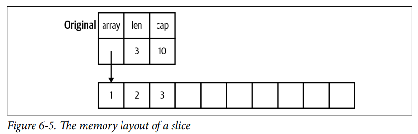

## Table of Contents
  - [数值类型](#%E6%95%B0%E5%80%BC%E7%B1%BB%E5%9E%8B)
    - [全部整数类型](#%E5%85%A8%E9%83%A8%E6%95%B4%E6%95%B0%E7%B1%BB%E5%9E%8B)
    - [书写不同进制的数字](#%E4%B9%A6%E5%86%99%E4%B8%8D%E5%90%8C%E8%BF%9B%E5%88%B6%E7%9A%84%E6%95%B0%E5%AD%97)
    - [数值类型的别名](#%E6%95%B0%E5%80%BC%E7%B1%BB%E5%9E%8B%E7%9A%84%E5%88%AB%E5%90%8D)
    - [选择哪一种整数类型?](#%E9%80%89%E6%8B%A9%E5%93%AA%E4%B8%80%E7%A7%8D%E6%95%B4%E6%95%B0%E7%B1%BB%E5%9E%8B)
    - [浮点数相关](#%E6%B5%AE%E7%82%B9%E6%95%B0%E7%9B%B8%E5%85%B3)
    - [什么是复数](#%E4%BB%80%E4%B9%88%E6%98%AF%E5%A4%8D%E6%95%B0)
  - [切片](#%E5%88%87%E7%89%87)
    - [数组](#%E6%95%B0%E7%BB%84)
    - [切片内存结构](#%E5%88%87%E7%89%87%E5%86%85%E5%AD%98%E7%BB%93%E6%9E%84)
    - [切片扩容系数](#%E5%88%87%E7%89%87%E6%89%A9%E5%AE%B9%E7%B3%BB%E6%95%B0)
    - [空切片和 nil 切片](#%E7%A9%BA%E5%88%87%E7%89%87%E5%92%8C-nil-%E5%88%87%E7%89%87)
    - [子切片共享同一底层数组](#%E5%AD%90%E5%88%87%E7%89%87%E5%85%B1%E4%BA%AB%E5%90%8C%E4%B8%80%E5%BA%95%E5%B1%82%E6%95%B0%E7%BB%84)
    - [小心对子切片调用 append](#%E5%B0%8F%E5%BF%83%E5%AF%B9%E5%AD%90%E5%88%87%E7%89%87%E8%B0%83%E7%94%A8-append)
    - [用 copy 函数复制切片](#%E7%94%A8-copy-%E5%87%BD%E6%95%B0%E5%A4%8D%E5%88%B6%E5%88%87%E7%89%87)
    - [切片指针有什么用](#%E5%88%87%E7%89%87%E6%8C%87%E9%92%88%E6%9C%89%E4%BB%80%E4%B9%88%E7%94%A8)
    - [拼接两个切片](#%E6%8B%BC%E6%8E%A5%E4%B8%A4%E4%B8%AA%E5%88%87%E7%89%87)
    - [二维切片或数组](#%E4%BA%8C%E7%BB%B4%E5%88%87%E7%89%87%E6%88%96%E6%95%B0%E7%BB%84)
  - [字符串](#%E5%AD%97%E7%AC%A6%E4%B8%B2)
    - [utf-8 编码](#utf8-%E7%BC%96%E7%A0%81)
    - [for-range 循环](#forrange-%E5%BE%AA%E7%8E%AF)
    - [rune 字面量](#rune-%E5%AD%97%E9%9D%A2%E9%87%8F)
    - [转成 []byte 或 []rune](#%E8%BD%AC%E6%88%90-byte-%E6%88%96-rune)
  - [Map](#Map)
    - [Map Key 必须是可比较类型](#Map-Key-%E5%BF%85%E9%A1%BB%E6%98%AF%E5%8F%AF%E6%AF%94%E8%BE%83%E7%B1%BB%E5%9E%8B)
    - [Empty Map 和 Nil Map](#Empty-Map-%E5%92%8C-Nil-Map)
    - [区分零值与未设置过值](#%E5%8C%BA%E5%88%86%E9%9B%B6%E5%80%BC%E4%B8%8E%E6%9C%AA%E8%AE%BE%E7%BD%AE%E8%BF%87%E5%80%BC)
    - [使用 Map 实现 Set](#%E4%BD%BF%E7%94%A8-Map-%E5%AE%9E%E7%8E%B0-Set)
    - [注意事项](#%E6%B3%A8%E6%84%8F%E4%BA%8B%E9%A1%B9)
  - [Struct](#Struct)
    - [结构体字面量](#%E7%BB%93%E6%9E%84%E4%BD%93%E5%AD%97%E9%9D%A2%E9%87%8F)
    - [匿名结构体](#%E5%8C%BF%E5%90%8D%E7%BB%93%E6%9E%84%E4%BD%93)
    - [匿名接口](#%E5%8C%BF%E5%90%8D%E6%8E%A5%E5%8F%A3)
  - [Data Allocation](#Data-Allocation)
    - [new 仅把内存置零](#new-%E4%BB%85%E6%8A%8A%E5%86%85%E5%AD%98%E7%BD%AE%E9%9B%B6)
    - [注意让类型的零值可用](#%E6%B3%A8%E6%84%8F%E8%AE%A9%E7%B1%BB%E5%9E%8B%E7%9A%84%E9%9B%B6%E5%80%BC%E5%8F%AF%E7%94%A8)
    - [构造函数是普通函数](#%E6%9E%84%E9%80%A0%E5%87%BD%E6%95%B0%E6%98%AF%E6%99%AE%E9%80%9A%E5%87%BD%E6%95%B0)
    - [make 初始化 slice/map/channel](#make-%E5%88%9D%E5%A7%8B%E5%8C%96-slicemapchannel)
    - [new 与 make 的区别](#new-%E4%B8%8E-make-%E7%9A%84%E5%8C%BA%E5%88%AB)
    - [new(T) 和 &T{} 的区别](#newT-%E5%92%8C-T-%E7%9A%84%E5%8C%BA%E5%88%AB)
  - [指针](#%E6%8C%87%E9%92%88)
    - [理解 nil](#%E7%90%86%E8%A7%A3-nil)
    - [各种复制陷阱](#%E5%90%84%E7%A7%8D%E5%A4%8D%E5%88%B6%E9%99%B7%E9%98%B1)
    - [区分零值和不提供值](#%E5%8C%BA%E5%88%86%E9%9B%B6%E5%80%BC%E5%92%8C%E4%B8%8D%E6%8F%90%E4%BE%9B%E5%80%BC)
    - [别返回 nil 表示数据不存在](#%E5%88%AB%E8%BF%94%E5%9B%9E-nil-%E8%A1%A8%E7%A4%BA%E6%95%B0%E6%8D%AE%E4%B8%8D%E5%AD%98%E5%9C%A8)
    - [栈上分配 vs 堆上分配](#%E6%A0%88%E4%B8%8A%E5%88%86%E9%85%8D-vs-%E5%A0%86%E4%B8%8A%E5%88%86%E9%85%8D)
    - [逃逸分析](#%E9%80%83%E9%80%B8%E5%88%86%E6%9E%90)

## 数值类型

### 全部整数类型

#### ➤ 取值范围

```go
func TestNumbers(t *testing.T) {
    var _ int8  // [-128, 127]
    var _ int16 // [-32768, 32767]
    var _ int32 // [-2^31, 2^31 - 1] 大约是 [负21亿, 正21亿]
    var _ int64 // [-2^63, 2^63 - 1]

    var _ uint8  // [0, 255]
    var _ uint16 // [0, 65535]
    var _ uint32 // [0, 2^32 - 1]    大约是 [0, 正42亿]
    var _ uint64 // [0, 2^64 - 1]
}
```

#### ➤ 类型转换

```go
func TestConversion(t *testing.T) {
    // 整数间的转换就是直接截取对应的位
    // 但如果被转换的数是有符号数, 那么它的符号位无限往左扩展
    i := 256       // 二进制为 1 0000 0000
    t.Log(int8(i)) // 截取低 8 位所以结果为 0

    n := int8(-1)    // 二进制为 1111 1111
    t.Log(uint8(n))  // 截取低 8 位所以结果是 255
    t.Log(uint16(n)) // 截取低 16 位, 但总共就 8 位啊, 所以把符号位 1 往左扩展可得 1111 1111 1111 1111
    t.Log(uint32(n)) //
}
```

#### ➤ 运行时不会自动检查运算溢出

```go
func TestOverflow(t *testing.T) {
    // 编译时, 那些常量计算, 会进行溢出检查, 比如 uint8(255) + 1 会编译错误
    // 运行时, 除非自己检查溢出, 否则溢出就溢出了, 不会有任何提示
    x := int8(127)
    one := int8(1)
    t.Log(x + one)   // 0111_111 + 1 = 1000_0000 再解释为 int8 就是 -128
    t.Log(x < x+one) // 没想到吧 x 不一定小于 x+1, 加一后值还变小了

    t.Log("------")
    t.Log(one << 7) // 左移 7 位从正数变成负数
    t.Log(one << 8) // 左移 8 位直接溢出, 只剩下 0
}
```

### 书写不同进制的数字

Integer literals are normally base ten, but different prefixes are used to indicate other bases:  

- `0b` for binary (base two), 
- `0o` for octal (base eight), 
- `0x` for hexadecimal (base sixteen). 
- 数字中可以用下划线, 比如 1_000 表示 1000,  另外 `0644` 也是八进制数，推荐写成 `0o644` 会更易懂

### 数值类型的别名

Go does have some special names for integer types. A `byte` is an alias for `uint8`. A `rune` is an alias for `int32` and is equivalent to `int32` in all ways. The second special name is `int`. On a 32-bit CPU, int is a 32-bit signed integer like an int32. On most 64-bit CPUs, int is a 64-bit signed integer, just like an int64.

Because `int` isn’t consistent from platform to platform, it is a compile-time error to assign, compare, or perform mathematical operations between an `int` and an `int32` or `int64` without a type conversion.

### 选择哪一种整数类型?

Given all of these choices, you might wonder when you should use each of them. There are three simple rules to follow:

1. If you are working with a binary file format or network protocol that has an integer of a specific size or sign, use the corresponding integer type.
2. If you are writing a library function that should work with any integer type, write a pair of functions, one with `int64` for the parameters and variables and the other with `uint64`.
3. <font color='#D05'>In all other cases, just use int</font>. Unless you need to be explicit about the size or sign of an integer for performance or integration purposes, use the `int` type. Consider any other type to be a premature optimization until proven otherwise.

第二条用 int64 和 uint64 是为了让函数能处理所有整数类型，这是 Go 1.18 之前的惯用写法 ( 现在可以用泛型了 )

> Using int64 and uint64 means that you can write the code once and let your callers use type conversions to pass values in and convert data that’s returned. You can see this pattern in the Go standard library with the functions `FormatInt` and `ParseInt` in the `strconv` package.

### 浮点数相关

一般推荐用 `float64` 而不是 `float32`. It also helps mitigate floating point accuracy issues since a `float32` only has six- or seven-decimal digits of precision. Don’t worry about the difference in memory size unless you have used the profiler to determine that it is a significant source of problems. 

> A floating point number cannot represent a decimal value exactly.  
> Do not use them to represent money or any other value that must have an exact decimal representation!

#### ➤ 整数除以 0 会 panic, 但浮点数除以 0 不会 panic、返回 Inf / -Inf / NaN

Floating point division has a couple of interesting properties. Dividing a nonzero floating point variable by 0 returns `+Inf` or `-Inf` (positive or negative infinity), depending on the sign of the number. Dividing a floating point variable set to 0 by 0 returns `NaN` (Not a Number).

#### ➤ 比较浮点数不能用 `==`、`!=`

While Go lets you use == and != to compare floats, don’t do it. Due to the inexact nature of floats, two floating point values might not be equal when you think they should be. Instead, define a maximum allowed variance and see if the difference between two floats is less than that.

### 什么是复数

There is one more numeric type and it is pretty unusual. Go has first-class support for `complex` numbers.  If you don’t know what complex numbers are, you are not the target audience for this feature; feel free to skip ahead. 所以可以先跳过.

## 切片

### 数组

golang 数组是一种值类型，数组本身的赋值和函数传参都是以整体复制的方式处理的.  
所以函数中修改数组，必须传数组指针，否则改掉的是拷贝，不会影响函数外面

<font color='#D05'>另外数组的长度是数组类型的一部分，两个不同长度的数组属于不同的类型</font>，这意味着

1. `[2]int` 无法赋值给 `[3]int`
2. 一个处理 [2]int 类型的函数只能处理 [2]int,  无法写出一个函数来处理任意长度的数组
3. 无法用一个变量来指定数组长度, 因为数组的长度必须在编译时确定

### 切片内存结构

Golang 切片的底层结构是一个 `reflect.SliceHeader` 结构体，它包含 length、capacity 和一个 array 指针

 

- 每个切片都有一个 capacity 字段，值为底层数组的长度
- 如果 len < cap 那么用 `append(slice, 123)` 添加元素时，会把元素放到空余位置，并返回新的 `reflect.SliceHeader`
- 通常会这么写: `slice = append(slice, 123)`，因为需要更新 `slice` 结构体的 `Len` 字段，否则看不到新添加的元素

#### ➤ 切片容量自动增长

If you try to add additional values when the length equals the capacity, the `append` function uses the Go runtime to allocate a new slice with a larger capacity. The values in the original slice are copied to the new slice, the new values are added to the end, and the new slice is returned. If you know how many things you plan to put into a slice, create the slice with the correct initial capacity. We do that with the `make([]int, 0, cap)` function.

```go
x := make([]int, 5)    // len:5, cap:5
x := make([]int, 0, 5) // len:0, cap:5, if len > cap, your program will panic at runtime.

// 新手可能会犯这个错误:
x := make([]int, 5)           // 这样创建的 slice 并不是空的,  它的长度和容量都为 5,  5 个元素都是零值
x = append(x, 10)             // 元素 10 会被添加到索引 5, 而不是索引 0
s := make([]int, 0, capacity) // 推荐这样写, 把 len 设为 0
```

### 切片扩容系数

- 小切片 ( cap < 256 ) 两倍扩容
- 大切片 ( cap >= 256 ) 则从两倍扩容**平滑过渡**到 1.25 倍扩容

可以加个条件断点，跟踪切片的扩容过程:

```go
func TestGrowSlice(t *testing.T) {
    s := make([]int, 233) // 故意用 233 的长度和容量
    s = append(s, 666)    // 方便给 runtime.growslice 加上条件断点: oldCap == 233
}

func nextslicecap(newLen, oldCap int) int {
    // ...

    // 发现阈值 256 和双倍扩容
    const threshold = 256
    if oldCap < threshold {
        return doublecap
    }
    for {
        // Transition from growing 2x for small slices to growing 1.25x for large slices. 
        // This formula gives a smooth-ish transition between the two.
        // 确实平滑啊，代入 256 得到下一个 cap 是 512，双倍扩容
        // 然后代入 512 得到下一个 cap 是 832，降到了 1.625 倍扩容
        newcap += (newcap + 3*threshold) >> 2
    }
}
```

### 空切片和 nil 切片

- You can create a slice using an empty slice literal: `var x = []int{}`. This creates a zero-length slice, which is non-nil (comparing it to `nil` returns `false`). 
- Otherwise, a `nil` slice works identically to a zero-length slice. 

- The only situation where a zero-length slice is useful is when converting a slice to JSON.

### 子切片共享同一底层数组

When you take a slice from a slice, you are not making a copy of the data. Instead, you now have two variables that are sharing memory. This means that *changes to an element in a slice affect all slices that share that element*. 

```go
// 从一个数组或 slice 创建另一个 slice 时,  并没有复制底层数组,  只是产生一个新的切片结构体
// 虽然每个子切片有独立的长度和容量信息,  但和源切片使用同一个底层数组
x := []int{1, 2, 3, 4}
y := x[:2]                   // y 反映切片的前两个元素
z := x[1:]                   // z 反映切片的后三个元素
z[0] = 333                   // 修改 z[0] 不止影响 z, 也会同时影响 x,y 切片
```

### 小心对子切片调用 append

```go
func 小心对子slice调用append() {
    x := []int{1, 2, 3, 4}
    y := x[:2]                          // [1, 2]
    z := x[1:]                          // [2, 3, 4]
    fmt.Println(cap(x), cap(y), cap(z)) // 4 4 3,  请问为什么 y 的容量是 4 而不是 2 ?

    y = append(y, 30)
    fmt.Println("y:", y) // [1 2 30]
    fmt.Println("x:", x) // [1 2 30 4],  请问为什么往 y 中添加元素会导致 x 中元素发生变化?
}
```

#### ➤ 为什么 y 的容量是 4 而不是 2

- 子切片容量 = 源切片容量 - 子切片在源切片中的偏移量
- 对于 `y` 切片来说，源切片的容量是 4，`y` 在源切片中的偏移量为 0，所以容量为 4 - 0 = 4

#### ➤ 为什么往 append(y, 30) 会导致 x 变化

- y 的长度为 2 容量为 4,  所以往 y 中添加元素时无需创建更大的数组,  把 30 放在索引 2 就行
- 因为 y 和 x 共享同一个底层数组,  所以 x 中索引为 2 的元素也会变成 30

#### ➤ full slice expression

*To avoid complicated slice situations, you should either never use append with a sub-slice or make sure that append doesn’t cause an overwrite by using a full slice expression*. The full slice expression includes a third part, which indicates the last position in the parent slice’s capacity that’s available for the subslice. Subtract the starting offset from this number to get the subslice’s capacity.

- 子切片 `slice[a:b:c]` 的容量为 `c - a`，与源切片共享 `[a, c)` 这个区间的内存

- 比如 `y := x[0:2:2]` 表示,  y 与源切片共享 [0, 2) 这块内存  
- 比如 `z := x[2:4:4]` 表示,  z 与源切片共享 [2, 4) 这块内存
- 如果 `slice[a:b:c]` 中 `b` 和 `c` 的值相等，那么子切片的 cap 一开始就满了，  
  所以调用 append 会触发扩容和复制，不再和源切片共享内存，所以能避免上面的问题

### 用 copy 函数复制切片

If you need to create a slice that’s independent of the original, use the built-in `copy` function. The copy function takes two parameters. The first is the destination slice and the second is the source slice. *It copies as many values as it can from source to destination*, limited by whichever slice is smaller, and returns the number of elements copied. The capacity of `x` and `y` doesn’t matter; it’s the length that’s important.

```go
func 使用copy函数复制切片() {
    x := []int{1, 2, 3, 4}
    y := make([]int, 2)
    num := copy(y, x) // 把 x 复制到 y, 这里 y 的长度更小只有 2
    fmt.Println(num)  // 所以 num 的值为 2 表示复制了 2 个元素

    // You could also copy from the middle of the source slice:
    copy(y, x[2:])
}
```

### 切片指针有什么用

- [Why pointers to slices are useful and how ignoring them can lead to tricky bugs](https://link.medium.com/tOemYJhIAub).  
- 如果只需修改切片中的元素,  那么函数参数用 `[]string` 类型  
- 如果需要增/删切片元素,  那么函数参数用 `*[]string` 类型,  否则外面会看不到增加/删除的元素

### 拼接两个切片

#### ➤ [参考回答](https://stackoverflow.com/a/58726780)

可以用 `c := append(a, b...)` 但这并不像 `a := append(a, b...)` 那样安全  
因为 c 和 a 不一定是独立的，有可能会共享内存，一般不希望 a 和 c 互相影响

```go
func main() {
    a := make([]int, 3, 6)
    b := []int{1, 1, 1}
    c := append(a, b...) // c 与 a 共用同一底层数组
    a[0] = 666           // 替换 a 中元素会影响到 c
    fmt.Println(c)       // c[0] 也变成了 666
}
```

#### ➤ 可以自己写个 `Append` 函数避免拼接结果和 `append(a, b...)` 中的 a 共享内存

```go
func Append(a, b []int) []int {
    newLen := len(a) + len(b)
    newSlice := make([]int, newLen, newLen*2) // Allocate double what's needed, for future growth.
    copy(newSlice, a)
    copy(newSlice[len(a):], b)
    return newSlice
}

func main() {
    a := make([]int, 3, 6)
    b := []int{1, 1, 1}
    c := Append(a, b)              // c 是重新分配的
    a[0] = 666                     //
    fmt.Println(c, len(c), cap(c)) // c[0] 依旧是 0, 不会被 a 影响
}
```

### 二维切片或数组

Go's arrays and slices are one-dimensional. To create the equivalent of a 2D array or slice, it is necessary to define an array-of-arrays or slice-of-slices, like this:

```go
type Transform [3][3]float64  // A 3x3 array, really an array of arrays.
type LinesOfText [][]byte     // A slice of byte slices.
```

Because slices are variable-length, it is possible to have each inner slice be a different length. That can be a common situation, as in our `LinesOfText` example: each line has an independent length.

```go
text := LinesOfText{
    []byte("Now is the time"),
    []byte("for all good gophers"),
    []byte("to bring some fun to the party."),
}
```

Sometimes it's necessary to allocate a 2D slice, a situation that can arise when processing scan lines of pixels, for instance. There are two ways to achieve this. One is to allocate each slice independently; the other is to allocate a single array and point the individual slices into it. Which to use depends on your application. If the slices might grow or shrink, they should be allocated independently to avoid overwriting the next line; if not, it can be more efficient to construct the object with a single allocation. For reference, here are sketches of the two methods. First, a line at a time:

```go
// Allocate the top-level slice.
picture := make([][]uint8, YSize) // One row per unit of y.
// Loop over the rows, allocating the slice for each row.
for i := range picture {
    picture[i] = make([]uint8, XSize)
}
```

只分配一个大切片，然后让各个子切片引用不同的位置，妙啊~

```go
// Allocate the top-level slice, the same as before.
picture := make([][]uint8, YSize) // One row per unit of y.
// Allocate one large slice to hold all the pixels.
pixels := make([]uint8, XSize*YSize) // Has type []uint8 even though picture is [][]uint8.
// Loop over the rows, slicing each row from the front of the remaining pixels slice.
for i := range picture {
    picture[i], pixels = pixels[:XSize], pixels[XSize:]
}
```


## 字符串

### utf-8 编码

1. `str[0]` 返回一个 `byte`，而不是一个字符，可以用 `for offset, char := range "字符串"` 按码点迭代
2. `len("🐶")` 返回字节个数 4,  `utf8.RuneCountInString("🐶")` 返回码点个数 1
3. 恐怖的是，[一个 character 可以由多个 code point 构成](https://github.com/rivo/uniseg#grapheme-clusters)，例如 `utf8.RuneCountInString("é́́")` 是 4


```go
func how_strings_work_in_go() {
    // You might think that a string in Go is made out of runes, but that’s not the case. 
    // Under the covers, Go uses a sequence of bytes to represent a string. 
    // string 就是一个 utf-8 编码的 byte array, 中文字符占三个字节、狗头占 4 个字节
    str := "你好🐶"
    for i := 0; i < len(str); i++ {
        fmt.Printf("%x ", str[i])
    }
    fmt.Println(str[:3])                     // 要前三个字节才能取出 '你' 这个字
    fmt.Println(utf8.RuneCountInString(str)) // len 返回的是字节数, 计算字符 (unicode码点) 个数要这样写

    // rune 类型是 int32 的别名,  所以 rune 存储的是 unicode 码点编号，而不是字符本身，
    // 如果你把 rune 传递给 fmt.Println，你会在输出中看到一个数字，而不是原始字符。
    fmt.Printf("狗头的 unicode 码点: 0x%x \n", '🐶')
    fmt.Printf("用百分号 c 打印 rune 类型: %c \n", '🐶')
}
```

### for-range 循环

For strings, the `range` does more work for you, breaking out individual Unicode code points by parsing the UTF-8. Erroneous encodings consume one byte and produce the replacement rune U+FFFD.

```go
for pos, char := range "日本\x80語" { // \x80 is an illegal UTF-8 encoding
    fmt.Printf("character %#U starts at byte position %d\n", char, pos)
}
```

prints

```bash
character U+65E5 '日' starts at byte position 0
character U+672C '本' starts at byte position 3
character U+FFFD '�' starts at byte position 6
character U+8A9E '語' starts at byte position 7
```

### rune 字面量

`Rune literals` represent characters and are surrounded by single quotes. Unlike many other languages, in Go single quotes and double quotes are not interchangeable. Rune literals can be written as 

- single Unicode characters ('a'), 
- 8-bit octal numbers ('\141'), 8-bit hexadecimal numbers ('\x61'), 
- 16-bit hexadecimal numbers ('\u0061'), 32-bit Unicode numbers ('\U00000061'). 
- There are also several backslash escaped rune literals, with the most useful ones being  
  newline ('\n'), tab('\t'), single quote ('\''), double quote ('\"'), and backslash ('\\').

### 转成 []byte 或 []rune

- 与切片类似、传递字符串参数时，不会复制底层数组，只需复制一下 `reflect.StringHeader`

- 然而 `string` 和 `[]byte` 的互相转换**可能会发生复制**，当 []byte 或 string 很长时有一定开销
- 另外 `string` 和 `[]rune` 的互相转换**必定会发生复制**，两者的内存结构都不一样，需要解码 utf8 并复制码点

```go
func TestString2Bytes(t *testing.T) {
    string2bytesWithoutCopy := func(str string) {
        if str == "" {
            return
        }
        d := unsafe.StringData(str)
        b := unsafe.Slice(d, len(str))
        t.Logf("%s\n", b)

        // Remember that you can't assign to b[n]. The memory is still read-only.
        // b[0] = 'F'
    }

    string2bytesWithoutCopy("foobar")

    func() {
        str := "abc"
        b := []byte(str)
        // 如果转换后的 b 没有被修改, 编译器可能会直接返回字符串的底层数组
        // b[0] = 'A'
        t.Log(unsafe.StringData(str) == unsafe.SliceData(b))
    }()
}
```

## Map

### Map Key 必须是可比较类型

The key for a map can be any comparable type. Go doesn’t require (or even allow) you to define your own hash algorithm or equality definition. Instead, the Go runtime that’s compiled into every Go program has code that implements hash algorithms for all types that are allowed to be keys.  

The key can be of any type for which the equality operator is defined, such as integers, floating point and complex numbers, strings, pointers, interfaces (as long as the dynamic type supports equality), structs and arrays. Slices cannot be used as map keys, because equality is not defined on them.

### Empty Map 和 Nil Map

```go
m := map[string]int{} // 这创建了一个空的 map
var m map[string]int  // 这是一个 nil map, 比较危险
```

A `nil` map behaves like an empty map when reading,  
but attempts to write to a `nil` map will cause a runtime panic; don't do that.

如果事先知道 map 中会有多少键值对, 为了减少底层数组的扩容开销  
You can use `make` to create a map with a default size: `ages := make(map[int]string, 10)`  
Maps created with `make` still have a length of 0, and they can grow past the initially specified size.  

### 区分零值与未设置过值

- When we try to read the value assigned to a map key that was never set,  
  the map returns the zero value for the map’s value type.

- 这个特性很方便，直接 `m["xxx"]++` 就行了，Java 的 `HashMap<String, Integer>` 则需要检测 null
- 为了判断 map 中是否设置过 xxx 这个键，可以用第二个返回值 ok，`v, ok = m["xxx"]`

### 使用 Map 实现 Set

例如 `intSet := map[int]bool{}`  

Go doesn’t include a set, but you can use a map to simulate some of its features. Use the key of the map for the type that you want to put into the set and use a `bool` for the value. If you need sets that provide operations like union, intersection, and subtraction, you can either write one yourself or use one of the many third-party libraries that provide the functionality.

Some people prefer to use `struct{}` for the value when a map is being used to implement a set. The advantage is that an empty struct uses zero bytes, while a boolean uses one byte. 缺点是看起来丑一点, and you need to use the comma ok idiom to check if a value is in the set.

### 注意事项

- 读取 nil map 返回零值，写入 nil map 则会 panic，所以像这样记得初始化 `m := make(map[int]int, 123)`
- 读写 nil slice 都会 panic，但 `append` 支持往 nil slice 添加元素
- 不要依赖 map 的迭代顺序: Each map iteration will produce different results.

## Struct

### 结构体字面量

A `struct literal` can be specified as a comma-separated list of values for the fields inside of braces:

```go
// When using this struct literal format, a value for every field in the struct must be specified, 
// and the values are assigned to the fields in the order they were declared in the struct definition.
julia := person{ "Julia", 40, "cat"}

// 上面的形式不推荐使用，调一下字段顺序就全乱了，一般这种形式用的更多
var p = person{
    age: 17,
    name: "ichigo",
}
```

### 匿名结构体

```go
var person struct{ name string }             // person 变量的类型为匿名结构体
person := struct{ name string }{"ichigo"}    // 把匿名结构体的 name 字段初始化为 ichigo
```

There are two common situations where anonymous structs are handy. 

1. The first is when you translate external data into a struct or a struct into external data (like JSON or protocol buffers). This is called unmarshaling and marshaling data. 
2. Writing tests is another place where anonymous structs pop up.

#### ➤ 匿名结构体和 Template Data

```go
func TestAnonymousData(t *testing.T) {
    ts, _ := template.New("").Parse("{{ .Name }}, {{ .Age }}\n")

    // struct{...} 和 []int 一样, 都是 type literal, 通常会用 type Data struct{...} 给类型命名
    // 但这里使用匿名结构体给模板提供数据, 虽然用 map[string]any 也行, 但结构体更轻量且类型安全
    data := struct {
        Name string
        Age  int
    }{"Homura", 18}

    if err := ts.Execute(os.Stdout, data); err != nil {
        panic(err)
    }
}
```

#### ➤ 匿名结构体和 JSON

```go
func TestAnonymousStructAndJSON(t *testing.T) {
    // 使用匿名结构体生成一段 json
    b, err := json.Marshal(struct {
        Name string `json:"name"`
        Age  int    `json:"age"`
    }{"Homura", 18})
    if err != nil {
        panic(err)
    }
    fmt.Println(string(b))

    // 从 json 中提取感兴趣的 name 字段
    b = []byte(`{"name":"Homura","age":18}`)
    var data struct {
        Name string `json:"name"`
    }
    if err := json.Unmarshal(b, &data); err != nil {
        panic(err)
    }
    fmt.Println("i love", data.Name)

    // 匿名结构体支持嵌套
    var data2 struct {
        ID     int `json:"id"`
        Person struct {
            Name string `json:"name"`
            Age  int    `json:"age"`
        } `json:"person"`
    }
    b, err = json.Marshal(data2)
    if err != nil {
        panic(err)
    }
    fmt.Println(string(b))
}
```

#### ➤ 用匿名结构体实现接口

```go
func TestAnonymousStructAndInterface(t *testing.T) {
    StringReadCloser := func(str string) io.ReadCloser {
        return struct {
            io.Reader // 嵌入 Reader 接口
            io.Closer // 嵌入 Closer 接口
        }{strings.NewReader(str), io.NopCloser(nil)}
    }

    // 另外也可以用 rc := io.NopCloser(strings.NewReader("hello world"))
    rc := StringReadCloser("Homura")

    b, err := io.ReadAll(rc)
    if err != nil {
        panic(err)
    }
    defer rc.Close()
    fmt.Println(string(b))
}
```

### 匿名接口

最常用的匿名接口是 `interface{}`，可以用匿名接口判断类型是否有 xxx 方法:

```go
func TestAnonymousInterface(t *testing.T) {
    err := errors.New("something wrong")
    if err, ok := err.(interface{ Error() string }); ok {
        fmt.Println(err.Error())
    }
}
```

## Data Allocation

### new 仅把内存置零

Go has two allocation primitives, the built-in functions `new` and `make`. They do different things and apply to different types, which can be confusing, but the rules are simple. Let's talk about `new` first. It's a built-in function that allocates memory, but unlike its namesakes in some other languages it does not *initialize* the memory, it only *zeros* it. That is, `new(T)` allocates zeroed storage for a new item of type `T` and returns its address, a value of type `*T`. 

```go
func TestNew(t *testing.T) {
    x := new(int)         // returns a pointer to a zero value instance of the provided type
    fmt.Println(x == nil) // false
    fmt.Println(*x)       // zero value of int is 0
}
```

### 注意让类型的零值可用

Since the memory returned by `new` is zeroed, it's helpful to arrange when designing your data structures that the zero value of each type can be used without further initialization. This means a user of the data structure can create one with `new` and get right to work. For example, the documentation for `bytes.Buffer` states that "the zero value for `Buffer` is an empty buffer ready to use." Similarly, `sync.Mutex` does not have an explicit constructor or `Init` method. Instead, the zero value for a `sync.Mutex` is defined to be an unlocked mutex. Sometimes the zero value isn't good enough and an initializing constructor is necessary.

### 构造函数是普通函数

- Golang 中的构造函数是普通函数，通常用 `New` 作为前缀，例如 `ring.NewRing()`  

- 注意 ring 包只导出了 `ring.Ring` 一个类型，并且包名也叫 ring，所以函数名可以简化为 `ring.New()`

### make 初始化 slice/map/channel

The built-in function `make(T, args)` serves a purpose different from `new(T)`. It creates slices, maps, and channels only, and it returns an *initialized* (not *zeroed*) value of type `T` (not `*T`). The reason for the distinction is that these three types represent, under the covers, references to data structures that must be initialized before use. For slices, maps, and channels, `make` initializes the internal data structure and prepares the value for use. For instance:

```go
s := make([]int, 10, 100) // 创建一个切片, 长度为 10, 容量为 100
s := new([]int)           // 创建一个指针, 指向 nil slice
```

### new 与 make 的区别

- `make` 仅适用于创建 map, slice, channel，`make` 返回的不是指针
- `new` 返回一个指针，指向类型的零值，比如 `new([]int)` 返回的指针指向 `nil`，因为切片类型的零值是 `nil`

```go
var p *[]int = new([]int)       // allocates slice structure; *p == nil; rarely useful
var v  []int = make([]int, 100) // the slice v now refers to a new array of 100 ints

var p *[]int = new([]int)       // Unnecessarily complex:
*p = make([]int, 100, 100)
```

### new(T) 和 &T{} 的区别

- [Is there a difference between](https://stackoverflow.com/questions/13244947/is-there-a-difference-between-new-and-regular-allocation) `new(Point)` and `&Point{}` ?
- `new()` is the only way to get a pointer to an unnamed integer or other basic type.   
- You can write `p := new(int)` but you can't write `p := &int{0}`. Other than that, it's a matter of preference.

## 指针

### 理解 nil

`nil` is slightly different from the `null` that’s found in other languages. In Go, `nil` is an identifier that represents the lack of a value for some types. Like the untyped numeric constants we saw in the previous chapter, *nil has no type*, so it can be assigned or compared against values of different types.

`pointer`、`slice`、`map`、`function`、`channel`、`interface` 变量的零值都是 `nil`.  `nil` is an untyped identifier that represents the lack of a value for certain types. Unlike NULL in C, `nil` is not another name for 0; you can’t convert it back and forth with a number. 

**Before dereferencing a pointer, you must make sure that the pointer is non-nil.**  
Your program will panic if you attempt to dereference a `nil` pointer.

### 各种复制陷阱

#### ➤ 若需要在函数中为切片增删元素，参数要用切片指针，例如 `AddItem(s *[]int)`

```go
type IntList []int

func TestAddItem(t *testing.T) {
    var s IntList
    AddItem(&s, 1)
    AddItem(&s, 2)
    AddItem(&s, 3)
    t.Logf("%T %v", s, s)
}

func AddItem[S ~[]E, E any](s *S, item E) {
    *s = append(*s, item)
}
```

#### ➤ for-range 取出来的东西是拷贝，想改记得用下标

```go
func TestSliceOfStructs(t *testing.T) {
    cs := []Character{
        {Name: "Cloud", From: "FF7"},
        {Name: "Tifa", From: "FF7"},
    }

    // 注意 for-range 取出来的东西是拷贝
    for i, c := range cs {
        c.From = "Final Fantasy 7" // 这样改无效
        cs[i].Age = 21             // 想改记得用下标
    }
    t.Log(cs)

}
```

#### ➤ 若想修改 `map[string]Data` 中的 Data，需要重新赋值

You are storing a struct by value which means that accession of that struct in the map gives you a copy of the value. This is why when you modify it, the struct in the map remains unmutated until you overwrite it with the new copy.

```go
func TestMapOfValues(t *testing.T) {
    var c = Character{Name: "Cloud", From: "FF7", Age: 21}
    var mapOfValues = map[string]Character{"Cloud": c}
    var mapOfPointers = map[string]*Character{"Cloud": &c}

    mapOfValues["Cloud"].From = "Final Fantasy 7"   // 编译错误
    mapOfPointers["Cloud"].From = "Final Fantasy 7" // 改用结构体指针, 一切正常
    mapOfPointers["Tifa"].From = "Final Fantasy 7"  // 当然用指针类型得小心 nil 指针!

    temp := mapOfValues["Cloud"] // 这样也行,  复制一份出来,  改完了再赋值回去
    temp.Name = "Final Fantasy 7"
    mapOfValues["Cloud"] = temp
}
```

#### ➤ 不要复制 `sync.WaitGroup`、`sync.Mutex` 之类的东西

```go
func TestCopySyncStruct(t *testing.T) {
    var wg sync.WaitGroup
    wg.Add(1)
    go doWork(wg) // 此处会复制 wg，所以现在有两把不同的锁
    wg.Wait()     // 发生死锁
    fmt.Println("all done")
}

// 不要这么做! 复制锁会让锁失去意义, 函数参数记得改用指针类型 *sync.WaitGroup
func doWork(wg sync.WaitGroup) {
    defer wg.Done()
    fmt.Println("do some work")
}
```

#### ➤ 使用 value receiver 会隐式复制结构体

```go
type SafeCounter struct {
    mu sync.Mutex
    v  map[string]int
}

func (c SafeCounter) Inc(key string) {
    c.mu.Lock()
    defer c.mu.Unlock()
    // Lock so only one goroutine at a time can access the map c.v.
    c.v[key]++
}

func (c SafeCounter) Value(key string) int {
    c.mu.Lock()
    defer c.mu.Unlock()
    // Lock so only one goroutine at a time can access the map c.v.
    return c.v[key]
}

// 解决办法: 要么 mu 字段改成指针, 要么方法改用 pointer receiver
```


### 区分零值和不提供值

The other common usage of pointers in Go is to indicate the difference between a variable or field that’s been assigned the zero value and a variable or field that hasn’t been assigned a value at all. If this distinction matters in your program, use a `nil` pointer to represent an unassigned variable or struct field.

在解析 JSON 请求时,  如果要区分 `age: 0` 和 `根本没传 age 字段` 这两种情况  
需要把 Person 结构体的 Age 字段设为 *int 类型，因为指针类型的零值是 nil，若 Age 等于 nil 说明没传  
如果要区分 `age: null` 和 `不传 age 字段`，参考 [JSON field set to null vs field not there](https://stackoverflow.com/questions/36601367/json-field-set-to-null-vs-field-not-there)

### 别返回 nil 表示数据不存在

其他语言返回 null 表示数据不存在，但 golang 使用第二个返回值 (类型为 bool/error) 来表示数据不存在

Rather than return a pointer set to `nil` from a function, use the comma ok idiom that we saw for maps and return a value type and a boolean. Resist the temptation to use a pointer field to indicate no value. While a pointer does provide a handy way to indicate no value, if you are not going to modify the value, you should use a value type instead, paired with a boolean.

### 栈上分配 vs 堆上分配

#### ➤ 为什么栈上分配效率高

Allocating memory on the stack is fast and simple. A stack pointer tracks the last location where memory was allocated; allocating additional memory is done by moving the stack pointer. When a function is invoked, a new stack frame is created for the function’s data. *Local variables are stored on the stack, along with parameters passed into a function*. When a function exits, its return values are copied back to the calling function via the stack and the stack pointer is moved back to the beginning of the stack frame for the exited function, deallocating all of the stack memory that was used by that function’s local variables and parameters.  

```markdown
- 虽然堆和栈都是内存，在硬件上没有差异，但使用方式(or算法)不同所以有性能差异
1. 在内存分配和垃圾回收方面，栈更简单，分配时不会遇到内存碎片，清理时不用管标记和回收
2. 栈的内存局部性更好，比如高频使用同一变量，所以缓存命中率更高
3. 每个线程有自己的栈，一般只能自己读写，而堆是所有线程共享的，经常需要并发同步
```

#### ➤ 栈上分配的一个前提是，能在编译器确定对象的大小

To store something on the stack, you have to know exactly how big it is at compile time. When you look at the *value types in Go (primitive values, arrays, and structs)*, they all have one thing in common: we know exactly how much memory they take at compile time. Because their sizes are known, they can be allocated on the stack instead of the heap.

#### ➤ `new(obj)` 创建的对象可能在栈上分配

In order to allocate the data the pointer points to on the stack, several conditions must be true.

1. It must be a local variable whose data size is known at compile time. 
2. The pointer cannot be returned from the function. 
3. If the pointer is passed into a function, the compiler must be able to ensure that these conditions still hold. 

If the size isn’t known, you can’t make space for it by simply moving the stack pointer. If the pointer variable is returned, the memory that the pointer points to will no longer be valid when the function exits.

```go
func count指针所指对象在栈上分配() *int {
    count := new(int)
    if count != nil {
        fmt.Println("haha")
    }    
    return nil // 如果 return count 那么 new(int) 就会在堆上分配
}
```

#### ➤ `new(obj)` 也可能在堆上分配

A common source of bugs in C programs is returning a pointer to a local variable. In C, this results in a pointer pointing to invalid memory. The Go compiler is smarter. When it sees that a pointer to a local variable is returned, the local variable’s value is stored on the heap.

When the compiler determines that the data can’t be stored on the stack, we say that the data the pointer points to *escapes the stack* and the compiler stores the data on the heap. The heap is the memory that’s managed by the garbage collector (or by hand in languages like C and C++).   

#### ➤ 为什么有时候 heap 效率要低一点 ?

Any data that’s stored on the heap is valid as long as it can be tracked back to a pointer type variable on a stack. Once there are no more pointers pointing to that data (or to data that points to that data), the data becomes garbage and it’s the job of the garbage collector to clear it out.

What’s so bad about storing things on the heap? There are two problems related to performance. 

1. First is that the garbage collector takes time to do its work. It isn’t trivial to keep track of all of the available chunks of free memory on the heap or tracking which used blocks of memory still have valid pointers. This is time that’s taken away from doing the processing that your program is written to do.  
2. The second problem deals with the nature of computer hardware. RAM might mean “random access memory,” but the fastest way to read from memory is to read it sequentially. A slice of structs in Go has all of the data laid out sequentially in memory. This makes it fast to load and fast to process. A slice of pointers to structs (or structs whose fields are pointers) has its data scattered across RAM, making it far slower to read and process.  

### 逃逸分析

#### ➤ 概述

1. 什么是逃逸分析? 就是编译器判断「 对象应该在栈上分配，还是堆上分配 」
2. 为什么要介意对象在哪分配? 因为栈上分配效率高性能好，而过度的堆上分配会降低性能，增加垃圾回收器负担

#### ➤ 查看对象是否发生逃逸

```bash
# -m    print optimization decisions
# -l    disable inlining
# -m=2  打印更详细的信息
go build -gcflags '-m -l' main.go
go build -gcflags '-m=2 -l' main.go

# 会看到如下两行信息，都是指对象在堆上分配
new(int) escapes to heap
moved to heap: i
```

#### ➤ 局部变量的指针逃逸

函数返回后，局部变量就全都清理掉了，所以指向局部变量的指针也会失效  
只有把这些对象改成堆上分配，才能让函数返回的指针有意义

```go
var global *int

func main() {
    returnLocalPointer()
    storePointerInGlobal()
}

// (1) 返回局部变量的指针
func returnLocalPointer() *int {
    var i int
    return &i
}

// (2) 把局部变量的指针赋值给全局变量
func storePointerInGlobal() {
    var o int
    global = &o
}
```

#### ➤ 闭包

```go
// 返回了闭包, 然后闭包捕获了局部变量 i, 所以 i 会逃逸
func returnClosure() func() {
    var i int
    return func() {
        i++
    }
}
```

#### ➤ 堆对象引用栈对象

```go
var data struct {
    Interface any
    Pointer   *int
    Value     int
}

// 堆对象引用栈对象时会发生逃逸
func main() {
    var num1 int
    var num2 int
    var num3 = new(int)
    data.Interface = num1 // 堆对象通过接口引用栈对象, 所以逃逸
    data.Pointer = &num2  // 堆对象通过指针引用栈对象, 所以逃逸
    data.Value = *num3    // 使用值, 没有引用关系, 所以不逃逸
}
```

#### ➤ 想了解 leak、escape、move 可以[参考这里](https://github.com/akutz/go-interface-values/tree/main/docs/03-escape-analysis)
