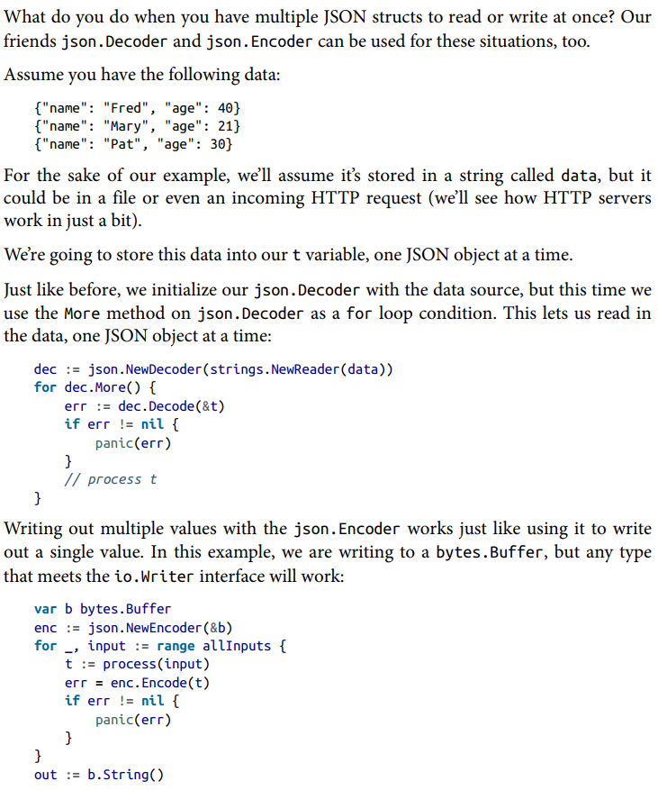

## Table of Contents
  - [fmt](#fmt)
    - [方便的 %v](#%E6%96%B9%E4%BE%BF%E7%9A%84-v)
    - [Stringer 接口](#Stringer-%E6%8E%A5%E5%8F%A3)
  - [io](#io)
    - [Reader/Writer 概述](#ReaderWriter-%E6%A6%82%E8%BF%B0)
    - [如何使用 Reader 接口](#%E5%A6%82%E4%BD%95%E4%BD%BF%E7%94%A8-Reader-%E6%8E%A5%E5%8F%A3)
    - [从字符串或Gzip文件创建 Reader](#%E4%BB%8E%E5%AD%97%E7%AC%A6%E4%B8%B2%E6%88%96Gzip%E6%96%87%E4%BB%B6%E5%88%9B%E5%BB%BA-Reader)
    - [其他 io 函数和工具](#%E5%85%B6%E4%BB%96-io-%E5%87%BD%E6%95%B0%E5%92%8C%E5%B7%A5%E5%85%B7)
    - [为现有类型添加方法、以实现接口](#%E4%B8%BA%E7%8E%B0%E6%9C%89%E7%B1%BB%E5%9E%8B%E6%B7%BB%E5%8A%A0%E6%96%B9%E6%B3%95%E4%BB%A5%E5%AE%9E%E7%8E%B0%E6%8E%A5%E5%8F%A3)
  - [time](#time)
    - [Parse / Format / Zone](#Parse--Format--Zone)
    - [time.Duration](#timeDuration)
    - [time.Time](#timeTime)
    - [Monotonic Time](#Monotonic-Time)
    - [Timers and Timeouts](#Timers-and-Timeouts)
  - [json](#json)
    - [Use Struct Tags to Add Metadata](#Use-Struct-Tags-to-Add-Metadata)
    - [Unmarshaling and Marshaling](#Unmarshaling-and-Marshaling)
    - [JSON, Readers, and Writers](#JSON-Readers-and-Writers)
    - [Encoding and Decoding JSON Streams](#Encoding-and-Decoding-JSON-Streams)
    - [Custom JSON Parsing](#Custom-JSON-Parsing)
    - [哪些类型或值不能被序列化?](#%E5%93%AA%E4%BA%9B%E7%B1%BB%E5%9E%8B%E6%88%96%E5%80%BC%E4%B8%8D%E8%83%BD%E8%A2%AB%E5%BA%8F%E5%88%97%E5%8C%96)
    - [关于 time.Time 的注意事项](#%E5%85%B3%E4%BA%8E-timeTime-%E7%9A%84%E6%B3%A8%E6%84%8F%E4%BA%8B%E9%A1%B9)
    - [json.RawMessage 有什么用](#jsonRawMessage-%E6%9C%89%E4%BB%80%E4%B9%88%E7%94%A8)
  - [net/http](#nethttp)
    - [HTTP Client](#HTTP-Client)
  - [os](#os)
    - [os/exec](#osexec)
  - [sort](#sort)
    - [sort.Slice](#sortSlice)
  - [log/slog](#logslog)
    - [入门](#%E5%85%A5%E9%97%A8)
    - [概述](#%E6%A6%82%E8%BF%B0)
    - [日志级别](#%E6%97%A5%E5%BF%97%E7%BA%A7%E5%88%AB)
    - [属性分组](#%E5%B1%9E%E6%80%A7%E5%88%86%E7%BB%84)
    - [Context](#Context)
    - [LogValuer](#LogValuer)

We can’t cover all of the standard library packages, and luckily, we don’t have to, as there are many excellent sources of information on the standard library, [starting with the documentation](https://pkg.go.dev/std). Instead, we’ll focus on several of the most important packages and how their design and use demonstrate the principles of idiomatic Go. Some packages (errors, sync, context, testing, reflect, and unsafe) are covered in their own chapters. In this chapter, we’ll look at Go’s built-in support for I/O, time, JSON, and HTTP.

Moreover, many of the packages contain working, self-contained executable examples you can run directly from the [golang.org](https://golang.org/) web site, such as [this one](https://go.dev/pkg/strings/#example_Map) (if necessary, click on the word "Example" to open it up). If you have a question about how to approach a problem or how something might be implemented, the documentation, code and examples in the library can provide answers, ideas and background.

## fmt

### 方便的 %v

If you just want the default conversion, such as decimal for integers, you can use the catchall format `%v` (for “value”); the result is exactly what `Print` and `Println` would produce. Moreover, that format can print *any* value, even arrays, slices, structs, and maps.

```go
var c = Character{Name: "Cloud", From: "FF7", Age: 21}
fmt.Printf("%v\n", timeZone)   // 等价于 fmt.Println(timeZone)
fmt.Printf("%+v\n", c)         // 打印结构体时带上字段名
fmt.Printf("%#v\n", c)         // prints the value in full Go syntax.
```

### Stringer 接口

如果 `User` 类型有个 `time.Time` 字段,  那么直接用 `fmt` 打印会很丑,  
可以实现 `Stringer` 接口,  然后 `fmt.Println` 就会调用这个接口把 `User` 转成 `string`

```go
type Character struct {
    Name string
    From string
    Age  int
}
func (c Character) String() string {
    return fmt.Sprintf("(%q, %q, %v)", c.Name, c.From, c.Age)
    // return fmt.Sprintf("%v", c)  // 别这样，会无限递归，fmt 处理 %s/%v/%q 时又会调用 String()
}
func main() {
    var c = Character{Name: "Cloud", From: "FF7", Age: 21}
    fmt.Println(c)
}
```

## io

### Reader/Writer 概述

For a program to be useful, it needs to read in and write out data. The heart of Go’s input/output philosophy can be found in the `io` package. In particular, two interfaces defined in this package are probably the second and third most-used interfaces in Go: `io.Reader` and `io.Writer`. (What’s number one? That’d be `error`). Both io.Reader and io.Writer define a single method:

```go
type Reader interface {
    Read(p []byte) (n int, err error)
}

type Writer interface {
    Write(p []byte) (n int, err error)
}
```

The `Write` method on the `io.Writer` interface takes in a slice of bytes, which are written to the interface implementation. It returns the number of bytes written and an error if something went wrong. 

The `Read` method on `io.Reader` is more interesting. Rather than return data through a return parameter, a slice input parameter is passed into the implementation and modified. Up to `len(p)` bytes will be written into the slice. The method returns the number of bytes written.

### 如何使用 Reader 接口

This might seem a little strange. You might expect this: `Read() ([]byte, error)`. There’s a very good reason why `io.Reader` is defined the way it is. Let’s write a function that’s representative of how to work with an io.Reader to understand:  

```go
func countLetters(r io.Reader) (map[string]int, error) {
    buf := make([]byte, 2048)
    out := map[string]int{}
    for {
        n, err := r.Read(buf)       // 重用一个 buffer,  避免多次分配内存
        for _, b := range buf[:n] { // 只有 buf[:n] 这个范围是有效数据
            if (b >= 'A' && b <= 'Z') || (b >= 'a' && b <= 'z') {
                out[string(b)]++
            }
        }
        if err == io.EOF { // 正常结束
            return out, nil
        }
        if err != nil { // 遇到错误
            return nil, err
        }
    }
}
```

(1) First, we create our buffer once and reuse it on every call to `r.Read`. This allows us to use a single memory allocation to read from a potentially large data source. If the `Read` method were written to return a `[]byte`, it would require a new allocation on every single call. Each allocation would end up on the heap, which would make quite a lot of work for the garbage collector. By passing in a slice to `io.Reader`, memory allocation is under the control of the developer.

(2) Second, we use the `n` value returned from `r.Read` to know how many bytes were written to the buffer and iterate over a subslice of our buf slice, processing the data that was read.  

(3) Finally, we know that we’re done reading from `r` when the error returned from `r.Read` is `io.EOF`. This error is a bit odd, in that it isn’t really an error. It indicates that there’s nothing left to read from the `io.Reader`. When `io.EOF` is returned, we are finished processing and return our result.  

There is one unusual thing about the `Read` method in `io.Reader`. In most cases when a function or method has an error return value, we check the error before we try to process the nonerror return values. We do the opposite for `Read` *(指没有检查 err 就使用了返回值)* because there might have been bytes returned before an error was triggered by the end of the data stream or by an unexpected condition.

### 从字符串或Gzip文件创建 Reader

Because `io.Reader` and `io.Writer` are such simple interfaces, they can be implemented many different ways. We can create an `io.Reader` from a string using the `strings.NewReader` function:

```go
func 从字符串创建Reader() {
    s := "The quick brown fox jumped over the lazy dog"
    sr := strings.NewReader(s)
    counts, err := countLetters(sr)
    fmt.Println(counts, err)
}
```

#### ➤ 装饰器模式指 decorator 拦截了函数调用、不改变对外接口、也不改变函数本身，但额外多了一层逻辑

Implementations of `io.Reader` and `io.Writer` are often chained together in a decorator pattern. Because countLetters depends on an `io.Reader`, we can use the exact same `countLetters` function to count English letters in a gzip-compressed file. First we write a function that, when given a filename, returns a `*gzip.Reader`:  

```go
func buildGZipReader(fileName string) (*gzip.Reader, func(), error) {
    r, err := os.Open(fileName)
    if err != nil {
        return nil, nil, err
    }
    gr, err := gzip.NewReader(r) // gzip.Reader 的输入是 io.Reader
    if err != nil {              // gzip.Reader 的作用是把 gzip 字节流解码成原始字节流
        return nil, nil, err     // gzip.Reader 也实现了 io.Reader 接口,  所以可以传给
                                 // countLetters 函数,  实现对 gzip 文件的计数
    }
    return gr, func() {
        _ = gr.Close()
        _ = r.Close()
    }, nil
}
```

*This function demonstrates the way to properly wrap types that implement io.Reader*. We create an `*os.File` (which meets the `io.Reader` interface), and after making sure it’s valid, we pass it to the `gzip.NewReader` function, which returns a `*gzip.Reader` instance. If it is valid, we return the `*gzip.Reader` and a closer closure that properly cleans up our resources when it is invoked. Since `*gzip.Reader` implements `io.Reader`, we can use it with `countLetters` just like we used the `*strings.Reader` previously:  

```go
func countGzipLetters() error {
    r, closer, err := buildGZipReader("my_data.txt.gz")
    if err != nil { // ①检查错误
        return err
    }
    defer closer() // ②确认没有错误后 defer closer()

    counts, err := countLetters(r)
    if err != nil {
        return err
    }
    fmt.Println(counts)
    return nil
}
```

### 其他 io 函数和工具

There’s a standard function in the io package for copying from an io.Reader to an io.Writer, `io.Copy`. There are other standard functions for adding new functionality to existing io.Reader and io.Writer instances. These include:  

- `io.MultiReader` returns an io.Reader that reads from multiple io.Reader instances, one after another.  

- `io.LimitReader` returns an io.Reader that only reads up to a specified number of bytes from the supplied io.Reader.  
- `io.MultiWriter` returns an io.Writer that writes to multiple io.Writer instances at the same time.  

The `io.Seeker` interface is used for random access to a resource. The `io.Closer` interface is implemented by types like os.File that need to do cleanup when reading or writing is complete. Usually, Close is called via a defer:

```go
func 打开和关闭文件(filename string) error {
    f, err := os.Open(filename)
    if err != nil {
        return err
    }
    defer f.Close() // 确认没有错误后使用 defer 关闭文件
    return nil      
}
```

#### ➤ 不要在循环里用 defer、推荐手动关闭、因为 defer 与块作用域无关

*If you are opening the resource in a loop, do not use defer*, as it will not run until the function exits. Instead, you should call `Close` before the end of the loop iteration. If there are errors that can lead to an exit, you must call `Close` there, too.  

#### ➤ 推荐用 io.ReadCloser 这样的整合接口而不是用 os.File 作为参数,  因为前者更通用、并且意图更清晰

The io package defines interfaces that combine these four interfaces in various ways. They include io.ReadCloser, io.ReadSeeker, io.ReadWriteCloser, io.ReadWrite Seeker, io.ReadWriter, io.WriteCloser, and io.WriteSeeker. Use these interfaces to specify what your functions expect to do with the data. For example, rather than just using an `os.File` as a parameter, use the interfaces to specify exactly what your function will do with the parameter. Not only does it make your functions more general purpose, it also makes your intent clearer.

#### ➤ 小文件可以用 ioutil、大文件应该用 bufio，( ioutil 已弃用，可以改用 io.ReadAll() 或 os.ReadFile()

The `ioutil` package provides some simple utilities for things like reading entire `io.Reader` implementations into byte slices at once, reading and writing files, and  working with temporary files. The `ioutil.ReadAll`, `ioutil.ReadFile`, and `ioutil.WriteFile` functions are fine for small data sources, *but it’s better to use the Reader, Writer, and Scanner in the bufio package to work with larger data sources*.

### 为现有类型添加方法、以实现接口

One of the more clever functions in `io` demonstrates a pattern for adding a method to a Go type. If you have a type that implements io.Reader but not io.Closer (such as strings.Reader) and need to pass it to a function that expects an io.ReadCloser, pass your `io.Reader` into `io.NopCloser` and get back a type that implements `io.ReadCloser`. If you look at the implementation, it’s very simple:  

```go
func NopCloser(r io.Reader) io.ReadCloser {   // 构造函数，接受 io.Reader 返回 io.ReadCloser
    if _, ok := r.(WriterTo); ok {
        return nopCloserWriterTo{r}
    }
    return nopCloser{r}
}

type nopCloser struct {
    io.Reader                                  // 嵌入 io.Reader 获得原类型的 Read 方法
}

func (nopCloser) Close() error { return nil }  // 添加额外的 Close 方法实现 io.Closer
```

**Any time you need to add additional methods to a type so that it can meet an interface, use this embedded type pattern**.

## time

### Parse / Format / Zone

```go
func TestFormat(tt *testing.T) {
    t := time.Now()
    fmt.Println("两者相等            : ", time.DateTime == "2006-01-02 15:04:05")
    fmt.Println("自定义格式          : ", t.Format("2006年1月2日 15点04分"))
    fmt.Println("RFC3339             : ", t.Format(time.RFC3339))
    fmt.Println("time.DateTime       : ", t.Format(time.DateTime))
    fmt.Println("time.DateOnly       : ", t.Format(time.DateOnly))
    fmt.Println("time.TimeOnly       : ", t.Format(time.TimeOnly))
}

func TestParse(tt *testing.T) {
    // 因为时间字符串里不提供时区信息, 所以时区字段是零值, 也就是 UTC 时区
    t, err := time.Parse(time.DateTime, "7777-07-07 07:07:07")
    if err != nil {
        tt.Fatalf(err.Error())
    }
    fmt.Println(t.Zone())

    // 解析不带时区的字符串时, 可指定时区信息, 用 time.Local 表示使用系统时区
    loc, _ := time.LoadLocation("Asia/Shanghai")
    t, err = time.ParseInLocation(time.DateTime, "7777-07-07 07:07:07", loc)
    t, err = time.ParseInLocation(time.DateTime, "7777-07-07 07:07:07", time.Local)
}

func TestToOtherTimeZone(tt *testing.T) {
    t := time.Date(2222, 2, 2, 0, 0, 0, 0, time.UTC)
    loc, _ := time.LoadLocation("Asia/Shanghai")
    fmt.Println(t)
    fmt.Println(t.In(loc)) // 从 UTC 转成中国时区, 时间加了 8 小时
}

func TestLoadTimeZone(t *testing.T) {
    var cst *time.Location
    if cst == nil {
        cst, _ = time.LoadLocation("Asia/Shanghai") // 这种方式需要读取系统文件, 非 Linux 系统可能会返回错误
        cst = time.FixedZone("CST", 8*3600)         // 可以自己创建时区, 这种方式不依赖系统
        love := time.FixedZone("LOVE", 520*3600)    // 一个虚构的 LOVE 时区
        fmt.Println(time.Now().In(love))
    }
}

func TestEqual(t *testing.T) {
    myZone := time.FixedZone("MyZone", 8*3600)
    now := time.Now()
    now2 := now.In(myZone)
    // 别用 == 比较两个时间, 因为按结构体字段比较无意义, 我们想判断两个时间逻辑上是否相等
    t.Log("now == now2", now == now2)
    t.Log("now.Equal(now2)", now.Equal(now2))
}
```

### time.Duration

There are two main types used to represent time, `time.Duration` and `time.Time`. A period of time is represented with a time.Duration, a type based on an `int64`. The smallest amount of time that Go can represent is one nanosecond, but the time package defines constants of type time.Duration to represent a nanosecond, microsecond, millisecond, second, minute, and hour. 

For example, you represent a duration of 2 hours and 30 minutes with: `d := 2 * time.Hour + 30 * time.Minute`. `d` is of type time.Duration. These constants make the use of a time.Duration both readable and type-safe. They demonstrate a good use of a typed constant.  

Go defines a sensible string format, a series of numbers, that can be parsed into a time.Duration with the `time.ParseDuration` function. As described in the standard library documentation:  

> A duration string is a possibly signed sequence of decimal numbers, each with optional fraction and a unit suffix, such as “300ms”, “-1.5h” or “2h45m”. Valid time units are “ns”, “us” (or “µs”), “ms”, “s”, “m”, “h”.  

There are several methods defined on time.Duration. It meets the `fmt.Stringer` interface and returns a formatted duration string via the `String` method. It also has methods to get the value as a number of hours, minutes, seconds, milliseconds, microseconds, or nanoseconds. The Truncate and Round methods truncate or round a time.Duration to the units of the specified time.Duration.  

```go
func 使用_duration() {
    d := 2 * time.Hour
    fmt.Println(reflect.TypeOf(d))     // d 的类型是 time.Duration
    d, _ = time.ParseDuration("1.5h")  // 从字符串解析 duration
    fmt.Println(d.String())            // 获取字符串表示
    fmt.Println(d.Minutes())           // 返回 1.5 小时等于多少分钟
    fmt.Println(d.Truncate(time.Hour)) // 以小时为单位进行截断
    fmt.Println(d.Round(time.Hour))    // 以小时为单位进行四舍五入
}
```

### time.Time

An moment of time is represented with the `time.Time` type, complete with a time zone. You acquire a reference to the current time with the function `time.Now`. This returns a `time.Time` instance set to the current local time.  

> The fact that a `time.Time` instance contains a time zone means that you should not use `==` to check if two time.Time instances refer to the same moment in time. Instead, use the `Equal` method, which corrects for time zone.  

The `time.Parse` function converts from a string to a time.Time, while the `Format` method converts a time.Time to a string. `time.Parse` parses a formatted string and returns the time value it represents. 

```go
func 解析字符串时间() {
    // 第一个参数描述了第二个参数的格式, 格式串可参考 time.Layout 上面的文档
    // 第二个参数必须符合第一个参数给定的格式, 否则会返回错误
    t, err := time.Parse("2006-01-02 15:04:05 -0700", time.Now().Format("2006-01-02 15:04:05 -0700"))
    if err != nil {
        fmt.Println(err)
    }
    fmt.Println(t.Format("2006-01-02 15:04:05 -0700"))
}
```

#### ➤ 提取时间分量、比较时间

Just as there are methods on time.Duration to extract portions of it, there are methods defined on time.Time to do the same, including Day, Month, Year, Hour, Minute, Second, Weekday, `Clock` (which returns the time portion of a time.Time as separate hour, minute, and second int values), and `Date` (which returns the year, month, and day as separate int values). You can compare one time.Time instance against another with the `After`, `Before`, and `Equal` methods.  

#### ➤ 时间的加减计算

The `Sub` method returns a `time.Duration` that represents the elapsed time between two `time.Time` instances, while the `Add` method returns a `time.Time` that is `time.Duration` later, and the `AddDate` method returns a new `time.Time` instance that’s incremented by the specified number of years, months, and days. As with time.Duration, there are `Truncate` and `Round` methods defined as well. All of these methods are defined on a value receiver, so they do not modify the time.Time instance.  

```go
func 使用_time() {
    t := time.Now()
    fmt.Println(t.Clock()) // 返回时分秒
    fmt.Println(t.Date())  // 返回年月日

    fmt.Println(t.After(time.Now()))  // 比较时间的三种方法
    fmt.Println(t.Before(time.Now())) // 比较时间的三种方法
    fmt.Println(t.Equal(time.Now()))  // 比较时间的三种方法

    fmt.Println(time.Now().Sub(t))    // 计算时间差
    fmt.Println(t.Add(2 * time.Hour)) // 加上一个时间段
    fmt.Println(t.AddDate(1, 0, 0))   // 加上若干天

    fmt.Println(t.Truncate(time.Hour)) // 按小时为单位截断
    fmt.Println(t.Round(time.Hour))    // 按小时为单位四舍五入
}
```

### Monotonic Time

Most operating systems keep track of two different sorts of time: the wall clock, which corresponds to the current time, and the *monotonic clock which simply counts up from the time the computer was booted*. The reason for tracking two different clocks is that the wall clock doesn’t uniformly increase. NTP (Network Time Protocol) updates can make the wall clock move unexpectedly forward or backward. This can cause problems when setting a timer or finding the amount of time that’s elapsed.  

To address this potential problem, Go uses monotonic time to track elapsed time whenever a timer is set or a time.Time instance is created with `time.Now`. This support is invisible; timers use it automatically. The `Sub` method uses the montonic clock to calculate the `time.Duration` if both of the `time.Time` instances have it set. If they don’t (because one or both of the instances was not created with `time.Now`), the `Sub` method uses the time specified in the instances to calculate the `time.Duration` instead.  

```go
func wall_clock_vs_monotonic_clock() {
    // wall clock      用来处理日历时间
    // monotonic clock 用来处理时间差、用来测量时间

    // time.Now() 返回的对象同时包含 wall clock 和 monotonic clock
    // If Time t has a monotonic clock reading, 在计算「 时间差 」的时候就会用 monotonic clock reading

    // Because t.AddDate(y, m, d), t.Round(d), and t.Truncate(d) are wall time computations,
    // they always strip any monotonic clock reading from their results.
    // Similarly, the constructors time.Date, time.Parse, time.ParseInLocation, and time.Unix,
    // always create times with no monotonic clock reading.
}
```

### Timers and Timeouts

The time package includes functions that return channels that output values after a specified time. The `time.After` function returns a channel that outputs once, while the channel returned by `time.Tick` returns a new value every time the specified time.Duration elapses. You can also trigger a single function to run after a specified time.Duration with the `time.AfterFunc` function. Don’t use `time.Tick` outside of trivial programs, because the underlying `time.Ticker` cannot be shut down (and therefore cannot be garbage collected). Use the `time.NewTicker` function instead, which returns a `*time.Ticker` that has the channel to listen to, as well as methods to reset and stop the ticker.


## json

### Use Struct Tags to Add Metadata

#### ➤ Marshal 的含义 ( [和序列化是近义词](https://stackoverflow.com/q/770474)，但不止包含对象状态，还允许包含类型信息，告知接收端如何解析 )

Go’s standard library includes support for converting Go data types to and from JSON. The word [marshaling](https://en.wikipedia.org/wiki/Marshalling_%28computer_science%29) means converting from a Go data type to an encoding, and unmarshaling means converting to a Go data type.

#### ➤ 字段名要大写导出，否则 json 包读不到

We specify the rules for processing our JSON with struct tags, strings that are written after the fields in a struct. Struct tags are composed of one or more tag-value pairs, written as `tagName:"tagValue"` and separated by spaces. Also, note that all of these fields are exported. Like any other package, the code in the `encoding/json` package cannot access an unexported field on a struct in another package.  

#### ➤ 推荐用 json 标签显式指定字段名

For JSON processing, we use the tag name `json` to specify the name of the JSON field that should be associated with the struct field. If no json tag is provided, the default behavior is to assume that the name of the JSON object field matches the name of the Go struct field. Despite this default behavior, it’s best to use the struct tag to specify the name of the field explicitly, even if the field names are identical.  

#### ➤ 反序列化时拿 JSON 中的字段匹配结构体字段，优先精确匹配，不行再尝试忽略大小写的匹配

When unmarshaling from JSON into a struct field, the name match is case-insensitive ( preferring an exact match but also accepting a case-insensitive match ). When marshaling a struct field with no json tag back to JSON , the JSON field will always have an uppercase first letter, because the field is exported.

```go
type Foo struct {
    A int `json:"a"`
    B int `json:"B"`
}

func TestUnmarshal(t *testing.T) {
    var s Foo
    var j = `{"a": 123, "A": 666, "b": 456}`
    _ = json.Unmarshal([]byte(j), &s)

    // 打印 {A:666 B:456}
    // 因为处理 {"A":666} 时发现结构体中没有精确匹配, 那就忽略大小写去匹配 json:"a"
    fmt.Printf("%+v\n", s)
}
```

#### ➤ 如何忽略某字段、以及 empty 的定义

If a field should be ignored when marshaling or unmarshaling, use a dash `-` for the name. If the field should be left out of the output when it is empty, add `,omitempty` after the name. Unfortunately, the definition of “empty” doesn’t exactly align with the zero value, as you might expect. The zero value of a struct doesn’t count as empty, but a zero-length slice or map does.

```go
// 通过 struct tags 指定序列化/解析 json 时的规则
// 比如字段名映射、忽略哪些字段
type Order struct {
    ID          string    `json:"id"`
    DateOrdered time.Time `json:"date_ordered"`
    CustomerID  string    `json:"customer_id"`
    Items       []Item    `json:"items"`
}
```

Struct tags allow you to use metadata to control how your program behaves. Other languages, most notably Java, encourage developers to place annotations on various program elements to describe how they should be processed, without explicitly specifying what is going to do the processing. While declarative programming allows for more concise programs, automatic processing of metadata makes it difficult to understand how a program behaves. Anyone who has worked on a large Java project with annotations has had a moment of panic when something goes wrong and they don’t understand which code is processing a particular annotation and what changes it made. *Go favors explicit code over short code*.

### Unmarshaling and Marshaling

The `Unmarshal` function in the encoding/json package is used to convert a slice of bytes into a struct. If we have a string named data, this is the code to convert data to a struct of type Order:

```go
func unmarshal_函数(data string) (Order, error) {
    var o Order
    err := json.Unmarshal([]byte(data), &o)
    if err != nil {
        return Order{}, err
    }
    return o, nil
}
```

The `json.Unmarshal` function populates data into an input parameter, just like the implementations of the `io.Reader` interface. There are two reasons for this. First, just like `io.Reader` implementations, this allows for efficient reuse of the same struct over and over, giving you control over memory usage. Second, there’s simply no other way to do it. Because Go doesn’t currently have generics, there’s no way to specify what type should be instantiated to store the bytes being read. Even when Go adopts generics, the memory usage advantages will remain.

We use the `Marshal` function in the encoding/json package to write an Order instance back as JSON, stored in a slice of bytes: `out, err := json.Marshal(o)`.

This leads to the question: how are you able to evaluate struct tags? You might also be wondering how `json.Marshal` and `json.Unmarshal` are able to read and write a struct of any type. After all, every other method that we’ve written has only worked with types that were known when the program was compiled (even the types listed in a type switch are enumerated ahead of time). The answer to both questions is reflection.

### JSON, Readers, and Writers

The `json.Marshal` and `json.Unmarshal` functions work on slices of bytes. As we just saw, most data sources and sinks in Go implement the `io.Reader` and `io.Writer` interfaces. While you could use `ioutil.ReadAll` to copy the entire contents of an `io.Reader` into a byte slice so it can be read by `json.Unmarshal`, *this is inefficient*. Similarly, we could write to an in-memory byte slice buffer using `json.Marshal` and then write that byte slice to the network or disk, but it’d be better if we could write to an `io.Writer` directly.

The encoding/json package includes two types that allow us to handle these situations. The `json.Decoder` and `json.Encoder` types read from and write to anything that meets the `io.Reader` and `io.Writer` interfaces, respectively.  

The `os.File` type implements both the `io.Reader` and `io.Writer` interfaces, so we can use it to demonstrate json.Decoder and json.Encoder. First, we write toFile to a temp file by passing the temp file to json.NewEncoder, which returns a json.Encoder for the temp file. We then pass toFile to the Encode method:  

```go
func 使用_encoder() {

    // 定义类型
    type Person struct {
        Name string `json:"name"`
        Age  int    `json:"age"`
    }

    toFile := Person{
        Name: "Fred",
        Age:  40,
    }

    // 创建临时文件
    tmpFile, err := ioutil.TempFile(os.TempDir(), "sample-json-")
    if err != nil {
        panic(err)
    }
    // defer os.Remove(tmpFile.Name()) // 可选用 defer 清除临时文件

    // 从 io.Writer 创建 Encoder,  并使用 Encode 方法把结构体序列化成 json
    err = json.NewEncoder(tmpFile).Encode(toFile)
    if err != nil {
        panic(err)
    }

    // 关闭临时文件
    err = tmpFile.Close()
    if err != nil {
        panic(err)
    }
}
```

Once `toFile` is written, we can read the JSON back in by passing a reference to the temp file to `json.NewDecoder` and then calling the `Decode` method on the returned `json.Decoder` with a variable of type `Person`:  

```go
func 使用_decoder() {

    type Person struct {
        Name string `json:"name"`
        Age  int    `json:"age"`
    }

    tmpFile2, err := os.Open(`C:\Users\xxx\AppData\Local\Temp\sample-json-4269487725`)
    if err != nil {
        panic(err)
    }

    // 从 io.Reader 创建 Decoder,  并使用 Decode 方法把 json 解析到结构体
    var fromFile Person
    err = json.NewDecoder(tmpFile2).Decode(&fromFile)
    if err != nil {
        panic(err)
    }

    // 关闭文件
    err = tmpFile2.Close()
    if err != nil {
        panic(err)
    }
    fmt.Printf("%+v\n", fromFile)
}
```

### Encoding and Decoding JSON Streams

 

### Custom JSON Parsing

While the default functionality is often sufficient, there are times you need to override it. While time.Time supports JSON fields in RFC 339 format out of the box, you might have to deal with other time formats. We can handle this by creating a new type that implements two interfaces, `json.Marshaler` and `json.Unmarshaler`:  

```go
// (1) 以 time.Time 为基础新增自定义类型
type RFC822ZTime struct {
    time.Time
}

// (2) 实现这两个方法，注意一个用 value receiver 另一个用 pointer receiver
//     虽然不统一，但如果 MarshalJSON 使用指针接收器，那就不能序列化值了
func (rt RFC822ZTime) MarshalJSON() ([]byte, error) {
    out := rt.Time.Format(time.RFC822Z)
    return []byte(`"` + out + `"`), nil
}

func (rt *RFC822ZTime) UnmarshalJSON(b []byte) error {
    if string(b) == "null" {
        return nil
    }
    t, err := time.Parse(`"`+time.RFC822Z+`"`, string(b))
    if err != nil {
        return err
    }
    *rt = RFC822ZTime{t} // 利用指针进行赋值
    return nil
}

func TestCustomMarshal(t *testing.T) {
    var x struct {
        Time RFC822ZTime `json:"time"`
    }
    // 如果 MarshalJSON 使用指针接收器, 会发现这两行打印的内容不同
    json.NewEncoder(os.Stdout).Encode(x)
    json.NewEncoder(os.Stdout).Encode(&x) // 注意 x.Time 并非指针，但如果传入 &x 那么 json 包会做特殊处理
}
```

We embedded a `time.Time` instance into a new struct called `RFC822ZTime` so that we still have access to the other methods on `time.Time`. As we discussed in “Pointer Receivers and Value Receivers” on page 131, the method that reads the time value is declared on a value receiver, *while the method that modifies the time value is declared on a pointer receiver*.

#### ➤ 分离序列化逻辑与业务逻辑

为了让自定义的时间格式生效, Order 结构体中需要用 RFC822ZTime 类型,  
导致格式化逻辑影响了数据的存储结构, 所以这种方式有一点耦合 (Order 中用 time.Time 存储时间更合适). 

To limit the amount of code that cares about what your JSON looks like, define two different structs. Use one for converting to and from JSON and the other for data processing. Read in JSON to your JSON-aware type, and then copy it to the other. When you want to write out JSON, do the reverse. This does create some duplication, but it keeps your business logic from depending on wire protocols.  

While JSON is probably the most commonly used encoder in the standard library, Go ships with others, including XML and Base64. If you have a data format that you want to encode and you can’t find support for it in the standard library or a thirdparty module, you can write one yourself. We’ll learn how to implement our own encoder in “Use Reflection to Write a Data Marshaler” on page 307.  

### 哪些类型或值不能被序列化?

#### ➤ [What input will cause golang's json.Marshal to return an error?](https://stackoverflow.com/questions/33903552/what-input-will-cause-golangs-json-marshal-to-return-an-error)

```go
func TestMarshalError(t *testing.T) {
    test := func(input any) {
        t.Log(json.Marshal(input))
    }
    test(unsafe.Pointer(nil)) // unsafe.Pointer 不行
    test(make(chan int))      // channel 不行
    test(complex(1, 1))       // 复数不行
    test(func() {})           // 函数不行
    test(math.Inf(1))         // Inf 这个值不行
    test(math.Log(-1))        // NaN 这个值不行
}
```

### 关于 time.Time 的注意事项

#### ➤ 如果想使用 time.RFC3339Nano 以外的格式 [点这里](https://stackoverflow.com/questions/25087960/json-unmarshal-time-that-isnt-in-rfc-3339-format)

```go
func TestMarshalTime(t *testing.T) {
    // 把 time.Time 序列化成 JSON 会使用 time.RFC3339Nano 格式
    date := time.Date(2000, 1, 1, 0, 0, 0, 0, time.Local)
    b, _ := json.Marshal(date)
    t.Log(string(b))

    // 如果秒以下的信息不是 0 会用小数表示, 例如 .001
    date2 := date.Add(time.Millisecond)
    b, _ = json.Marshal(date2)
    t.Log(string(b))
}

func TestUnmarshalTime(t *testing.T) {
    // 反序列化成 time.Time 要求时间的格式为 time.RFC3339Nano ( 秒以下信息可省略 )
    // 此处 +08:00 的意思是, 这是北京时区的时间, 如果改成 Z 则表示 UTC 时间
    // 然后 +08:00 是因为 UTC 时间换算成北京时间要加 8 个小时
    b := []byte(`"2000-01-01T00:00:00+08:00"`)

    var date time.Time
    _ = json.Unmarshal(b, &date)
    t.Log(date == time.Date(2000, 1, 1, 0, 0, 0, 0, time.Local))
}

func TestUnmarshalTimeError(t *testing.T) {
    // time.Time 类型限制了时间格式为 time.RFC3339Nano
    // 所以使用其他格式会报错, 如果想用其他时间格式, 可以新建类型自定义序列化
    var date time.Time
    t.Log(json.Unmarshal([]byte(`"2000-01-01"`), &date))
}
```

### json.RawMessage 有什么用

#### ➤ 若 status 字段可能为 string 或 number,  可以用 json.RawMessage 延迟解析

```go
func main() {
    records := [][]byte{
        []byte(`{"status": 200, "tag":"one"}`),
        []byte(`{"status":"ok", "tag":"two"}`),
    }

    for idx, record := range records {
        var result struct {
            StatusCode uint64
            StatusName string
            Status     json.RawMessage `json:"status"`
            Tag        string          `json:"tag"`
        }

        // 注意 Status 字段的类型为 json.RawMessage
        // 所谓 json.RawMessage 是个 byte slice,  表示先把数据存下来,  等下再进一步解析
        if err := json.NewDecoder(bytes.NewReader(record)).Decode(&result); err != nil {
            fmt.Println("error:", err)
            return
        }

        // records 中的 status 字段可能是字符串,  也可能是数字
        var stringStatus string
        if err := json.Unmarshal(result.Status, &stringStatus); err == nil {
            result.StatusName = stringStatus
        }

        var numberStatus uint64
        if err := json.Unmarshal(result.Status, &numberStatus); err == nil {
            result.StatusCode = numberStatus
        }

        fmt.Printf("[%v] result => %+v\n", idx, result)
    }
}
```

## net/http

### HTTP Client

(1) The net/http package defines a Client type to make HTTP requests and receive HTTP responses. A default client instance (cleverly named DefaultClient) is found in the net/http package, but you should avoid using it in production applications, because it defaults to having no timeout. Instead, instantiate your own. You only need to create a single http.Client for your entire program, as it properly handles multiple simultaneous requests across goroutines:  `client := &http.Client{Timeout: 30 * time.Second}`

(2) When you want to make a request, you create a new `*http.Request` instance with the `http.NewRequestWithContext` function, passing it a context, the method, and URL that you are connecting to. If you are making a PUT, POST, or PATCH request, specify the body of the request with the last parameter as an `io.Reader`. If there is no body, use `nil`.

(3) Once you have an `*http.Request` instance, you can set any headers via the `Headers` field of the instance. Call the `Do` method on the `http.Client` with your http.Request and the result is returned in an http.Response.

(4) The response has several fields with information on the request. The numeric code of the response status is in the `StatusCode` field, the text of the response code is in the `Status` field, the response headers are in the `Header` field, and any returned content is in a `Body` field of type `io.ReadCloser`. This allows us to use it with `json.Decoder` to process REST API responses.

```go
func TestHTTPClient(t *testing.T) {
    // (1) 创建 client
    client := &http.Client{Timeout: 30 * time.Second}

    // (2) 创建请求
    req, err := http.NewRequestWithContext(
        context.Background(), http.MethodGet,
        "https://jsonplaceholder.typicode.com/todos/1", nil)
    if err != nil {
        panic(err)
    }

    // (3) 设置请求头、发送请求
    req.Header.Add("X-My-Client", "Learning Go")
    res, err := client.Do(req)
    if err != nil {
        panic(err)
    }

    // (4) 使用 Response 对象、解析 Body
    defer closeOrPanic(res.Body)
    if res.StatusCode != http.StatusOK {
        panic(fmt.Sprintf("unexpected status: got %v", res.Status))
    }
    fmt.Println(res.Header.Get("Content-Type"))
    var data struct {
        UserID    int    `json:"userId"`
        ID        int    `json:"id"`
        Title     string `json:"title"`
        Completed bool   `json:"completed"`
    }
    err = json.NewDecoder(res.Body).Decode(&data)
    if err != nil {
        panic(err)
    }
    fmt.Printf("%+v\n", data)
}

func closeOrPanic(closer io.Closer) {
    err := closer.Close()
    if err != nil {
        panic(err)
    }
}
```

There are functions in the net/http package to make GET, HEAD, and POST calls. Avoid using these functions because they use the default client, which means they don’t set a request timeout.  


## os

### os/exec

#### [➤ 官方文档](https://pkg.go.dev/os/exec)

Package exec runs external commands. It wraps os.StartProcess to make it easier to remap stdin and stdout, connect I/O with pipes, and do other adjustments.

Unlike the "system" library call from C and other languages, <font color='#D05'>the os/exec package intentionally does not invoke the system shell</font> and does not expand any glob patterns or handle other expansions, pipelines, or redirections typically done by shells. The package behaves more like C's "exec" family of functions. To expand glob patterns, either call the shell directly, taking care to escape any dangerous input, or use the path/filepath package's Glob function. To expand environment variables, use package os's ExpandEnv.

## sort

### sort.Slice

#### ➤ [参考例子](https://go.dev/doc/effective_go#:~:text=bytes.Buffer.-,Interfaces%20and%20other%20types,-Interfaces)

1. 想让自定义类型支持排序,  可以实现 `sort.Interface`
2. `sort.Sort` 和 `sort.Stable` 分别是不稳定排序、和稳定排序
3. 如果实现 `Less` 方法时需要比较两个浮点数,  要考虑 `NaN`,  参考 `sort.Float64Slice` 的 `Less` 实现

#### ➤ 有现成函数对 `[]int`、`[]string`、`[]float64` 排序

```go
type Sequence []int

func main() {
    var s = Sequence{3, 2, 1}
    fmt.Println(s)
    sort.Ints(s)            // It's an idiom in Go programs to convert the type of
    sort.IntSlice(s).Sort() // an expression to access a different set of methods.
    fmt.Println(s)
}

func (s Sequence) Copy() Sequence {
    copy := make(Sequence, 0, len(s))
    return append(copy, s...)
}

func (s Sequence) String() string {
    // Now, instead of having Sequence implement multiple interfaces (sorting and printing), 
    // we're using the ability of a data item to be converted to multiple types (Sequence, sort.IntSlice and []int), 
    // each of which does some part of the job.
    s = s.Copy()                 // 转成 Sequence 利用它的 Copy f
    sort.IntSlice(s).Sort()      // 转成 sort.IntSlice 利用它的排序方法
    return fmt.Sprint([]int(s))  // 转成 []int 利用 fmt.Sprint 对 []int 的支持
}
```

#### ➤ The other way is to use `sort.Slice` with a custom `Less` function.

```go
sort.Slice(people, func(i, j int) bool {
    return people[i].Age < people[j].Age
})
```

#### ➤ 若需要支持多种排序方式, [参考 sort 包的三个例子](https://pkg.go.dev/sort#example-package-SortKeys)

```go
// Sort the planets by the various criteria.
By(name).Sort(planets)
By(mass).Sort(planets)

OrderedBy(user).Sort(changes)
OrderedBy(user, increasingLines).Sort(changes)

sort.Sort(ByWeight{s})
sort.Sort(ByName{s})
```

## log/slog

### 入门

#### ➤ [Structured Logging with slog](https://go.dev/blog/slog)

The new `log/slog` package in Go 1.21 brings structured logging to the standard library. Structured logs use key-value pairs so they can be parsed, filtered, searched, and analyzed quickly and reliably. For servers, logging is an important way for developers to observe the detailed behavior of the system, and often the first place they go to debug it. Logs therefore tend to be voluminous, and the ability to search and filter them quickly is essential.

#### ➤ A tour of `slog`

Here is the simplest program that uses `slog`:

```go
package main

import "log/slog"

func main() {
    slog.Info("hello, world")
}
```

As of this writing, it prints:

```bash
2023/08/04 16:09:19 INFO hello, world
```

Unlike with the `log` package, we can easily add key-value pairs to our output by writing them after the message:

```go
slog.Info("hello, world", "user", os.Getenv("USER"))
```

The output now looks like this:

```bash
2023/08/04 16:27:19 INFO hello, world user=jba
```

As we mentioned, `slog`’s top-level functions use the default logger. We can get this logger explicitly, and call its methods:

```go
logger := slog.Default()
logger.Info("hello, world", "user", os.Getenv("USER"))
```

#### ➤ 两种格式，键值对和 JSON

Initially, slog’s output goes through the default `log.Logger`, producing the output we’ve seen above. We can change the output by changing the *handler* used by the logger. `slog` comes with two built-in handlers. A `TextHandler` emits all log information in the form `key=value`.

```go
logger := slog.New(slog.NewTextHandler(os.Stdout, nil))
logger.Info("hello, world", "user", os.Getenv("USER"))
```

Everything has been turned into a key-value pair, with strings quoted as needed to preserve structure:

```bash
time=2023-08-04T16:56:03.786-04:00 level=INFO msg="hello, world" user=jba
```

For JSON output, install the built-in `JSONHandler` instead:

```go
logger := slog.New(slog.NewJSONHandler(os.Stdout, nil))
logger.Info("hello, world", "user", os.Getenv("USER"))
```

Now our output is a sequence of JSON objects, one per logging call:

```json
{"time":"2023-08-04T16:58:02.939245411-04:00","level":"INFO","msg":"hello, world","user":"jba"}
```

#### ➤ 更多特性，The best place to learn about all of `slog` is the [package documentation](https://pkg.go.dev/log/slog).

The alternating key-value syntax for attributes that we’ve been using so far is convenient, but for frequently executed log statements it may be more efficient to use the `Attr` type and call the `LogAttrs` method. These work together to minimize memory allocations. There are functions for building `Attr`s out of strings, numbers, and other common types. This call to `LogAttrs` produces the same output as above, but does it faster:

```go
slog.LogAttrs(context.Background(), slog.LevelInfo, "hello, world", slog.String("user", os.Getenv("USER")))
```

There is a lot more to `slog`:

- As the call to `LogAttrs` shows, you can pass a `context.Context` to some log functions so a handler can extract context information like trace IDs.
- You can call `Logger.With` to add attributes to a logger that will appear in all of its output, effectively factoring out the common parts of several log statements. This is not only convenient, but it can also help performance, as discussed below.
- Attributes can be combined into groups. This can add more structure to your log output and can help to disambiguate keys that would otherwise be identical.
- You can control how a value appears in the logs by providing its type with a `LogValue` method. That can be used to [log the fields of a struct as a group](https://pkg.go.dev/log/slog@master#example-LogValuer-Group) or [redact sensitive data](https://pkg.go.dev/log/slog@master#example-LogValuer-Secret), among other things.

### 概述

#### ➤ Logger 把 Record 交给 Handler 处理

Package slog provides structured logging, in which log records include a message, a severity level, and various other attributes expressed as key-value pairs. 

It defines a type, [Logger](https://pkg.go.dev/log/slog#Logger), which provides several methods (such as [Logger.Info](https://pkg.go.dev/log/slog#Logger.Info) and [Logger.Error](https://pkg.go.dev/log/slog#Logger.Error)) for reporting events of interest. Each Logger is associated with a [Handler](https://pkg.go.dev/log/slog#Handler). A Logger output method creates a [Record](https://pkg.go.dev/log/slog#Record) from the method arguments and passes it to the Handler, which decides how to handle it. 

The default handler formats the log record's message, time, level, and attributes as a string and passes it to the [log](https://pkg.go.dev/log) package. For more control over the output format, create a logger with a different handler. This statement uses [New](https://pkg.go.dev/log/slog#New) to create a new logger with a [TextHandler](https://pkg.go.dev/log/slog#TextHandler) that writes structured records in text form to standard error:

```go
logger := slog.New(slog.NewTextHandler(os.Stderr, nil))
```

Both [TextHandler](https://pkg.go.dev/log/slog#TextHandler) and [JSONHandler](https://pkg.go.dev/log/slog#JSONHandler) can be configured with [HandlerOptions](https://pkg.go.dev/log/slog#HandlerOptions). There are options for setting the minimum level (see Levels, below), displaying the source file and line of the log call, and modifying attributes before they are logged.

#### ➤ 设置默认 Logger

Setting a logger as the default with

```go
func TestSetDefaultLogger(t *testing.T) {
    logger := slog.New(slog.NewTextHandler(os.Stderr, nil))
    slog.SetDefault(logger) // 调用 SetDefault 后
    slog.Info("homura")     // 这行
    log.Printf("homura")    // 和这行的输出一致
}
```

will cause the top-level functions like [Info](https://pkg.go.dev/log/slog#Info) to use it. [SetDefault](https://pkg.go.dev/log/slog#SetDefault) also updates the default logger used by the [log](https://pkg.go.dev/log) package, so that existing applications that use [log.Printf](https://pkg.go.dev/log#Printf) and related functions will send log records to the logger's handler without needing to be rewritten.

#### ➤ 让老代码用上结构化日志

```go
func TestNewLogLogger(t *testing.T) {
    logger := slog.New(slog.NewTextHandler(os.Stderr, nil))
    // 老代码的入参是 *log.Logger 类型, 无法改成 *slog.Logger
    // NewLogLogger() 可解决此问题, 他返回 *log.Logger 类型, 但输出的是结构化日志
    l := slog.NewLogLogger(logger.Handler(), slog.LevelError)
    l.Println("homura and hikari and nia")

    // 例如让 HTTP Server 的日志变成结构化日志, 且日志级别为 Error
    _ = &http.Server{
        ErrorLog: slog.NewLogLogger(logger.Handler(), slog.LevelError),
    }
}
```

#### ➤ 避免重复固定的 Attribute 例如 trace id 和 url

Some attributes are common to many log calls. For example, you may wish to include the URL or trace identifier of a server request with all log events arising from the request. Rather than repeat the attribute with every log call, you can use [Logger.With](https://pkg.go.dev/log/slog#Logger.With) to construct a new Logger containing the attributes:

```go
logger2 := logger.With("url", r.URL)
```

The arguments to With are the same key-value pairs used in [Logger.Info](https://pkg.go.dev/log/slog#Logger.Info). The result is a new Logger with the same handler as the original, but additional attributes that will appear in the output of every call.

### 日志级别

A [Level](https://pkg.go.dev/log/slog#Level) is an integer representing the importance or severity of a log event. The higher the level, the more severe the event. This package defines constants for the most common levels, but any int can be used as a level.

#### ➤ 最低输出级别

In an application, you may wish to log messages only at a certain level or greater. One common configuration is to log messages at Info or higher levels, suppressing debug logging until it is needed. The built-in handlers can be configured with the minimum level to output by setting `&slog.HandlerOptions{Level: ...}`. The program's `main` function typically does this. The default value is `slog.LevelInfo`.

```go
func TestLogLevel(t *testing.T) {
    logger := slog.New(slog.NewTextHandler(os.Stderr, &slog.HandlerOptions{
        Level: slog.LevelWarn,
    }))
    logger.Info("hikari") // 最低输出级别是 Warn, 这行 Info 日志不会输出
    logger.Warn("hikari") // 正常输出
}
```

#### ➤ 动态改变日志级别 ( 避免重启应用 )

Setting the [HandlerOptions.Level] field to a [Level](https://pkg.go.dev/log/slog#Level) value fixes the handler's minimum level throughout its lifetime. Setting it to a [LevelVar](https://pkg.go.dev/log/slog#LevelVar) allows the level to be varied dynamically. A LevelVar holds a Level and is safe to read or write from multiple goroutines. To vary the level dynamically for an entire program, first initialize a global `LevelVar`:

```go
var logLevel = new(slog.LevelVar) // Info by default

func TestDynamicLogLevel(t *testing.T) {
    slog.SetDefault(slog.New(slog.NewJSONHandler(os.Stderr, &slog.HandlerOptions{
        Level: logLevel,
    })))
    slog.Debug("homura")          // 默认是 Info 所以不会输出
    logLevel.Set(slog.LevelDebug) // 动态修改日志级别为 Debug
    slog.Debug("hikari")          // 正常输出
}
```

### 属性分组

#### ➤ 加个前缀或加层嵌套，避免字段名冲突

Attributes can be collected into groups. A group has a name that is used to qualify the names of its attributes. How this qualification is displayed depends on the handler. [TextHan dler](https://pkg.go.dev/log/slog#TextHandler) separates the group and attribute names with a dot. [JSONHandler](https://pkg.go.dev/log/slog#JSONHandler) treats each group as a separate JSON object, with the group name as the key.

```go
func TestGroup(t *testing.T) {
    r, _ := httptest.NewRequest("GET", "https://google.com", nil)

    // 输出 msg=finished duration=1s request.method=GET request.url=https://google.com
    slog.SetDefault(slog.New(slog.NewTextHandler(os.Stderr, nil)))
    slog.Info("finished",
        slog.Duration("duration", time.Second),
        slog.Group("request", "method", r.Method, "url", r.URL.String()),
    )

    // 输出 {"msg":"finished","duration":1000000000,"request":{"method":"GET","url":"https://google.com"}}
    slog.SetDefault(slog.New(slog.NewJSONHandler(os.Stderr, nil)))
    slog.Info("finished",
        slog.Duration("duration", time.Second),
        slog.Group("request", "method", r.Method, "url", r.URL.String()),
    )
}
```

#### ➤ WithGroup 的作用

Calling WithGroup on a Logger results in a new Logger with the same Handler as the original, but with all its attributes qualified by the group name. This can help prevent duplicate attribute keys in large systems, where subsystems might use the same keys. Pass each subsystem a different Logger with its own group name so that potential duplicates are qualified:

```go
func TestWithGroup(t *testing.T) {
    // 所有属性都会加上 waifu 前缀
    logger1 := slog.Default().WithGroup("waifu")
    logger1.Info("my", "name", "homura", "age", 18)

    // 所有属性都会加上 world 前缀, 所以 waifu.name 不会和 world.name 发生冲突
    logger2 := slog.Default().WithGroup("world")
    logger2.Info("my", "name", "Xenoblade Chronicles 2")
}
```

### Context

Some handlers may wish to include information from the [context.Context](https://pkg.go.dev/context#Context) that is available at the call site. One example of such information is the identifier for the current span when tracing is enabled. It is recommended to pass a context to an output method if one is available.

```go
// 当前上下文能拿到 ctx, 那么推荐用这个版本:
slog.InfoContext(ctx, "message")
```

### LogValuer

If a type implements the [LogValuer](https://pkg.go.dev/log/slog#LogValuer) interface, the [Value](https://pkg.go.dev/log/slog#Value) returned from its LogValue method is used for logging. You can use this to control how values of the type appear in logs. For example, you can redact secret information like passwords, or gather a struct's fields in a Group. See the examples under [LogValuer](https://pkg.go.dev/log/slog#LogValuer) for details.

A LogValue method may return a Value that itself implements [LogValuer](https://pkg.go.dev/log/slog#LogValuer). The [Value.Resolve](https://pkg.go.dev/log/slog#Value.Resolve) method handles these cases carefully, avoiding infinite loops and unbounded recursion. Handler authors and others may wish to use [Value.Resolve](https://pkg.go.dev/log/slog#Value.Resolve) instead of calling LogValue directly.
