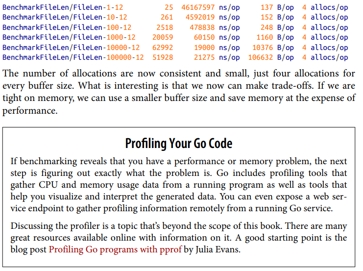

## Table of Contents
  - [Testing in Go](#Testing-in-Go)
    - [单元测试流程](#%E5%8D%95%E5%85%83%E6%B5%8B%E8%AF%95%E6%B5%81%E7%A8%8B)
    - [Basics of Testing](#Basics-of-Testing)
    - [Table Driven Test - 例1](#Table-Driven-Test--%E4%BE%8B1)
    - [Table Driven Test - 例2](#Table-Driven-Test--%E4%BE%8B2)
    - [Reporting Test Failures](#Reporting-Test-Failures)
    - [Setting Up and Tearing Down](#Setting-Up-and-Tearing-Down)
    - [Storing Sample Test Data  ](#Storing-Sample-Test-Data)
    - [Testing Your Public API](#Testing-Your-Public-API)
    - [Use go-cmp to Compare Test Results](#Use-gocmp-to-Compare-Test-Results)
    - [Checking Your Code Coverage](#Checking-Your-Code-Coverage)
    - [Customizing How Tests Run](#Customizing-How-Tests-Run)
    - [Skipping long-running tests](#Skipping-longrunning-tests)
    - [Parallel Testing](#Parallel-Testing)
    - [Benchmarks](#Benchmarks)
  - [测试 HTTP 接口](#%E6%B5%8B%E8%AF%95-HTTP-%E6%8E%A5%E5%8F%A3)
    - [Hanlder Unit Test](#Hanlder-Unit-Test)
    - [Middleware Unit Test](#Middleware-Unit-Test)
    - [End-to-end Test - 入门例子](#Endtoend-Test--%E5%85%A5%E9%97%A8%E4%BE%8B%E5%AD%90)
    - [End-to-end Test - Mock 依赖](#Endtoend-Test--Mock-%E4%BE%9D%E8%B5%96)
    - [End-to-end Test - 发送表单](#Endtoend-Test--%E5%8F%91%E9%80%81%E8%A1%A8%E5%8D%95)
    - [Integration Test - 与单元测试的区别](#Integration-Test--%E4%B8%8E%E5%8D%95%E5%85%83%E6%B5%8B%E8%AF%95%E7%9A%84%E5%8C%BA%E5%88%AB)
    - [Integration Test - 数据库集成测试](#Integration-Test--%E6%95%B0%E6%8D%AE%E5%BA%93%E9%9B%86%E6%88%90%E6%B5%8B%E8%AF%95)
  - [GoMock](#GoMock)
    - [为何 Mock 数据库](#%E4%B8%BA%E4%BD%95-Mock-%E6%95%B0%E6%8D%AE%E5%BA%93)
    - [使用 GoMock 模拟数据库](#%E4%BD%BF%E7%94%A8-GoMock-%E6%A8%A1%E6%8B%9F%E6%95%B0%E6%8D%AE%E5%BA%93)

## Testing in Go

### 单元测试流程

1. 写代码 ( 如果先写测试后写代码就叫「 测试驱动开发 」 )
2. 写单元测试，也就是为 `函数/类` 编写测试。写完函数总得自测一下吧，  
   与其在 `main` 函数中试一试，不如写成单元测试，避免重复手工测试，还能确保以后的修改也不会破坏现有功能。
3. 看看测试覆盖率，理想状况是把每一行都测到。可以用 IDE 的 `Run '...' with Coverage` 功能看测试覆盖率。

### Basics of Testing

Over the past two decades, the widespread adoption of automated testing has probably done more to improve code quality than any other software engineering technique. As a language and ecosystem focused on improving software quality, it’s not surprising that *Go includes testing support as part of its standard library*.

Go’s testing support has two parts: libraries and tooling. The `testing` package in the standard library provides the types and functions to write tests, while the `go test` tool that’s bundled with Go runs your tests and generates reports.

```go
// 文件名: adder.go
func addNumbers(x, y int) int {
    return x + x
}

// 文件名: adder_test.go
func Test_addNumbers(t *testing.T) {
    result := addNumbers(2, 3)
    if result != 5 {
        t.Error("incorrect result: expected 5, got", result)
    }
}
```

(1) Every test is written in a file whose name ends with `_test.go`. If you are writing tests against `foo.go`, place your tests in a file named `foo_test.go`.

(2) Test functions start with the word `Test` and take in a single parameter of type `*testing.T`. By convention, this parameter is named `t`. Test functions do not return any values.   

(3) Also note that we use standard Go code to call the code being tested and to validate if the responses are as expected. When there’s an incorrect result, we report the error with the `t.Error` method, which works like the `fmt.Print` function.

(4) Just as `go build` builds a binary and `go run` runs a file, the command `go test` runs the tests in the current directory. The `go test` command allows you to specify which packages to test. Using `./...` for the package name specifies that you want to run tests in the current directory and all of the subdirectories of the current directory. Include a `-v` flag to get verbose testing output.

### Table Driven Test - 例1

```go
func humanDate(t time.Time) string {
    if t.IsZero() {
        return ""
    }
    // 使用 time.FixedZone() 创建一个时区
    // 然后把时间转成 UTC+08:00 时区再进行格式化
    return t.In(time.FixedZone("CST", 8*3600)).Format("2006-01-02 15:04")
}

func TestHumanDate2(t *testing.T) {
    testCases := []struct {
        name string
        time time.Time
        want string
    }{
        {
            name: "Empty",
            time: time.Time{},
            want: "",
        },
        {
            name: "UTC",
            time: time.Date(2222, 2, 2, 0, 0, 0, 0, time.UTC),
            want: "2222-02-02 08:00", // 输入时间为 UTC 时区时, 格式化后应该加 8 个小时
        },
    }

    for _, tc := range testCases {
        // t.Run 默认同步运行, 所以此处无需使用 tc := tc, 除非在子测试中用了 t.Parallel()
        // go.mod 文件 1.22 和以上版本也无需 tc := tc，因为每次循环都是新的迭代变量
        t.Run(tc.name, func(t *testing.T) {
            got := humanDate(tc.time)
            assert.Equal(t, tc.want, got)
        })
    }
}
```

### Table Driven Test - 例2

Most of the time, it takes more than a single test case to validate that a function is working correctly. You could write multiple test functions to validate your function or multiple tests within the same function, but you’ll find that a great deal of the testing logic is repetitive. You set up supporting data and functions, specify inputs, check the outputs, and compare to see if they match your expectations. Rather than writing this over and over, you can take advantage of a pattern called table tests.

```go
func DoMath(num1, num2 int, op string) (int, error) {
    switch op {
    case "+":
        return num1 + num2, nil
    case "-":
        return num1 - num2, nil
    case "*":
        return num1 + num2, nil
    case "/":
        if num2 == 0 {
            return 0, errors.New("division by zero")
        }
        return num1 / num2, nil
    default:
        return 0, fmt.Errorf("unknown operator %s", op)
    }
}

func TestDoMath_verbose(t *testing.T) {
    result, err := DoMath(2, 2, "+")
    if result != 4 {
        t.Error("Should have been 4, got", result)
    }
    if err != nil {
        t.Error("Should have been nil error, got", err)
    }
    result2, err2 := DoMath(2, 2, "-")
    if result2 != 0 {
        t.Error("Should have been 0, got", result2)
    }
    if err2 != nil {
        t.Error("Should have been nil error, got", err2)
    }
    // and so on... 其实只有 <输入, 输出, 错误消息> 是不同的
}

func TestDoMath(t *testing.T) {
    // 匿名结构体包含这些字段: 测试名, 入参, 返回值
    data := []struct {
        name     string
        num1     int
        num2     int
        op       string
        expected int
        errMsg   string
    }{
        {"addition", 2, 2, "+", 4, ""},
        {"subtraction", 2, 2, "-", 0, ""},
        {"multiplication", 2, 2, "*", 4, ""},
        {"division", 2, 2, "/", 1, ""},
        {"bad_division", 2, 0, "/", 0, `division by zero`},
    }
    // 在循环中执行每一个测试用例, 下面才是测试主体, 上面属于初始化测试数据
    for _, d := range data {
        t.Run(d.name, func(t *testing.T) {
            result, err := DoMath(d.num1, d.num2, d.op)
            if result != d.expected {
                t.Errorf("Expected %d, got %d", d.expected, result)
            }
            // 比较错误消息并不靠谱, 错误消息是易变的, 一般推荐用 errors.Is 或 errors.As
            // 但 DoMath 函数用 errors.New 和 fmt.Errorf 返回错误, 所以只能比较错误消息
            var errMsg string
            if err != nil {
                errMsg = err.Error()
            }
            if errMsg != d.errMsg {
                t.Errorf("Expected error message `%s`, got `%s`", d.errMsg, errMsg)
            }
        })
    }
}
```

### Reporting Test Failures

While `Error` and `Errorf` mark a test as failed, the test function continues running. If you think a test function should stop processing as soon as a failure is found, use the `Fatal` and `Fatalf` methods.  The difference is that the test function exits immediately after the test failure message is generated. Note that this doesn’t exit all tests; any remaining test functions ( and sub-tests ) will execute after the current test function exits.  

When should you use `Fatal/Fatalf` and when should you use `Error/Errorf`? If the failure of a check in a test means that further checks in the same test function will always fail or cause the test to panic, use Fatal or Fatalf. If you are testing several independent items (such as validating fields in a struct), then use Error or Errorf so you can report as many problems at once. This makes it easier to fix multiple problems without rerunning your tests over and over.

### Setting Up and Tearing Down

Sometimes you have some common state that you want to set up before any tests run and remove when testing is complete. Use a `TestMain` function to manage this state and run your tests:  

```go
var testTime time.Time

func TestMain(m *testing.M) {
    fmt.Println("Set up stuff for tests here")
    testTime = time.Now()
    exitVal := m.Run()
    fmt.Println("Clean up stuff after tests here")
    os.Exit(exitVal)
}

func TestFirst(t *testing.T) {
    fmt.Println("TestFirst uses stuff set up in TestMain", testTime)
}

func TestSecond(t *testing.T) {
    fmt.Println("TestSecond also uses stuff set up in TestMain", testTime)
}
```

Both `TestFirst` and `TestSecond` refer to the package-level variable `testTime`. Once the state is configured, call the `Run` method on `*testing.M` to run the test functions. The `Run` method returns the exit code; 0 indicates that all tests passed. Finally, you must call `os.Exit` with the exit code returned from `Run`.

Be aware that `TestMain` is invoked once, not before and after each individual test. Also be aware that you can have only one `TestMain` per package. There are two common situations where `TestMain` is useful:  

- When you need to set up data in an external repository, such as a database.
- When the code being tested depends on package-level variables that need to be initialized. As mentioned before (and will be mentioned again!) you should avoid package-level variables in your programs. They make it hard to understand how data flows through your program. If you are using `TestMain` for this reason, consider refactoring your code.

如果只想让 setup 和 shutdown 应用于某几个测试, [这有个巧妙写法:](https://stackoverflow.com/a/68549161)

```go
func setupTest() func() {
    // Setup code here

    return func() {
        // tear-down code here
    }
}

func TestMethod(t *testing.T) {
    defer setupTest()()
    // asserts, ensures, requires... here
}
```

The `t.Cleanup()` method ( which registers a function to be called when the test (or subtest) and all its subtests complete ) is used to clean up temporary resources created for a single test. This method has a single parameter, a function with no input parameters or return values. The function runs when the test completes. For simple tests, you can achieve the same result by using a `defer` statement, but `Cleanup` is useful when tests rely on helper functions to set up sample data.

- It’s fine to call `Cleanup` multiple times. 

- Just like `defer`, the functions are invoked in last added, first called order.

```go
// createFile is a helper function called from multiple tests
func createFile(t *testing.T) (string, error) {
    f, err := os.Create("tempFile")
    if err != nil {
        return "", err
    }
    // write some data to f
    t.Cleanup(func() {
        os.Remove(f.Name())
    })
    return f.Name(), nil
}
func TestFileProcessing(t *testing.T) {
    fName, err := createFile(t)
    if err != nil {
        t.Fatal(err)
    }
    // do testing, don't worry about cleanup
}
```

#### ➤ 测试文件中的 init()

If test file has an *init()* function, then that *init()* will be executed before the test is executed. In other words, first, all not-test files *init()* functions are executed, then all test files *init*() functions are executed (hopefully in lexical order).

### Storing Sample Test Data  

As `go test` walks your source code tree, *it uses the current package directory as the current working directory*. If you want to use sample data to test functions in a package, create a subdirectory named `testdata` to hold your test data files. **Directory and file names that begin with "." or "_" are ignored by the go tool, as are directories named "testdata".** When reading from `testdata`, always use a relative file reference. Since go test changes the current working directory to the current package, each package accesses its own `testdata` via a relative file path.

### Testing Your Public API

The tests that we’ve written are in the same package as the production code. *This allows us to test both exported and unexported functions*. If you want to test just the public API of your package, Go has a convention for specifying this. You still keep your test source code in the same directory as the production source code, but you use `packagename_test` for the package name. 

(一个目录中只能有一个包, 但 foo 和 foo_test 可以共存)

```go
// foo 包导出了这个函数
func AddNumbers(x, y int) int {
    return x + x
}

// 在 foo 包里面创建测试文件, 并且把包名设为 foo_test
func TestAddNumbers(t *testing.T) {
    result := foo.AddNumbers(2, 3) // 现在只能测试 foo 包的导出函数
    if result != 5 {
        t.Error("incorrect result")
    }
}
```

The advantage of using the `_test` package suffix is that it lets you treat your package as a “black box”; you are forced to interact with it only via its exported functions, methods, types, constants, and variables.

### Use go-cmp to Compare Test Results

It can be verbose to write a thorough comparison between two instances of a compound type. While you can use `reflect.DeepEqual` to compare structs, maps, and slices, there’s a better way. Google released a third-party module called `go-cmp` that does the comparison for you and returns a detailed description of what does not match.

```go
import (
    "github.com/google/go-cmp/cmp"
)

type Person struct {
    Name      string
    Age       int
    DateAdded time.Time
}

func CreatePerson(name string, age int) Person {
    return Person{
        Name:      name,
        Age:       age,
        DateAdded: time.Now(),
    }
}

func TestCreatePerson(t *testing.T) {
    expected := Person{
        Name: "Dennis",
        Age:  37,
    }
    result := CreatePerson("Dennis", 37)
    if diff := cmp.Diff(expected, result); diff != "" {
        t.Error(diff)
    }
}
// 输出如下:
//        -     DateAdded: s"0001-01-01 00:00:00 +0000 UTC",
//        +     DateAdded: s"2023-08-08 15:02:24.3665695 +0800 CST m=+0.002080301",
```

The lines with a "-" and "+" indicate the fields whose values differ. Our test failed because our dates didn’t match. ( 然而我们希望忽略 DateAdded 字段进行比较 ) You do that by specifying a comparator function.

```go
func TestCreatePerson(t *testing.T) {
    expected := Person{
        Name: "Dennis",
        Age:  37,
    }
    result := CreatePerson("Dennis", 37)
    // 使用自定义 comparator 在比较结构体时忽略 DateAdded 字段
    comparer := cmp.Comparer(func(x, y Person) bool {
        return x.Name == y.Name && x.Age == y.Age
    })
    if diff := cmp.Diff(expected, result, comparer); diff != "" {
        t.Error(diff)
    }
}
```

Pass a function to the `cmp.Comparer` function to create a customer comparator. The function that’s passed in must have two parameters of the same type and return a `bool`. 

- It also must be symmetric (the order of the parameters doesn’t matter), 
- deterministic (it always returns the same value for the same inputs), 
- and pure (it must not modify its parameters).  

### Checking Your Code Coverage

Code coverage is a very useful tool for knowing if you’ve missed any obvious cases. However, reaching 100% code coverage doesn’t guarantee that there aren’t bugs in your code for some inputs. Adding the `-cover` flag to the `go test` command calculates coverage information and includes a summary in the test output. If you include a second flag `-coverprofile`, you can save the coverage information to a file:  `go test -v -cover -coverprofile=c.out ./...`

You can then view the coverage profile by using the `go tool cover` command like so: `go tool cover -func=c.out`. It’d be more useful if we could see what we missed. The cover tool included with Go generates an HTML representation of your source code with that information: `go tool cover -html=c.out`

Every file that’s tested appears in the combo box in the upper left. The source code is in one of three colors. Gray is used for lines of code that aren’t testable, green is used for code that’s been covered by a test, and red is used for code that hasn’t been tested. From looking at this, we can see that we didn’t write a test to cover the default case, when a bad operator is passed to our function.

Code coverage is a great thing, but it’s not enough. *You can have 100% code coverage and still have bugs in your code!* There’s actually a bug in our code, even though we have 100% coverage.

然而为什么不用 IDE 呢?

- 在 IDE 中查看 Code Coverage 更方便
- 直接在 GoLand 中搜索 Coverage 然后选 Run '....' with Coverage

### Customizing How Tests Run

执行选定的测试:

```bash
go test -v ./...                                 # 执行所有目录和子目录中的测试
go test -v -run='^TestPing$' ./web               # 执行 ./web 包中匹配 ^TestPing$ 的测试方法
go test -v -run='^TestHumanDate2$/^UTC$' ./web   # 甚至能只运行特定子测试, 中间用斜杠 / 隔开
go test -v -skip='^TestHumanDate$' ./cmd/web     # 跳过指定测试
```

执行 go test 命令后有一些测试带有 `(cached)` 后缀，说明这个测试没有重新执行，而是使用缓存的结果

```bash
go test -count=1 ./cmd/web   # 不使用缓存, 重新执行所有测试
go clean -testcache          # 另一种方法，删掉测试缓存

# Go caches compiled packages if they haven’t changed, Go also caches test results 
# when running tests across multiple packages if they have passed and their code 
# hasn’t changed. The tests are recompiled and rerun if you change any file 
# in the package or in the testdata directory.
```

代码中使用 `t.Error()` 不会让测试终止运行，可以用 `-failfast` 快速终止

```bash
go test -v -failfast ./cmd/web                   # 遇到首个错误就退出测试
go test -v -failfast ./...                       # 每个包都会执行, 遇到错误则终止当前包, 其他包的测试会继续执行
```

### Skipping long-running tests

When your tests take a long time, you might decide that you want to skip specific long-running tests under certain circumstances. For example, you might decide to only run your integration tests before committing a change, instead of more frequently during development. 

A common and idiomatic way to skip long-running tests is to use the `testing.Short()` function to check for the presence of a `-short` flag in your `go test` command, and then call the `t.Skip()` method to skip the test if the flag is present.  

```go
func TestUserModelExists(t *testing.T) {
    // Skip the test if the "-short" flag is provided when running the test.
    if testing.Short() {
        t.Skip("models: skipping integration test")
    }
}
```

And then try running our tests with the `-short` flag enabled:

```bash
go test -v -short ./... # Notice the SKIP annotation in the output?
```

### Parallel Testing

By default, the go test command executes all tests in a serial manner, one after another. When you have a small number of tests (like we do) and the runtime is very fast, this is absolutely fine. But if you have hundreds or thousands of tests the total run time can start adding up to something more meaningful. And in that scenario, you may save yourself some time by running your tests in parallel. You can indicate that it’s OK for a test to be run concurrently alongside other tests by calling the `t.Parallel()` function at the start of the test. For example:

```go
func TestPing(t *testing.T) {
    t.Parallel() // 在测试的开头执行这个, 能让测试并发运行
}

func TestParallel(t *testing.T) {
    testCases := []struct {
        name string
        data int
    }{
        {name: "test1", data: 111},
        {name: "test2", data: 222},
        {name: "test3", data: 333},
    }
    for _, tc := range testCases {
        tc := tc // t.Run 默认并发运行, 但下面用了 t.Parallel(), 所以拷贝一下避免 tc 变量改变
        t.Run(tc.name, func(t *testing.T) {
            t.Parallel()
            time.Sleep(time.Second)
            fmt.Println(tc.data)
        })
    }
}
```

- Tests marked using `t.Parallel()` will be run in parallel with — and only with — other parallel tests.  
- By default, the maximum number of tests that will be run simultaneously is the current value of GOMAXPROCS. You can override this by setting a specific value via the `-parallel` flag. For example: `go test -parallel=4 ./...`
- Not all tests are suitable to be run in parallel. For example, if you have an integration test which requires a database table to be in a specific known state, then you wouldn’t want to run it in parallel with other tests that manipulate the same database table.

The go test command includes a `-race` flag which enables Go’s race detector when running tests. If the code you’re testing leverages concurrency, or you’re running tests in parallel, enabling this can be a good idea to help to flag up race conditions that exist in your application. You can use it like so:

```bash
go test -race ./cmd/web/
```

It’s important to point out that the race detector is just a tool that flags data races if and when they are identified at runtime during testing. A clear run doesn’t ensure that your code is free of race conditions. Enabling the race detector will also increase the overall running time of your tests. So if you’re running tests very frequently as part of a TDD workflow, you may prefer to use the `-race` flag during precommit test runs only.

### Benchmarks

建议看书上 13 章的对应小节

Our goal is to find out what size buffer we should use to read from the file.  

Before you spend time going down an optimization rabbit hole, be sure that you need to optimize. If your program is already fast enough to meet your responsiveness requirements and is using an acceptable amount of memory, then your time is better spent on adding features and fixing bugs. Your business requirements determine what “fast enough” and “acceptable amount of memory” mean  

In Go, benchmarks are functions in your test files that start with the word `Benchmark` and take in a single parameter of type `*testing.B`. This type includes all of the functionality of a *testing.T as well as additional support for benchmarking.

Every Go benchmark must have a loop that iterates from 0 to `b.N`. The testing framework calls our benchmark functions over and over with larger and larger values for N until it is sure that the timing results are accurate. 

 

## 测试 HTTP 接口


### Hanlder Unit Test

#### ➤ [httptest.NewRequest vs http.NewRequest](https://stackoverflow.com/questions/45682353/httptest-newrequest-vs-http-newrequest-which-one-to-use-in-tests-and-why)

As indicated in the documentation, [`httptest.NewRequest`](https://golang.org/pkg/net/http/httptest/#NewRequest) "returns a new incoming server Request, suitable for passing to an http.Handler for testing", while [`http.NewRequest`](https://golang.org/pkg/net/http/#NewRequest) "returns a Request suitable for use with Client.Do or Transport.RoundTrip." So, if you're passing the request directly to the handler in a unit test, use `httptest.NewRequest`, and if you're executing a full round-trip using `http.Client`, use `http.NewRequest`.

```go
func ping(w http.ResponseWriter, r *http.Request) {
    _, _ = w.Write([]byte("OK"))
}

func TestPing(t *testing.T) {
    w := httptest.NewRecorder()
    r, err := httptest.NewRequest(http.MethodGet, "/", nil)
    if err != nil {
        t.Fatal(err)
    }
    // http handler 的单元测试, 就是创建请求、调用 handler、记录响应、检查响应
    // 注意 handler 通常包含很多依赖, 所以还得初始化依赖, 这个简单例子中没有体现这点
    ping(w, r)
    resp := w.Result()
    assert.Equal(t, http.StatusOK, resp.StatusCode)

    // 检查响应 Body
    //goland:noinspection GoUnhandledErrorResult
    defer resp.Body.Close()
    body, err := io.ReadAll(resp.Body)
    if err != nil {
        t.Fatal(err)
    }
    assert.Equal(t, "OK", string(body))
}
```

### Middleware Unit Test

```go
func secureHeaders(next http.Handler) http.Handler {
    return http.HandlerFunc(func(w http.ResponseWriter, r *http.Request) {
        w.Header().Set("Content-Security-Policy", "default-src 'self'")
        w.Header().Set("Referrer-Policy", "origin-when-cross-origin")
        w.Header().Set("X-Frame-Options", "deny")
        next.ServeHTTP(w, r)
    })
}

func TestSecureHeaders(t *testing.T) {
    w := httptest.NewRecorder()
    r, err := httptest.NewRequest(http.MethodGet, "/", nil)
    assert.NoError(t, err)

    // 组合 Middleware 和 Handler 后调用它
    next := http.HandlerFunc(func(w http.ResponseWriter, r *http.Request) {
        _, _ = w.Write([]byte("OK"))
    })
    secureHeaders(next).ServeHTTP(w, r)
    resp := w.Result()

    // 检查有没有设置响应头
    assert.Equal(t, "default-src 'self'", resp.Header.Get("Content-Security-Policy"))
    assert.Equal(t, "origin-when-cross-origin", resp.Header.Get("Referrer-Policy"))
    assert.Equal(t, "deny", resp.Header.Get("X-Frame-Options"))

    // 检查 middleware 有没有调用 next
    assert.Equal(t, http.StatusOK, resp.StatusCode)
    defer resp.Body.Close()
    body, err := io.ReadAll(resp.Body)
    assert.NoError(t, err)
    assert.Equal(t, "OK", string(body))
}
```

### End-to-end Test - 入门例子

- 端到端测试就是模拟 client 和 server 的交互

- 像这样启动 test server，然后用 client 访问它，就能让 router、middleware、handler 都被测到:

```go
func newTestApplication(t *testing.T) *application {
    // 初始化依赖
    templateCache, err := newTemplateCache()
    assert.NoError(t, err)
    formDecoder := form.NewDecoder()
    sessionManager := scs.New() // 不设置 Store 则用内存作为 Store, 刚好适用于测试
    sessionManager.Lifetime = 12 * time.Hour
    sessionManager.Cookie.Secure = true
    return &application{
        errorLog:       log.New(io.Discard, "", 0),
        infoLog:        log.New(io.Discard, "", 0),
        snippets:       &mocks.SnippetModel{}, // 注意让 snippets, users 字段使用接口类型
        users:          &mocks.UserModel{},
        templateCache:  templateCache,
        formDecoder:    formDecoder,
        sessionManager: sessionManager,
    }
}

type testServer struct {
    *httptest.Server
}

func newTestServer(t *testing.T, h http.Handler) *testServer {
    ts := httptest.NewTLSServer(h)

    // 设置 cookie jar 让 client 像浏览器一样存储和发送 cookie
    jar, err := cookiejar.New(nil)
    assert.NoError(t, err)
    ts.Client().Jar = jar

    // 设置 client 不要跟随重定向, 因为我们要验证/检查的东西就是重定向响应本身
    // CheckRedirect 函数会在 client 收到 3xx 重定向时被执行
    ts.Client().CheckRedirect = func(req *http.Request, via []*http.Request) error {
        return http.ErrUseLastResponse // 不管什么类型的重定向都不跟随
    }

    return &testServer{
        Server: ts,
    }
}

// 向 test server 发出 get 请求并返回 status code, header, body
func (ts *testServer) get(t *testing.T, urlPath string) (int, http.Header, string) {
    resp, err := ts.Client().Get(ts.URL + urlPath)
    assert.NoError(t, err)

    //goland:noinspection GoUnhandledErrorResult
    defer resp.Body.Close()
    body, err := io.ReadAll(resp.Body)
    assert.NoError(t, err)

    return resp.StatusCode, resp.Header, string(body)
}

func TestPing3(t *testing.T) {
    // 经过上面的封装, 测试代码更干净了
    app := newTestApplication(t)        // 初始化依赖
    ts := newTestServer(t, routes(app)) // 启动 test server, 它会随机选一个可用端口
    defer ts.Close()                    // 别忘了关 test server

    code, header, body := ts.get(t, "/ping") // 使用 ts.Client() 向测试服务器发请求
    assert.Equal(t, http.StatusOK, code)
    assert.Equal(t, "OK", body)
    assert.Equal(t, "text/plain; charset=utf-8", header.Get("Content-Type"))
}
```

### End-to-end Test - Mock 依赖

Throughout this project we’ve injected dependencies into our handlers via the application struct, which currently looks like this:

```go
type application struct {
    errorLog       *log.Logger
    infoLog        *log.Logger
    snippets       models.SnippetModel          
    users          *models.UserModel             
    formDecoder    *form.Decoder                 
    templateCache  map[string]*template.Template 
    sessionManager *scs.SessionManager
}
```

When testing, it sometimes makes sense to mock these dependencies instead of using exactly the same ones that you do in your production application. For example, in the previous chapter we mocked the `errorLog` and `infoLog` dependencies with loggers that write messages to `io.Discard`, instead of the `os.Stdout` and `os.Stderr` streams like we do in our production application.

```go
func newTestApplication(t *testing.T) *application {
    return &application{
        errorLog: log.New(io.Discard, "", 0),
        infoLog:  log.New(io.Discard, "", 0),
    }
}
```

The reason for mocking these and writing to `io.Discard` is to avoid clogging up our test output with unnecessary log messages when we run `go test -v` (with verbose mode enabled). The other two dependencies that it makes sense for us to mock are the `models.SnippetModel` and `models.UserModel` database models. By creating mocks of these it’s possible for us to test the behavior of our handlers without needing to setup an entire test instance of the MySQL database.  

Create a new `internal/models/mocks` package:

```bash
mkdir internal/models/mocks
touch internal/models/mocks/snippets.go
touch internal/models/mocks/users.go
```

Let’s begin by creating a mock of our `models.SnippetModel`. To do this, we’re going to create a simple struct which implements the same methods as our production `models.SnippetModel`, but have the methods return some fixed dummy data instead.

```go
var mockSnippet = &models.Snippet{
    ID:      1,
    Title:   "I love homura",
    Content: "And I love hikari",
    Created: time.Now(),
    Expires: time.Now(),
}

type SnippetModel struct {
}

func (m *SnippetModel) Insert(title, content string, expires int) (int, error) {
    return 2, nil
}

func (m *SnippetModel) Get(id int) (*models.Snippet, error) {
    switch id {
    case 1:
        return mockSnippet, nil
    default:
        return nil, models.ErrNoRecord
    }
}

func (m *SnippetModel) Latest() ([]*models.Snippet, error) {
    return []*models.Snippet{mockSnippet}, nil
}
```

And let’s do the same for our `models.UserModel`, like so:  

```go
type UserModel struct {
}

func (m *UserModel) Insert(name, email, password string) error {
    switch email {
    case "nia@xb2.com":
        return models.ErrDuplicateEmail
    default:
        return nil
    }
}

func (m *UserModel) Authenticate(email, password string) (int, error) {
    if email == "nia@xb2.com" && password == "11111111" {
        return 1, nil
    }
    return 0, models.ErrInvalidCredentials
}

func (m *UserModel) Exists(id int) (bool, error) {
    switch id {
    case 1:
        return true, nil
    default:
        return false, nil
    }
}
```

Let’s head back to the `testutils_test.go` file and update the `newTestApplication()` function so that it creates an application struct with all the necessary dependencies for testing

```go
type application struct {
    snippets       models.SnippetModelInterface // 依赖接口而不是具体类型
    users          models.UserModelInterface    // GoLand 中可以一键从类型 Extract Interface
}

func newTestApplication(t *testing.T) *application {
    // 初始化依赖
    templateCache, err := newTemplateCache()
    assert.NoError(t, err)
    formDecoder := form.NewDecoder()
    sessionManager := scs.New() // 不设置 Store 则用内存作为 Store, 刚好适用于测试
    sessionManager.Lifetime = 12 * time.Hour
    sessionManager.Cookie.Secure = true
    return &application{
        errorLog:       log.New(io.Discard, "", 0),
        infoLog:        log.New(io.Discard, "", 0),
        snippets:       &mocks.SnippetModel{}, // 注意让 snippets, users 字段使用接口类型
        users:          &mocks.UserModel{},
        templateCache:  templateCache,
        formDecoder:    formDecoder,
        sessionManager: sessionManager,
    }
}
```

With that all now set up, let’s get stuck into writing an end-to-end test for our `snippetView` handler which uses these mocked dependencies.

```go
func TestSnippetView(t *testing.T) {
    app := newTestApplication(t)
    ts := newTestServer(t, routes(app))
    defer ts.Close()

    testCases := []struct {
        name     string
        urlPath  string
        wantCode int
        wantBody string
    }{
        {
            name:     "Valid ID",
            urlPath:  "/snippet/view/1",
            wantCode: http.StatusOK,
            wantBody: "And I love hikari",
        },
        {name: "Non-existent ID", urlPath: "/snippet/view/2", wantCode: http.StatusNotFound},
        {name: "Negative ID", urlPath: "/snippet/view/-1", wantCode: http.StatusNotFound},
        {name: "Decimal ID", urlPath: "/snippet/view/1.23", wantCode: http.StatusNotFound},
        {name: "String ID", urlPath: "/snippet/view/foo", wantCode: http.StatusNotFound},
        {name: "Empty ID", urlPath: "/snippet/view/", wantCode: http.StatusNotFound},
    }
    for _, tc := range testCases {
        tc := tc
        t.Run(tc.name, func(t *testing.T) {
            code, _, body := ts.get(t, tc.urlPath)
            assert.Equal(t, tc.wantCode, code)
            if tc.wantBody != "" {
                assert.StringContains(t, body, tc.wantBody)
            }
        })
    }
}
```

### End-to-end Test - 发送表单

Testing this route is made a bit more complicated by the anti-CSRF check that our application does. Any request that we make to `POST /user/signup` will always receive a `400 Bad Request` response unless the request contains a valid CSRF token and cookie. To get around this we need to emulate the workflow of a real-life user as part of our test, like so:

1. Make a `GET /user/signup` request. This will return a response which contains a CSRF cookie in the response headers and the CSRF token for the signup page in the response body.

2. Extract the CSRF token from the HTML response body.
3. Make a `POST /user/signup` request, using the same `http.Client` that we used in step 1 (so it automatically passes the CSRF cookie with the POST request) and including the CSRF token alongside the other POST data that we want to test.

Let’s begin by adding a new helper function to our `cmd/web/testutils_test.go` file for extracting the CSRF token (if one exists) from a HTML response body:

```go
// 从 HTML 中提取 CSRF token 的正则表达式
var csrfTokenRX = regexp.MustCompile(`<input type='hidden' name='csrf_token' value='(.+)'>`)

func extractCSRFToken(t *testing.T, body string) string {
    // FindStringSubmatch 只返回首个匹配的子串, 可用 FindAllStringSubmatch 返回所有匹配的子串
    // 返回值是 []string 类型, 首个元素是与 regexp 匹配的子串, 剩下的元素与正则中的 capture group 一一对应
    matches := csrfTokenRX.FindStringSubmatch(body)
    if len(matches) < 2 {
        t.Fatal("no csrf token found in body")
    }
    // 我们在模板中用 <input ... value='{{.CSRFToken}}'> 设置表单的隐藏字段
    // token 中可能包含 '+' 字符, 会被 {{.CSRFToken}} 转义成 &#43; 所以取值时要还原
    return html.UnescapeString(matches[1])
}
```

Let’s go back to our cmd/web/handlers_test.go file and create a new TestUserSignup test.

```go
func TestUserSignup(t *testing.T) {
    app := newTestApplication(t)
    ts := newTestServer(t, routes(app))
    defer ts.Close()

    _, _, body := ts.get(t, "/user/signup")
    csrfToken := extractCSRFToken(t, body)
    t.Logf("CSRF token is: %q", csrfToken)
}
```

Let’s create a new postForm() method on our testServer type.

```go
// 向 test server 发出 get 请求并返回 status code, header, body
func (ts *testServer) postForm(t *testing.T, urlPath string, form url.Values) (int, http.Header, string) {
    resp, err := ts.Client().PostForm(ts.URL+urlPath, form)
    assert.NoError(t, err)

    //goland:noinspection GoUnhandledErrorResult
    defer resp.Body.Close()
    body, err := io.ReadAll(resp.Body)
    assert.NoError(t, err)
    return resp.StatusCode, resp.Header, string(body)
}
```

And now, at last, we’re ready to add some table-driven sub-tests to test the behavior of our application’s `POST /user/signup` route. Specifically, we want to test that:  

- A valid signup results in a `303 See Other` response.
- A form submission without a valid CSRF token results in a `400 Bad Request` response.
- A invalid from submission results in a `422 Unprocessable Entity` response and the signup form being redisplayed. This should happen when:
  - The name, email or password fields are empty.
  - The email is not in a valid format.
  - The password is less than 8 characters long.
  - The email address is already in use.

```go
func TestUserSignup(t *testing.T) {
    app := newTestApplication(t)
    ts := newTestServer(t, routes(app))
    defer ts.Close()

    _, _, body := ts.get(t, "/user/signup")
    validCSRFToken := extractCSRFToken(t, body)

    defaultForm := url.Values{}
    defaultForm.Add("name", "homura")
    defaultForm.Add("email", "homura@xb2.com")
    defaultForm.Add("password", "11111111")
    defaultForm.Add("csrf_token", validCSRFToken)

    formTag := "<form action='/user/signup' method='POST' novalidate>"
    testCases := []struct {
        name        string
        form        url.Values
        wantCode    int
        wantFormTag string
    }{
        {name: "Valid submission", wantCode: 303, form: formFields()},
        {name: "Invalid CSRF Token", wantCode: 400, form: formFields("csrf_token", "wrongToken")},
        {name: "Empty name", wantCode: 422, wantFormTag: formTag, form: formFields("name", "")},
        {name: "Empty email", wantCode: 422, wantFormTag: formTag, form: formFields("email", "")},
        {name: "Empty password", wantCode: 422, wantFormTag: formTag, form: formFields("password", "")},
        {name: "Invalid email", wantCode: 422, wantFormTag: formTag, form: formFields("email", "bob@example.")},
        {name: "Short password", wantCode: 422, wantFormTag: formTag, form: formFields("password", "pass")},
        {name: "Duplicate email", wantCode: 422, wantFormTag: formTag, form: formFields("email", "nia@xb2.com")},
    }
    for _, tc := range testCases {
        tc := tc
        t.Run(tc.name, func(t *testing.T) {
            // 除非设置过值, 否则使用 defaultForm 中的默认值
            form := url.Values{}
            for k, v := range defaultForm {
                form[k] = v
                if tc.form.Has(k) {
                    form[k] = tc.form[k]
                }
            }

            code, _, body := ts.postForm(t, "/user/signup", form)
            assert.Equal(t, tc.wantCode, code)
            if tc.wantFormTag != "" {
                assert.StringContains(t, body, tc.wantFormTag)
            }

        })
    }
}

func formFields(s ...string) url.Values {
    if len(s)%2 != 0 {
        panic("wrong number of arguments")
    }
    form := url.Values{}
    for i := 0; i+1 < len(s); i += 2 {
        form.Add(s[i], s[i+1])
    }
    return form
}
```

### Integration Test - 与单元测试的区别

- [What's the difference between unit tests and integration tests?](https://stackoverflow.com/questions/5357601/whats-the-difference-between-unit-tests-and-integration-tests)

> A **unit test** is a test written by the programmer to verify that a relatively small piece of code is doing what it is intended to do. Unit tests should only depend on the tested implementation unit; they should not depend on external components such as databases, network services, web browser interaction. When such external elements are required, unit tests use mock objects. Unit tests test internal consistency as opposed to proving that they play nicely with some outside system.
>
> Why should a unit test have no external dependencies? Because in a unit test you only want to check the behavior of the tested function in a well-defined context. It should not be influenced by a potential bug in the dependencies. If you want to assert that the combination of the function and the dependencies works as expected, you are writing a integration test.

- 单元测试是为了验证一个较小的功能单元 ( 比如函数和类 ) 是否正确，因为外部依赖不是测试目标所以用 Mock 替代
- 集成测试是为了测试组件之间的配合，「连接真实数据库测试 CRUD 代码」就属于集成测试，它测试了 app 和 db 之间的配合
- 单元测试只测试一个工作单元，而集成测试要测试多个工作单元的协作。  
  单元测试用于验证零件的正确性，而集成测试用于验证组装的正确性。  

### Integration Test - 数据库集成测试

Running end-to-end tests with mocked dependencies is a good thing to do, but we could improve confidence in our application even more if we also verify that our real MySQL database models are working as expected. To do this we can run integration tests against a test version our MySQL database. The first step is to create the test version of our MySQL database.

```mysql
# 创建测试数据库和用户
CREATE DATABASE test_snippetbox CHARACTER SET utf8mb4 COLLATE utf8mb4_unicode_ci;
CREATE USER 'test_web'@'%';
GRANT CREATE, DROP, ALTER, INDEX, SELECT, INSERT, UPDATE, DELETE ON test_snippetbox.* TO 'test_web'@'%';
ALTER USER 'test_web'@'%' IDENTIFIED BY 'pass';
```

Once that’s done, let’s make two SQL scripts:

1. A setup script to create the database tables (so that they mimic our production database) and insert a known set of test data than we can work with in our tests.

2. A teardown script which drops the database tables and any data.

The idea is that we’ll call these scripts at the start and end of each integration test, so that the test database is fully reset each time. This helps ensure that any changes we make during one test are not ‘leaking’ and affecting the results of another test. Let’s go ahead and create these scripts in a new `internal/models/testdata` directory like so:

```bash
# The Go tool ignores any directories called testdata, so these scripts will be ignored when compiling your 
# application (it also ignores any directories or files which have names that begin with an _ or . character)
mkdir internal/models/testdata
touch internal/models/testdata/setup.sql
touch internal/models/testdata/teardown.sql
```

File: internal/models/testdata/setup.sql

```mysql
CREATE TABLE snippets
(
    id      INTEGER      NOT NULL PRIMARY KEY AUTO_INCREMENT,
    title   VARCHAR(100) NOT NULL,
    content TEXT         NOT NULL,
    created DATETIME     NOT NULL,
    expires DATETIME     NOT NULL
);
CREATE INDEX idx_snippets_created ON snippets (created);
CREATE TABLE users
(
    id              INTEGER      NOT NULL PRIMARY KEY AUTO_INCREMENT,
    name            VARCHAR(255) NOT NULL,
    email           VARCHAR(255) NOT NULL,
    hashed_password CHAR(60)     NOT NULL,
    created         DATETIME     NOT NULL
);
ALTER TABLE users
    ADD CONSTRAINT users_uc_email UNIQUE (email);
INSERT INTO users (name, email, hashed_password, created)
VALUES ('homura',
        'homura@xb2.com',
        '$2a$12$vbuOtZQwRmA.jvg/8ZnGTuzqaG703sOuY9MHzCKg7xv4DmSLeSlp2',
        '2023-08-10 04:38:54');
```

File: internal/models/testdata/teardown.sql

```mysql
DROP TABLE users;
DROP TABLE snippets;
```

Let’s create a `internal/models/testutils_test.go` file and add to it a `newTestDB()` helper function which:

- Creates a new `*sql.DB` connection pool for the test database;
- Executes the `setup.sql` script to create the database tables and dummy data;
- Register a ‘cleanup’ function which executes the `teardown.sql` script and closes the connection pool.

```go
func newTestDB(t *testing.T) *sql.DB {
    // 使用 test user 连接 test database, 添加 multiStatements=true 参数让 db.Exec() 能执行多条 SQL
    dsn := "test_web:pass@tcp(localhost)/test_snippetbox?parseTime=true&multiStatements=true"
    db, err := sql.Open("mysql", dsn)
    assert.NoError(t, err)

    // 读取并执行 setup.sql
    script, err := os.ReadFile("./testdata/setup.sql")
    assert.NoError(t, err)
    _, err = db.Exec(string(script))
    assert.NoError(t, err)

    // 使用 t.Cleanup() 注册清理函数, 当调用 newTestDB(t) 的测试或子测试结束时, 清理函数就会执行
    // 在清理函数中读取并执行 teardown.sql, 然后关掉数据库连接池
    t.Cleanup(func() {
        script, err := os.ReadFile("./testdata/teardown.sql")
        assert.NoError(t, err)
        _, err = db.Exec(string(script))
        assert.NoError(t, err)
        _ = db.Close()
    })

    return db
}
```

We know that our `setup.sql` script creates a users table containing one record (which should have the user ID 1). So we want to test that: Calling `models.UserModel.Exists(1)` returns `(true, nil)`. Calling `models.UserModel.Exists()` with any other user ID returns `(false, nil)`

```go
// 使用了真实数据库, 所以这属于集成测试, 测试目的为「 验证 CRUD 功能是否正确 」
func TestUserModelExists(t *testing.T) {
    testCases := []struct {
        name   string
        userID int
        want   bool
    }{
        {name: "Valid ID", userID: 1, want: true},
        {name: "Zero ID", userID: 0, want: false},
        {name: "Nonexistent ID", userID: 2, want: false},
    }

    for _, tc := range testCases {
        tc := tc
        t.Run(tc.name, func(t *testing.T) {
            // 在这里调用 newTestDB(), 所以每次执行子测试都会创建并删掉数据库表
            db := newTestDB(t)
            m := UserModel{db}
            exists, err := m.Exists(tc.userID)
            assert.Equal(t, tc.want, exists)
            assert.NilError(t, err)
        })
    }
}
```

## GoMock

### 为何 Mock 数据库

1. 数据隔离不会发生冲突 ( 如果使用真实数据库，需要填充和清理数据，还可能发生数据冲突 )
2. 不用连接 db 执行速度更快
3. 可以测试 edge case 比如连接断开，方便达成测试覆盖率 100%

所谓「 模拟实现 」是指函数签名一致，但逻辑是假的，如下是 `store.GetAccount` 的模拟实现:

```go
func GetAccount(id int) Account {
    return Account{Name: "xxx"}             // 直接写死函数的输入输出，可用于测试目的
}
// 使用模拟实现而不是连接真实数据库, 就能获得上述好处。这样会让 Store 的代码没有被测试
// 但 Store 本身的 CRUD 有专门的单元测试, 此处我们 mock database 是为了方便测试 Handler
```

> - 有时候模拟数据库方便，有时候用真实数据库方便，不能一概而论。
> - My philosophy for mocks is based on cost: only use mocks when using the real thing is more expensive. Mocking a database is never going to be cheap if you go to the effort of simulating all their behaviour, including not null constraints, unique keys, foreign keys, transaction isolation levels, etc. And even if you do manage to simulate all that, you’ve simply delayed the testing against the real database that you will have to do. ( 因为在真实数据库上测试是必不可少的 )

### 使用 GoMock 模拟数据库

[「 点此查看视频教程 」](https://www.youtube.com/watch?v=rL0aeMutoJ0&list=PLy_6D98if3ULEtXtNSY_2qN21VCKgoQAE)

(1) 安装 GoMock, 另外别忘了把 ~/go/bin 添加到 PATH

```bash
go install github.com/golang/mock/mockgen@v1.6.0
mockgen -version
go get github.com/golang/mock/mockgen/model
```

(2) 提取 Store 或 Model 接口

```go
// 在结构体上使用 GoLand 的 Refactor 功能可一键提取接口
// 另外在 sqlc 中开启 emit_interface: true 也会为 CRUD 方法生成接口
type SnippetModel interface {
    Insert(title string, content string, expires int) (int, error)
    Get(id int) (*Snippet, error)
    Latest() ([]*Snippet, error)
}
```

(3) 使用 MockGen 生成 Store 接口的模拟实现

```bash
# 设定包名、输出文件、目标接口 ( 哪个包下的哪个接口 )
mockgen -package mockdb -destination db/mock/store.go xxx.com/simplebank/db/sqlc Store
mockgen -package mockdb -destination internal/mock/store.go xianyukang.com/learn_go/web/internal/models SnippetModel
```

(4) 创建 snippet_test.go 并初始化我们的模拟数据库，然后 Run ... with Coverage 查看测试覆盖率

```go
func TestCreateSnippet(t *testing.T) {
    app := newTestApplication(t)        // 初始化依赖
    ts := newTestServer(t, routes(app)) // 启动 test server
    defer ts.Close()                    // 别忘了关 test server

    validInput := url.Values{
        "title":   {"我爱光焰"},
        "content": {"我爱光焰一万年!"},
        "expires": {strconv.Itoa(1)},
    }

    insertTimesZero := func(store *mockdb.MockSnippetModel) {
        store.EXPECT().
            Insert(gomock.Any(), gomock.Any(), gomock.Any()).
            Times(0)
    }

    testCases := []struct {
        name       string
        body       url.Values
        buildStubs func(store *mockdb.MockSnippetModel)
        code       int
    }{
        {
            name: "OK",
            body: validInput,
            buildStubs: func(store *mockdb.MockSnippetModel) {
                // 在这个测试用例中 store.Insert() 方法应该恰好被调用 1 次
                // 并且第一个参数等于 ..., 第二个参数等于 ..., 第三个参数等于 ...
                // 与此同时, 设置 store.Insert() 方法的返回值为 (1, nil)
                store.EXPECT().
                    Insert(gomock.Eq("我爱光焰"), gomock.Eq("我爱光焰一万年!"), gomock.Eq(1)).
                    Times(1).
                    Return(1, nil)
            },
            code: 303,
        },
        {
            // 在这个测试用例中 store.Insert() 方法应该恰好被调用 0 次
            // 所以不关心三个入参是什么, 就用 gomock.Any() 忽略校验
            // 也无需设置返回值, 所以不调用 Return 方法
            name:       "Empty Content",
            body:       url.Values{"content": {""}},
            buildStubs: insertTimesZero,
            code:       422,
        },
        {name: "Empty Title", buildStubs: insertTimesZero, code: 422, body: url.Values{"title": {""}}},
        {name: "Invalid Expires", buildStubs: insertTimesZero, code: 422, body: url.Values{"expires": {"666"}}},
    }

    for _, tc := range testCases {
        tc := tc
        t.Run(tc.name, func(t *testing.T) {
            // 初始化 GoMock
            ctrl := gomock.NewController(t)
            mockStore := mockdb.NewMockSnippetModel(ctrl)
            tc.buildStubs(mockStore)
            app.snippets = mockStore

            // 读取登录页 CSRF token 并进行登录
            _, _, body := ts.get(t, "/user/login")
            ts.postForm(t, "/user/login", url.Values{
                "email":      []string{"nia@xb2.com"},
                "password":   []string{"11111111"},
                "csrf_token": []string{extractCSRFToken(t, body)},
            })

            // 读取创建页 CSRF token, 设置表单数据
            data := url.Values{}
            _, _, body = ts.get(t, "/snippet/create")
            data["csrf_token"] = []string{extractCSRFToken(t, body)}
            for k, v := range validInput {
                data[k] = v
                if tc.body.Has(k) {
                    data[k] = tc.body[k]
                }
            }

            // 用 client 发送请求, 然后检查响应
            code, _, _ := ts.postForm(t, "/snippet/create", data)
            require.Equal(t, tc.code, code)
        })
    }
}
```
