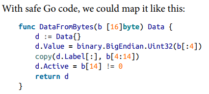
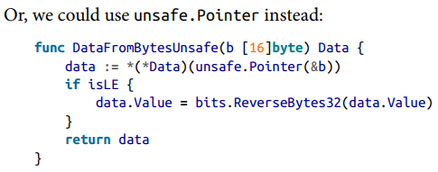

## Table of Contents
  - [反射](#%E5%8F%8D%E5%B0%84)
    - [概述](#%E6%A6%82%E8%BF%B0)
    - [什么是反射](#%E4%BB%80%E4%B9%88%E6%98%AF%E5%8F%8D%E5%B0%84)
  - [使用反射](#%E4%BD%BF%E7%94%A8%E5%8F%8D%E5%B0%84)
    - [Types and Kinds](#Types-and-Kinds)
    - [接口相关](#%E6%8E%A5%E5%8F%A3%E7%9B%B8%E5%85%B3)
    - [Elem 方法](#Elem-%E6%96%B9%E6%B3%95)
    - [结构体的字段信息](#%E7%BB%93%E6%9E%84%E4%BD%93%E7%9A%84%E5%AD%97%E6%AE%B5%E4%BF%A1%E6%81%AF)
    - [读取变量的值](#%E8%AF%BB%E5%8F%96%E5%8F%98%E9%87%8F%E7%9A%84%E5%80%BC)
    - [写入变量的值](#%E5%86%99%E5%85%A5%E5%8F%98%E9%87%8F%E7%9A%84%E5%80%BC)
    - [Making New Values](#Making-New-Values)
    - [用反射检查 nil interface](#%E7%94%A8%E5%8F%8D%E5%B0%84%E6%A3%80%E6%9F%A5-nil-interface)
    - [用反射创建 wrapper 函数](#%E7%94%A8%E5%8F%8D%E5%B0%84%E5%88%9B%E5%BB%BA-wrapper-%E5%87%BD%E6%95%B0)
    - [反射的相关限制](#%E5%8F%8D%E5%B0%84%E7%9A%84%E7%9B%B8%E5%85%B3%E9%99%90%E5%88%B6)
    - [反射有代价，别滥用](#%E5%8F%8D%E5%B0%84%E6%9C%89%E4%BB%A3%E4%BB%B7%E5%88%AB%E6%BB%A5%E7%94%A8)
  - [反射与序列化](#%E5%8F%8D%E5%B0%84%E4%B8%8E%E5%BA%8F%E5%88%97%E5%8C%96)
    - [把结构体切片转成 csv ](#%E6%8A%8A%E7%BB%93%E6%9E%84%E4%BD%93%E5%88%87%E7%89%87%E8%BD%AC%E6%88%90-csv)
    - [把 csv 转成结构体切片](#%E6%8A%8A-csv-%E8%BD%AC%E6%88%90%E7%BB%93%E6%9E%84%E4%BD%93%E5%88%87%E7%89%87)
  - [unsafe](#unsafe)
    - [unsafe 概述](#unsafe-%E6%A6%82%E8%BF%B0)
    - [unsafe 包的适用场景](#unsafe-%E5%8C%85%E7%9A%84%E9%80%82%E7%94%A8%E5%9C%BA%E6%99%AF)
    - [runtime.KeepAlive()](#runtimeKeepAlive)
  - [Cgo](#Cgo)
    - [为啥不推荐](#%E4%B8%BA%E5%95%A5%E4%B8%8D%E6%8E%A8%E8%8D%90)

## 反射

### 概述

In this chapter, we’re going to look at how to handle situations that can’t be solved with normal Go code. For example, when the type of the data can’t be determined at compile time, you can use the reflection support in the `reflect` package to interact with and even construct data. When you need to take advantage of the memory layout of data types in Go, you can use the `unsafe` package. And if there is functionality that can only be provided by libraries written in C, you can call into C code with `cgo`.  

You might be wondering why these advanced concepts appear in a book targeted at those new to Go. There are two reasons. First, developers searching for a solution to a problem sometimes discover (and copy and paste) techniques they don’t fully understand. It’s best to know a bit about advanced techniques that can cause problems before you add them to your codebase. Second, these tools are fun. Because they allow you to do things that aren’t normally possible with Go.

### 什么是反射

We use types to represent the data structures we know we need when we write our programs. Since types are a core part of Go, the compiler uses them to make sure that our code is correct. But sometimes, relying on only compilation-time information is a limitation.

You might need to work with variables at runtime using information that didn’t exist when the program was written. Maybe you’re trying to map data from a file or network request into a variable, or you want to build a single function that works with different types. In those situations, you need to use reflection. 

<font color='#D05'>Reflection allows us to examine types at runtime. It also provides the ability to examine, modify, and create variables, functions, and structs at runtime</font>.  

This leads to the question of when we need this functionality. If you look at the Go standard library, you can get an idea. Its uses fall into one of a few general categories:

- Reading and writing from a database.  (把数据映射到结构体时,  需要知道结构体有哪些字段)

- Go’s built-in templating libraries, `text/template` and `html/template`,  
  use reflection to process the values that are passed to the templates.

- The `fmt` package uses reflection heavily, as all of those calls to fmt.Println and friends rely on reflection to detect the type of the provided parameters.

- The `errors` package uses reflection to implement errors.Is and errors.As.

- The `sort` package uses reflection to implement functions that sort and evaluate slices of any type: sort.Slice, sort.SliceStable, and sort.SliceIsSorted.

- The last main usage of reflection in the Go standard library is for marshaling and unmarshaling data into JSON and XML, along with the other data formats defined in the various encoding packages. Struct tags are accessed via reflection, and the fields in structs are read and written
  using reflection as well. 

Most of these examples have one thing in common: they involve accessing and formatting data that is being imported into or exported out of a Go program. *You’ll often see reflection used at the boundaries between your program and the outside world*.

## 使用反射

Reflection is built around three core concepts: types, kinds, and values.  

### Types and Kinds

#### ➤ 用 reflect.TypeOf 获取变量的类型信息

First let’s look at types. A type in reflection is exactly what it sounds like. It defines the properties of a variable, what it can hold, and how you can interact with it. With reflection, you are able to query a type to find out about these properties using code. We get the reflection representation of the type of a variable with the `TypeOf` function in the reflect package: `vType := reflect.TypeOf(v)`.

```go
func TestName(t *testing.T) {
    var x int
    xt := reflect.TypeOf(x)
    fmt.Println("type of x:", xt.Name()) // int

    xpt := reflect.TypeOf(&x)
    fmt.Println("typeof &x:", xpt.Name()) // 空字符串

    // Some types, like a slice or a pointer, don’t have names;
    // in those cases, Name() returns an empty string.
}
```

#### ➤ Kind 表示底层类型的种类: slice、map、struct、string、int、function、...

The `Kind` method on `reflect.Type` returns a value of type `reflect.Kind`, which is a constant that says what the type is made of—a slice, a map, a pointer, a struct, an interface, a string, an array, a function, an int, or some other primitive type. The difference between the kind and the type can be tricky to understand. Remember this rule: if you define a struct named `Foo`, the kind is `reflect.Struct` and the type is `Foo`.

#### ➤ 一些反射方法不能无脑调用，需要检查 Kind，否则会 panic

The kind is very important. Some of the methods defined on `reflect.Type` and other types in the reflect package only make sense for certain kinds. For example, there’s a method on `reflect.Type` called `NumIn`. If your `reflect.Type` instance represents a function, it returns the number of input parameters for the function. If your reflect.Type instance isn’t a function, calling `NumIn` will panic your program.  

```go
func TestKind(t *testing.T) {
    var f = func() {
        fmt.Println("haha")
    }

    ft := reflect.TypeOf(f)
    if ft.Kind() == reflect.Func {
        fmt.Println("f() has", ft.NumIn(), "parameters")
    }
}
```

### 接口相关

```go
func TestInterface(t *testing.T) {
    // err 变量的类型是 error 接口, 其中的具体类型是一个实现了 error 接口的指针
    err := errors.New("something wrong")
    pt := reflect.TypeOf(err) // 返回接口变量的具体类型
    t.Log(pt.Kind())          // 指针
    t.Log(pt.Elem())          // 指针指向 errors.errorString 类型

    // 在反射中判断一个类型是否实现了指定接口
    errorType := reflect.TypeFor[error]()
    t.Log(pt.Implements(errorType))
}
```

### Elem 方法

Another important method on `reflect.Type` is `Elem`. Some types in Go have references to other types and `Elem` is how to find out what the contained type is. (用来查看指针、切片含有什么类型的数据). The `Elem` method also works for slices, maps, channels, and arrays.

```go
func TestElem(t *testing.T) {
    var a []int
    var b string
    fmt.Println("elem of []int   is", reflect.TypeOf(a).Elem().Name())  // 切片含有 int 数据
    fmt.Println("elem of *string is", reflect.TypeOf(&b).Elem().Name()) // 指针含有 string 数据

    var x int
    pt := reflect.TypeOf(&x)
    fmt.Println(pt.Name())        // returns an empty string
    fmt.Println(pt.Kind())        // returns reflect.Ptr
    fmt.Println(pt.Elem().Name()) // returns "int"
    fmt.Println(pt.Elem().Kind()) // returns reflect.Int
}
```

### 结构体的字段信息

There are methods on `reflect.Type` for reflecting on structs. Use the `NumField` method to get the number of fields in the struct, and get the fields in a struct by index with the `Field` method. That returns each field’s structure described in a `reflect.StructField`, which has the name, order, type, and struct tags on a field. Let’s look at a quick example:

```go
func TestStruct(t *testing.T) {
    type Foo struct {
        A int    `myTag:"value"`
        B string `myTag:"value2"`
    }

    var f Foo
    ft := reflect.TypeOf(f)

    // 后面的 NumField() 和 Field() 方法要求 Kind 是结构体否则会 panic
    if ft.Kind() != reflect.Struct {
        return
    }

    // we use the NumField() method to set up a for loop
    // we use the Field() method to get the reflect.StructField struct that represents the field
    for i := 0; i < ft.NumField(); i++ {
        field := ft.Field(i)
        fmt.Println(field.Name, field.Type.Name(), field.Tag.Get("myTag"))
    }
}
```

### 读取变量的值

In addition to examining the types of variables, you can also use reflection to read a variable’s value, set its value, or create a new value from scratch.  

We use the `reflect.ValueOf` function to create a `reflect.Value` instance that represents the value of a variable:  `vValue := reflect.ValueOf(v)`. `reflect.Value` has a method called `Type` that returns the reflect.Type of the reflect.Value. There’s also a `Kind` method, just as there is on reflect.Type.

We’ll start by looking at how to read our values back out of a `reflect.Value`. The `Interface` method returns the value of the variable as an empty interface. However, the type information is lost; when you put the value returned by `Interface` into a variable, you have to use a type assertion to get back to the right type:  

```go
func TestReadValue(t *testing.T) {
    s := []byte{'a', 'b', 'c'}
    sv := reflect.ValueOf(s)    // 获得 reflect.Value
    _ = sv.Interface().([]byte) // 然后用 Interface 读取值、用类型断言恢复类型
    _ = sv.Bytes()              // 如果是 bool, int, []byte 之类的类型可以用对应的方法
}
```

While `Interface` can be called for `reflect.Value` instances that contain values of any kind, there are special case methods that you can use if the kind of the variable is one of the built-in, primitive types: Bool, Complex, Int, Uint, Float, and String. There’s also a Bytes method that works if the type of the variable is a slice of bytes. If you use a method that doesn’t match the type of the `reflect.Value`, your code will `panic`.

### 写入变量的值

We can use reflection to set the value of a variable as well, but it’s a three-step process.

(1) First, you pass a pointer to the variable into `reflect.ValueOf`. This returns a `reflect.Value` that represents the pointer: `iv := reflect.valueOf(&i)`.

(2) Just like `Elem` on `reflect.Type` returns the type that’s pointed to by a containing type, `Elem` on `reflect.Value` returns the value that’s pointed to by a pointer or the value that’s stored in an interface: `ivv := iv.Elem()`.

(3) Finally, you get to the actual method that’s used to set the value. Just like there are special-case methods for reading primitive types, there are special-case methods for setting primitive types: SetBool, SetInt, SetFloat, SetString, and SetUint.  `ivv.setInt(20)`

```go
func TestWriteValue(t *testing.T) {
    i := 10
    iv := reflect.ValueOf(&i)    // 注意用 &i 因为要用指针修改变量 i 的值
    ivv := iv.Elem()             // Elem 返回 &i 所指的值,  也就是 i
    ivv.Set(reflect.ValueOf(20)) // Set 方法接受一个 reflect.Value,  这里也可以用 SetInt
    fmt.Println(i)

    fmt.Println(reflect.ValueOf(i).CanSet())         // 不用指针, 发现不能修改 i 的值
    fmt.Println(reflect.ValueOf(&i).Elem().CanSet()) // 所以想改值要传指针并调用 Elem()
}
```

For all other types, you need to use the `Set()` method, which takes a variable of type `reflect.Value`. The value that you are setting it to doesn’t need to be a pointer, because we are just reading this value, not changing it. And just like you can use Interface() to read primitive types, you can use Set() to write primitive types.  

> The reason you need to pass a pointer to `reflect.ValueOf` to change the value of the input parameter is that it is just like any other function in Go. As we discussed in *“Pointers Indicate Mutable Parameters”* on page 113, you use a parameter of a pointer type to indicate that you want to modify the value of the parameter.

> If you don’t pass a pointer to a variable to `reflect.ValueOf`, you can still read the value of the variable using reflection. But if you try to use any of the methods that can change the value of a variable, *the method calls will (not surprisingly) panic*.  

### Making New Values

Before we look at how to best use reflection, there’s one more thing to cover: how to create a value. The `reflect.New` function is the reflection analog of the new function. *It takes in a `reflect.Type` and returns a `reflect.Value` that’s a pointer to a `reflect.Value` of the specified type*. Since it’s a pointer, you can modify it and then assign the modified value to a variable using the `Interface()` method.  

Just as `reflect.New` creates a pointer to a scalar type, you can also use reflection to do the same thing as the make keyword with the following functions. Each of these functions takes in a `reflect.Type` that represents the compound type, not the contained type.  

```go
func MakeChan(typ Type, buffer int) Value
func MakeMap(typ Type) Value
func MakeMapWithSize(typ Type, n int) Value
func MakeSlice(typ Type, len, cap int) Value  
```

reflect.TypeOf() 的入参需要特定类型的任意值，可以这样做:

```go
func TestTypeOf(t *testing.T) {
    var stringType = reflect.TypeOf((*string)(nil)).Elem() // 这样写挺怪的
    var stringSliceType = reflect.TypeOf([]string(nil))    // 这个倒是能接受
    var intType = reflect.TypeFor[int]()                   // 然后 Go 1.22 引入了这个方便的函数
    t.Log(stringType, stringSliceType, intType)
}
```

Now that we have these types, we can see how to use `reflect.New` and `reflect.MakeSlice`:  

```go
func TestMakeValues(t *testing.T) {
    var stringType = reflect.TypeFor[string]()
    var stringSliceType = reflect.TypeFor[[]string]() // 有了 reflect.Type
    ssv := reflect.MakeSlice(stringSliceType, 0, 10)  // 再传给 New / Make 创建此类型的值
    sv := reflect.New(stringType).Elem()              // New() 返回指针, 所以要 Elem()

    sv.SetString("hello")
    ssv = reflect.Append(ssv, sv)    // append 函数的反射版本
    sv.SetString("world")            //
    ssv = reflect.Append(ssv, sv)    //
    ss := ssv.Interface().([]string) // 用类型断言恢复类型
    fmt.Println(ss)                  // prints [hello world]
}
```

### 用反射检查 nil interface

As we talked about in “Interfaces and nil” on page 147, if a nil variable of a concrete type is assigned to a variable of an interface type, the variable of the interface type is not nil. *This is because there is a type associated with the interface variable*. If you want to check if the value associated with an interface is nil, you can do so with reflection using two methods: `IsValid` and `IsNil`:  

```go
func IsNil(i any) bool {
    // 对于 interface 类型,  nil 分两种情况,
    // ①nil interface ②值为 nil 但类型不为 nil

    // The IsValid method returns true if reflect.Value holds anything other than a nil interface.
    // v := reflect.ValueOf(i)
    // if !v.IsValid() {
    //     return true // 这种情况是 nil interface
    // }
    if i == nil {
        return true
    }

    v := reflect.ValueOf(i)
    switch v.Kind() {
    case reflect.Pointer, reflect.UnsafePointer,
        reflect.Slice, reflect.Map, reflect.Chan,
        reflect.Func, reflect.Interface:
        return v.IsNil() // 对于这些类型, 检查值是否为 nil
    default:
        return false
    }
}

func TestIsNil(t *testing.T) {
    var _nil any
    var non_nil error = (*os.PathError)(nil)
    t.Log(_nil == nil, non_nil == nil)
    t.Log(IsNil(_nil))
    t.Log(IsNil(non_nil))
}
```

The `IsValid` method returns true if `reflect.Value` holds anything other than a nil interface. We need to check this first because calling any other method on `reflect.Value` will (unsurprisingly) *panic* if `IsValid` is false. The `IsNil` method returns true if the value of the `reflect.Value` is nil, but it can only be called if the `reflect.Kind` is something that can be nil. If you call it on a type whose zero value isn’t nil, it (you guessed it) *panics*.

### 用反射创建 wrapper 函数

Another thing that Go lets you do with reflection is create a function. We can use this technique to wrap existing functions with common functionality without writing repetitive code. For example, here’s a factory function that adds timing to any function that’s passed into it:  

```go
// 此函数会在 f 执行前后做点什么, 例如计算调用时间
func Wrap[T any](f T) T {
    ft := reflect.TypeOf(f)
    fv := reflect.ValueOf(f)

    // 用 []reflect.Value 表示函数的入参和返回值, 毕竟 Go 支持多个返回值嘛
    wrapperF := reflect.MakeFunc(ft, func(in []reflect.Value) []reflect.Value {
        start := time.Now()
        res := fv.Call(in)
        end := time.Now()
        fmt.Println(end.Sub(start))
        return res
    })
    return wrapperF.Interface().(T)
}

func Sleep(a int) int {
    time.Sleep(time.Duration(a) * time.Second)
    result := a * 2
    return result
}

func TestMakeFunctions(t *testing.T) {
    timed := Wrap(Sleep)
    fmt.Println(timed(1))
}
```

While generating functions is clever, be careful when using this feature. you will be *making it harder to understand* the flow of data through your program. Furthermore, as we’ll discuss in “Only Use Reflection If It’s Worthwhile” on page 314, reflection *makes your programs slower*, so using it to generate and invoke functions seriously impacts performance unless the code you are generating is already performing a slow operation, like a network call.   

### 反射的相关限制

#### ➤ 创建结构体

You Can Build Structs with Reflection, but Don’t. There’s one more thing you can make with reflection and it’s weird. The `reflect.StructOf` function takes in a slice of reflect.StructField and returns a reflect.Type that represents a new struct type. These structs can only be assigned to variables of type interface{}, and their fields can only be read and written using reflection.  

#### ➤ 无法用反射添加新方法

While we can use reflection to create new functions and new struct types, there’s no way to use reflection to add methods to a type. This means you cannot use reflection to create a new type that implements an interface.  

### 反射有代价，别滥用

While reflection is essential when converting data at the boundaries of Go, be careful using it in other situations. *Reflection isn’t free*. 

#### ➤ 反射代码更复杂，难以阅读

To demonstrate, let’s implement `Filter` using reflection. It’s a common function in many languages, which takes in a list of values, tests each item in the list, and returns a list that only contains the items that passed the test. Go doesn’t let you write a single type-safe function that works on slices of any type (因为之前没泛型), but you can use reflection to write Filter:  

```go
func Filter(slice interface{}, filter interface{}) interface{} {
    // 虽然 Filter 的逻辑很简单,  但反射相关的代码太啰嗦
    sv := reflect.ValueOf(slice)
    fv := reflect.ValueOf(filter)
    sliceLen := sv.Len()
    out := reflect.MakeSlice(sv.Type(), 0, sliceLen)
    for i := 0; i < sliceLen; i++ {
        curVal := sv.Index(i)
        values := fv.Call([]reflect.Value{curVal})
        if values[0].Bool() {
            out = reflect.Append(out, curVal)
        }
    }
    return out.Interface()
}
```

#### ➤ 反射速度更慢

Using reflection is roughly 30 times slower than a custom function for string filtering and nearly 70 times slower for ints. It uses significantly more memory and performs thousands of allocations, which creates additional work for the garbage collector. Depending on your needs, these might be acceptable trade-offs, but you should be hesitant.  

#### ➤ 多写几行代码怎么了,  简单性、正确性、可维护性更重要

*A more serious downside is that the compiler can’t stop you from passing in a wrong type* for either the slice or the filter parameter. You might not mind a few thousand nanoseconds of CPU time, but if someone passes in a function or slice of the wrong type to `Filter`, *your program will crash in production*. <font color='#D05'>The maintenance cost might be too high to accept. Writing the same function for multiple types might be repetitive, but saving a few lines of code isn’t worth the cost most of the time</font>.  

## 反射与序列化

### 把结构体切片转成 csv 

```go
// 入参为任意结构体切片
// 返回值为 []string 切片,  每个 []string 表示 csv 中的一行数据
func Marshal(v interface{}) ([][]string, error) {

    // 检查是否为 slice 类型
    sliceVal := reflect.ValueOf(v)
    if sliceVal.Kind() != reflect.Slice {
        return nil, errors.New("must be a slice of structs")
    }

    // 检查 slice 的元素是否为结构体
    structType := sliceVal.Type().Elem()
    if structType.Kind() != reflect.Struct {
        return nil, errors.New("must be a slice of structs")
    }

    // 处理第一行的表头,  把切片的元素类型传给 marshalHeader
    var out [][]string
    header := marshalHeader(structType)
    out = append(out, header)

    // 处理每一行,  把切片中的一个元素传给 marshalOne
    for i := 0; i < sliceVal.Len(); i++ {
        row, err := marshalOne(sliceVal.Index(i))
        if err != nil {
            return nil, err
        }
        out = append(out, row)
    }
    return out, nil
}

type MyData struct {
    Name   string `csv:"name"`
    Age    int    `csv:"age"`
    HasPet bool   `csv:"has_pet"`
}

// The first row of our CSV is going to be the header with the column names, so we get
// those column names from the struct tags on fields in the struct’s type.
func marshalHeader(vt reflect.Type) []string {
    var row []string
    for i := 0; i < vt.NumField(); i++ {
        field := vt.Field(i)
        if curTag, ok := field.Tag.Lookup("csv"); ok {
            row = append(row, curTag)
        }
    }
    return row
}

func marshalOne(vv reflect.Value) ([]string, error) {
    var row []string
    vt := vv.Type()
    // 遍历结构体每一个字段,  去掉不含 csv tag 的字段
    for i := 0; i < vv.NumField(); i++ {
        fieldVal := vv.Field(i)
        if _, ok := vt.Field(i).Tag.Lookup("csv"); !ok {
            continue
        }
        // 把字段值转成字符串
        switch fieldVal.Kind() {
        case reflect.Int:
            row = append(row, strconv.FormatInt(fieldVal.Int(), 10))
        case reflect.String:
            row = append(row, fieldVal.String())
        case reflect.Bool:
            row = append(row, strconv.FormatBool(fieldVal.Bool()))
        default:
            return nil, fmt.Errorf("cannot handle field of kind %v", fieldVal.Kind())
        }
    }
    return row, nil
} 
```

### 把 csv 转成结构体切片

Since we are copying data into a slice of any kind of struct, we need to use a parameter of type interface{}. Furthermore, because we are modifying the value stored in this parameter, we must pass in a pointer to a slice of structs.  

```go
func Unmarshal(data [][]string, v interface{}) error {

    // 检查是否是指针
    sliceValPtr := reflect.ValueOf(v)
    if sliceValPtr.Kind() != reflect.Ptr {
        return errors.New("must be a pointer to a slice of structs")
    }
    // 检查是否指向切片
    sliceVal := sliceValPtr.Elem()
    if sliceVal.Kind() != reflect.Slice {
        return errors.New("must be a pointer to a slice of structs")
    }
    // 检查切片元素类型是否是结构体
    structType := sliceVal.Type().Elem()
    if structType.Kind() != reflect.Struct {
        return errors.New("must be a pointer to a slice of structs")
    }

    // assume the first row is a header
    header := data[0]
    namePos := make(map[string]int, len(header))
    for k, v := range header {
        namePos[v] = k
    }

    // 把一行数据填充到结构体
    for _, row := range data[1:] {
        newVal := reflect.New(structType).Elem()
        err := unmarshalOne(row, namePos, newVal)
        if err != nil {
            return err
        }
        // 类似于 s = append(s, val)
        sliceVal.Set(reflect.Append(sliceVal, newVal))
    }
    return nil
}
```

We then loop through all of the remaining string slices, creating a new reflect.Value using the reflect.Type of the struct, call unmarshalOne to copy the data in the current string slice into the struct, and then add the struct to our slice.  

```go
func unmarshalOne(row []string, namePos map[string]int, vv reflect.Value) error {
    // 遍历结构体每一个字段,  跳过不含 csv tag 的字段
    vt := vv.Type()
    for i := 0; i < vv.NumField(); i++ {
        typeField := vt.Field(i)
        pos, ok := namePos[typeField.Tag.Get("csv")]
        if !ok {
            continue
        }
        // 取出字段对应的值,  转成对应的类型
        // 注意 reflect.Type 和 reflect.Value 都有 Field() 方法
        // 一个用来获取字段的 tag,  另一个用来设置字段的值
        val := row[pos]
        field := vv.Field(i)
        switch field.Kind() {
        case reflect.Int:
            i, err := strconv.ParseInt(val, 10, 64)
            if err != nil {
                return err
            }
            field.SetInt(i)
        case reflect.String:
            field.SetString(val)
        case reflect.Bool:
            b, err := strconv.ParseBool(val)
            if err != nil {
                return err
            }
            field.SetBool(b)
        default:
            return fmt.Errorf("cannot handle field of kind %v", field.Kind())
        }
    }
    return nil
}
```

测试函数如下:

```go
func TestCSVSerialization(t *testing.T) {
    data := `name,age,has_pet
Jon,"100",true
"Fred ""The Hammer"" Smith",42,false
Martha,37,"true"
`
    // 字符串 -> Reader -> csv Reader
    r := csv.NewReader(strings.NewReader(data))
    allData, err := r.ReadAll()
    if err != nil {
        panic(err)
    }

    // 注意传指针进去哦 !
    var entries []MyData
    _ = Unmarshal(allData, &entries)
    fmt.Println(entries)

    // now to turn entries into output
    out, err := Marshal(entries)
    if err != nil {
        panic(err)
    }

    // Writer -> csv Writer,  后者的 WriteAll 方法把 [][]string 转成 csv
    sb := &strings.Builder{}
    w := csv.NewWriter(sb)
    _ = w.WriteAll(out)
    fmt.Println(sb)
}
```

## unsafe

### unsafe 概述

Just as the reflect package allows us to manipulate types and values, the unsafe package allows us to manipulate memory. The unsafe package is very small and very odd. It defines three functions and one type, none of which act like the types and functions found in other packages.  

- `unsafe.Sizeof` takes in a variable of any type and returns how many bytes it uses
- `unsafe.Offsetof` takes in a field of a struct and returns the number of bytes from the start of the struct to the start of the field
- `unsafe.Alignof` takes in a field or a variable and returns the byte alignment it requires

Unlike every other non-built-in function in Go, these functions can have any value passed into them, and the values returned are constants, so they can be used in constant expressions.  

The `unsafe.Pointer` type is a special type that exists for a single purpose: a pointer of any type can be converted to or from unsafe.Pointer. In addition to pointers, unsafe.Pointer can also be converted to or from a special integer type, called uintptr. Like any other integer type, you can do math with it. *This allows you to walk into an instance of a type, extracting individual bytes. You can also perform pointer arithmetic*, just like you can with pointers in C and C++. This byte manipulation changes the value of the variable.  

### unsafe 包的适用场景

Given Go’s focus on memory safety, you might wonder why unsafe even exists. The majority of unsafe usages were motivated by integration with operating systems and C code. Developers also frequently use unsafe to write more efficient Go code.

The plurality of the uses of unsafe are for system interoperability. The Go standard library uses unsafe to read data from and write data to the operating system. You can see examples in the syscall package in the standard library or in the higher-level sys package.

The second reason that people use unsafe is for performance, especially when reading data from a network. If you want to map the data into or out of a Go data structure, unsafe.Pointer gives you a very fast way to do so. 假设需要把一串二进制映射到结构体:

 

 

简而言之把一串字节重新解释为 Data,  能省掉几行代码、几次复制,  所以代码更快了.

#### ➤ 这里为什么涉及端序转换呢?

1. 假设通过网络发送一个 int 数据
2. 一些机器用大端序存储 int、另一些 (大部分) 机器用小端序存储 int
3. 所以通过网络发送 int 时不能直接把内存中的 int 发出去,  得定一个标准
4. 标准就是大端序,  发送端发送 int 时转成大端序,  接收端接收 int 时再转回小端序

### runtime.KeepAlive()

You can’t rely on a uintptr to refer to valid memory for longer than a single statement. How do we keep garbage collection from making this reference invalid? We do so by adding a call to runtime.KeepAlive(s) at the end of the function.  

```go
func TestKeepAlive(t *testing.T) {
    s := "hello"
    sHdr := (*reflect.StringHeader)(unsafe.Pointer(&s))

    // 从这一行开始 s 就不需要了,  s 可能会被垃圾回收,  导致后面的指针失效

    for i := 0; i < sHdr.Len; i++ {
        bp := *(*byte)(unsafe.Pointer(sHdr.Data + uintptr(i)))
        fmt.Print(string(bp))
    }

    runtime.KeepAlive(s) // 这里使用一下 s,  确保到此为止 s 是有效的
}
```

## Cgo

### 为啥不推荐

<font color='#D05'>Cgo Is for Integration, Not Performance.</font>

*Just like reflection and unsafe, cgo is most useful at the border between Go programs and the outside world. Reflection helps integrate with external textual data, unsafe is best used with operating system and network data, and cgo is best for integrating with C libraries*.  

Despite being nearly 50 years old, C is still the lingua franca of programming languages. All of the major operating systems are primarily written in either C or C++, which means that they are bundled with libraries written in C. It also means that nearly every programming language provides a way to integrate with C libraries. Go calls its FFI (foreign function interface) to C cgo.  

These rules make using cgo nontrivial. If you have a background in Python or Ruby, you might think that using cgo is worth it for performance reasons. Those developers write the performance-critical parts of their programs in C. The speed of NumPy is due to the C libraries that are wrapped by Python code.  

In most cases, Go code is many times faster than Python or Ruby, so the need torewrite algorithms in a lower-level language is greatly reduced. You might think that you could save cgo for those situations when you do need additional performance gains, but unfortunately, it’s very difficult to make your code faster using cgo. Due to the mismatches in the processing and memory models, calling a C function from Go is roughly 29 times slower than a C function calling another C function.   

Since cgo isn’t fast, and it isn’t easy to use for nontrivial programs, <font color='#D05'>the only reason to use cgo is if there is a C library that you must use and there is no suitable Go replacement. Rather than writing cgo yourself, see if there’s already a third-party module that provides the wrapper</font>. For example, if you want to embed SQLite in a Go application, look at [GitHub](https://github.com/mattn/go-sqlite3). For ImageMagick, check out [this repository](https://github.com/gographics/imagick).  

If you find yourself needing to use an internal C library or third-party library that doesn’t have a wrapper, you can find [additional details](https://pkg.go.dev/cmd/cgo) on how to write your integration in the Go documentation. For information on the sorts of performance and design trade-offs that you are likely to encounter when using cgo, read Tobias Grieger’s blog post called [“The Cost and Complexity of Cgo”](https://www.cockroachlabs.com/blog/the-cost-and-complexity-of-cgo/).  