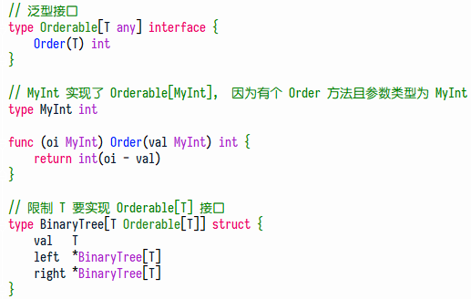
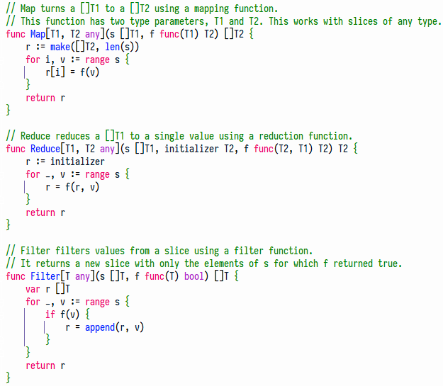
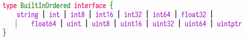
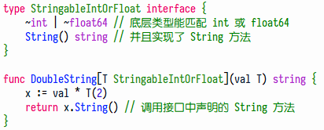
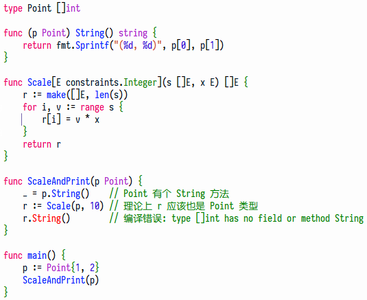
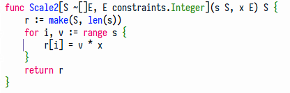

## Table of Contents
  - [为什么用泛型](#%E4%B8%BA%E4%BB%80%E4%B9%88%E7%94%A8%E6%B3%9B%E5%9E%8B)
    - [为什么人们想要泛型](#%E4%B8%BA%E4%BB%80%E4%B9%88%E4%BA%BA%E4%BB%AC%E6%83%B3%E8%A6%81%E6%B3%9B%E5%9E%8B)
    - [没有泛型的诸多限制](#%E6%B2%A1%E6%9C%89%E6%B3%9B%E5%9E%8B%E7%9A%84%E8%AF%B8%E5%A4%9A%E9%99%90%E5%88%B6)
    - [Idiomatic Go and Generics](#Idiomatic-Go-and-Generics)
    - [什么时候适合用泛型](#%E4%BB%80%E4%B9%88%E6%97%B6%E5%80%99%E9%80%82%E5%90%88%E7%94%A8%E6%B3%9B%E5%9E%8B)
    - [使用泛型的一个例子](#%E4%BD%BF%E7%94%A8%E6%B3%9B%E5%9E%8B%E7%9A%84%E4%B8%80%E4%B8%AA%E4%BE%8B%E5%AD%90)
  - [使用泛型](#%E4%BD%BF%E7%94%A8%E6%B3%9B%E5%9E%8B)
    - [关于 Type Parameter](#%E5%85%B3%E4%BA%8E-Type-Parameter)
    - [关于 Type Set](#%E5%85%B3%E4%BA%8E-Type-Set)
    - [关于 Type Inference](#%E5%85%B3%E4%BA%8E-Type-Inference)
    - [几个常用约束](#%E5%87%A0%E4%B8%AA%E5%B8%B8%E7%94%A8%E7%BA%A6%E6%9D%9F)
    - [例子 - 泛型接口](#%E4%BE%8B%E5%AD%90--%E6%B3%9B%E5%9E%8B%E6%8E%A5%E5%8F%A3)
    - [例子 - 泛型函数](#%E4%BE%8B%E5%AD%90--%E6%B3%9B%E5%9E%8B%E5%87%BD%E6%95%B0)
  - [Type Set](#Type-Set)
    - [操作符取交集](#%E6%93%8D%E4%BD%9C%E7%AC%A6%E5%8F%96%E4%BA%A4%E9%9B%86)
    - [声明过的方法才能用](#%E5%A3%B0%E6%98%8E%E8%BF%87%E7%9A%84%E6%96%B9%E6%B3%95%E6%89%8D%E8%83%BD%E7%94%A8)
  - [奇怪问题](#%E5%A5%87%E6%80%AA%E9%97%AE%E9%A2%98)
    - [请解释图中的问题](#%E8%AF%B7%E8%A7%A3%E9%87%8A%E5%9B%BE%E4%B8%AD%E7%9A%84%E9%97%AE%E9%A2%98)

## 为什么用泛型

### 为什么人们想要泛型

<font color='#D05'>Generics Reduce Repetitive Code and Increase Type Safety.</font>

If we wanted a binary tree for strings or float64s and we wanted type safety, we would have to write a custom tree for each type. *That’s verbose and error-prone*. It would be nice to write a single data structure that could handle any type that can be compared with a `<`, but Go doesn’t let you do that today. 

While data structures without generics are inconvenient, the real limitation is in writing functions. Rather than write multiple functions to handle different numeric types, Go implements functions like `math.Max`, `math.Min`, and `math.Mod` using `float64` parameters, which have a range big enough to represent nearly every other numeric type exactly. (The exceptions are an int, int64, or uint with a value greater than 2^53 – 1 or less than –2^53 – 1)

### 没有泛型的诸多限制

You also cannot create a new instance of a variable that’s specified by interface, nor can you specify that two parameters that are of the same interface type are also of the same concrete type. Go also doesn’t provide a way to process a slice of any type; you cannot assign a `[]string` or `[]int` to a variable of `[]interface{}`. This means functions that operate on slices have to be repeated for each type of slice, unless you resort to reflection and give up some performance along with compile-time type safety (this is how `sort.Slice` works).

The result is that many common algorithms, such as `map`, `reduce`, and `filter`, end up being reimplemented for different types. While simple algorithms are easy enough to copy, many (if not most) software engineers find it grating to duplicate code simply because the compiler isn’t smart enough to do it automatically.

### Idiomatic Go and Generics

Adding generics clearly changes some of the advice for how to use Go idiomatically. The use of `float64` to represent any numeric type will end. We will no longer use `interface{}` to represent any possible value in a data structure or function parameter. You can handle different slice types with a single function. *But don’t feel the need to switch all of your code over to using type parameters immediately*. Your old code will still work as new design patterns are invented and refined.

### 什么时候适合用泛型

- Functions that work on slices, maps, and channels of any element type. ( 例如从 map 生成 key 列表 )
- General purpose data structures. For exmaple, a linked list or binary tree.
- When a method looks the same for all types.

#### ➤ 如果只是为了调用特定方法，应该用接口

```go
func BadRead[T io.Reader](r T) {
    r.Read(nil) // 如果只会用到 Read 方法那么别用泛型啊, 接口 io.Reader 比泛型更简单易读
    var s []T   // 像这样用得上类型参数时, 才使用泛型
    s = append(s, r)
}
```

### 使用泛型的一个例子

```go
// "T" is type parameter and "any" is type constraint.
type Stack[T any] struct {
    vals []T
}

// We refer to the type in the receiver section with Stack[T] instead of Stack.
func (s *Stack[T]) Push(val T) {
    s.vals = append(s.vals, val)
}

func (s *Stack[T]) Pop() (T, bool) {
    // Finally, generics make zero value handling a little interesting.
    // In Pop, we can’t just return nil, because that’s not a valid value for a value type, like int.
    // To get a zero value for a generic, we simply declare a variable with var and return it.
    if len(s.vals) == 0 {
        var zero T
        return zero, false
    }
    top := s.vals[len(s.vals)-1]
    s.vals = s.vals[:len(s.vals)-1]
    return top, true
}

func TestStack(t *testing.T) {
    var s Stack[int]
    s.Push(10)       // 类型安全,  禁止 push 字符串
    s.Push(20)       // 使用方便,  返回值无需 type assertion
    s.Push(30)       // 减少重复,  不用为 string、float64 类型重写一遍 Stack
    v, ok := s.Pop() // 用第二个返回值 ok 表示「 值不存在 」是 Go 的常用套路
    fmt.Println(v, ok)
}
```

## 使用泛型

[**泛型由三个部分构成:**](https://youtu.be/Pa_e9EeCdy8?t=126)

1. Type parameters for functions and types
2. Type sets defined by interfaces
3. Type inference

### 关于 Type Parameter

1. 和函数参数很像，但用方括号: `[P, Q constraint, R constraint]`

2. 类型参数的意义是让 function / type 可以使用 type 作为输入参数，例如:
   ```go
   func Min[T constraints.Ordered](a, b T) T {
       if a < b {
           return a
       }
       return b
   }
   
   func TestInstantiation(t *testing.T) {
       minInt := Min[int]               // 泛型函数 Min 使用 int 类型作为类型参数 T 的输入
       minFloat := Min[float64]         // 像这样为泛型函数传入类型, 叫做实例化 ( instantiation )
       fmt.Println()                    //
       fmt.Println(minInt(1, 2))        // 编译器会用具体类型替换类型参数, 例如用 int 替换 T
       fmt.Println(minFloat(1.25, 2.5)) // 并检查 int 是否满足 Ordered 约束, 若不满足则实例化失败
   }
   ```

### 关于 Type Set

1. Type Set 就是一组类型，它表示 T 的取值范围，例如 constraints.Ordered 包含 int/float64/... 等类型

2. Type Set 也叫 Type Constraint，例如 `[T constraints.Ordered]` 限制了 T 必须是可比较大小的类型

3. 使用 interface 定义 type set:

   ```go
   // 这个 type set 包含 Integer、Float、和所有底层类型为 string 的类型 ( 写作 ~string )
   type Ordered interface {
       Integer | Float | ~string
   }
   ```

4. 只能调用 type set 中共有的东西:
   ```go
   type IntOrString interface {
       Integer | string
   }
   
   func double[T IntOrString](x T) T {
       return x + x // 合法, 因为 + 操作对 Integer 和 string 都适用
       return x * 2 // 非法, 因为 T 可能是 string 类型, 此时不支持 * 2 操作
   }
   ```

5. Interfaces used as constraints may be given names (such as `Ordered`), or they may be literal interfaces inlined in a type parameter list. For example: `[S interface{~[]E}, E interface{}]` ( S 是 `~[]E` 类型，E 是任意类型 )
6. Because this is a common case, the enclosing `interface{}` may be omitted for interfaces in constraint position, and we can simply write: `[S ~[]E, E interface{}]`. Because the empty interface is common in type parameter lists, Go 1.18 introduces a new identifier `any`. Finally, we arrive at this idiomatic code: `[S ~[]E, E any]`

### 关于 Type Inference

In some situations, type inference isn’t possible (for example, when a type parameter is only used as a return value). When that happens, all of the type arguments must be specified:  

```go
// T2 仅仅作为返回值, 无法做类型推断
func Convert[T1, T2 Integer](in T1) T2 {
    return T2(in)
}

func TestInference(t *testing.T) {
    var a int = 10
    b := Convert[int, int64](a) // 需要显式指定类型
    fmt.Println(b)
}
```

### 几个常用约束

```go
func process[T any](x T) {
    // T 的约束是 any 类型, 所以不能对 x 变量调用任何方法, 但能把 T 放到容器里面
    var s []T
    s = append(s, x)
}
```

(1) 内置类型约束:

- `any` 即 `interface{}` 的别名，可以是任意类型
- `comparable` 表示可判断相等性的类型，可以用 `==` 和 `!=` 运算符

(2) 下载 golang.org/x/exp/constraints 包:

- `constraints.Ordered` 表示可比较大小的类型，可以用 `< <= >= >` 运算符
- `constraints.Integer` 表示所有整数类型 ( 以及底层类型为整数的类型 )，比如 `int uint int32 uint32 ...`
- `constraints.Float` 表示所有浮点数类型 ( 以及底层类型为浮点数的类型 )，比如 `float32 float64 ...`

### 例子 - 泛型接口

 

### 例子 - 泛型函数

Earlier we mentioned that not having generics made it difficult to write map, reduce, and filter implementations that work for all types. Generics make it easy.  

 

## Type Set

### 操作符取交集

While we can use our Tree with built-in types when there’s an associated type that meets Orderable, it might be nice to use a Tree with built-in types that didn’t require the wrappers. To do that, we need a way to specify that we can use the `<` operator. Go generics do that with a type set, which is simply a list of types specified within an interface:  

 

When a type constraint is specified with an interface containing a type list, *any listed type can match. However, the allowed operators are the ones that apply for all of the listed types*. In this case, those are the operators ==, !=, >, <, >=, <=, and +.   

Type lists also specify which constants can be assigned to variables of the generic type. There are no constants that can be assigned to all of the listed types in BuiltInOrdered, so you cannot assign a constant to a variable of that generic type.  

### 声明过的方法才能用

Specifying a user-defined type does not give you access to the methods on the type. Any methods on user-defined types that you want to access must be defined in the interface, but all types specified in the type list must implement those methods, or they will not match the interface.

在下面的例子中,  `int` 类型虽然能匹配 `~int`,  但没有实现 String 方法,  所以 DoubleString 函数不能传 int

 

## 奇怪问题

### 请解释图中的问题

#### ➤ 为什么 `Scale(p, 10)` 返回的是 `[]int` 类型?

 

调用 Scale 时,  E 被实例化成 int,  所以返回值是 `[]int`,  而不是 `Point`.  
解决办法如下,  S 可以是任意底层类型为 `[]E` 的类型，调用 Scale2 时 S 被实例化成 Point,  所以返回值也是 Point 类型:

 

